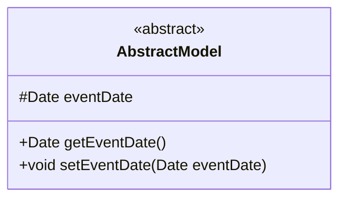
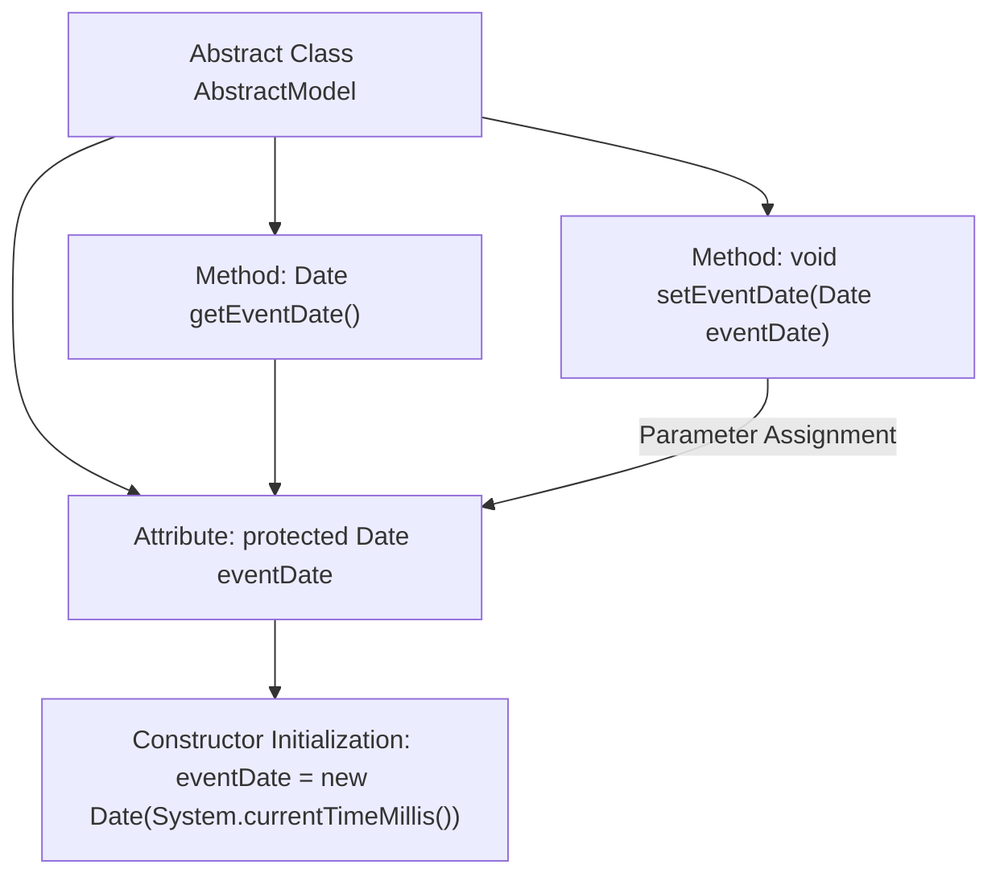

# Basic Information

|      |      |
|------|------|
| Name | AbstractModel |
| Language | .java |
| Code Path | WeFe/common/java/common-data-storage/src/main/java/com/welab/wefe/common/data/storage/model/AbstractModel.java |
| Package Name | com.welab.wefe.common.data.storage.model |
| Dependencies | ['java.sql.Date'] |
| Brief Description | The abstract class AbstractModel contains a protected field of type Date named eventDate, and provides getter and setter methods for accessing and modifying this field. |

# Description

The content describes an abstract class named AbstractModel, which includes a protected Date-type field called eventDate, initialized to the current system time. It provides getEventDate and setEventDate methods for retrieving and setting the field value. The comment for the eventDate field indicates its use for partitioning purposes. The overall class structure is concise, focusing on the encapsulation and management of the date field.

# Class Summary

| Name   | Type  | Description |
|-------|------|-------------|
| AbstractModel | class | The abstract class AbstractModel contains a protected eventDate field along with its getter and setter methods, which are used for partitioning. |

## Class AbstractModel

|      |      |
|------|------|
| Access Modifier | public abstract |
| Type | class |
| Name | AbstractModel |
| Description | The abstract class AbstractModel contains a protected eventDate field along with its getter and setter methods, which are used for partitioning. |

### UML Class Diagram

This code defines an abstract class named AbstractModel, which includes a protected Date-type field eventDate (initialized to the current system time) along with corresponding getter and setter methods. As a base model class, its abstract design allows subclasses to inherit the date field and related operations, making it suitable for domain model scenarios requiring event time recording. The protected modifier of the eventDate field restricts its visibility to within the inheritance hierarchy, demonstrating the encapsulation feature of object-oriented design.

### Internal Method Call Graph

This flowchart describes the structure and behavior of the AbstractModel abstract class. The class contains a protected Date-type attribute eventDate, which is initialized with the current system time upon declaration. It provides two public methods: getEventDate() for retrieving the date value and setEventDate() for modifying it. Arrows clearly illustrate the data flow between attributes and methods, where the setter method receives a new value via parameters and updates the attribute. The entire design demonstrates encapsulated management of timestamp attributes, adhering to fundamental object-oriented encapsulation principles.

### Field List

| Name  | Type  | Description |
|-------|-------|------|
| eventDate = new Date(System.currentTimeMillis()) | Date | Declare a protected Date type variable named eventDate, initialized to the current system time. |

### Method List

| Name  | Type  | Description |
|-------|-------|------|
| getEventDate | Date | Methods to obtain the event date, returns an eventDate object. |
| setEventDate | void | The method to set the event date assigns the passed Date object to the class's eventDate property. |

