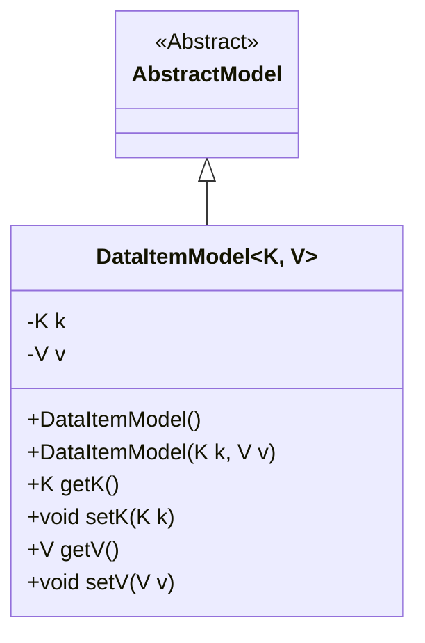
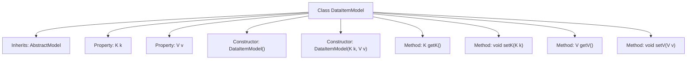

# Basic Information

|      |      |
|------|------|
| Name | DataItemModel |
| Language | .java |
| Code Path | WeFe/common/java/common-data-storage/src/main/java/com/welab/wefe/common/data/storage/model/DataItemModel.java |
| Package Name | com.welab.wefe.common.data.storage.model |
| Dependencies | [] |
| Brief Description | DataItemModel is a generic class that inherits from AbstractModel, containing a key of type K and a value of type V, providing constructors and getter/setter methods. |

# Description

This is a generic class named DataItemModel, which inherits from AbstractModel. It contains two private generic fields, k and v, representing the key and value respectively. The class provides a no-argument constructor and a parameterized constructor, the latter of which can initialize k and v. It also offers public methods getK, setK, getV, and setV for retrieving and setting k and v. This class implements the encapsulation and basic operations of key-value pair data.

# Class Summary

| Name   | Type  | Description |
|-------|------|-------------|
| DataItemModel | class | The generic class `DataItemModel` extends `AbstractModel`, containing a key of type K and a value of type V, and provides constructors and getter/setter methods. |

## Class DataItemModel

|      |      |
|------|------|
| Access Modifier | public |
| Type | class |
| Name | DataItemModel |
| Description | The generic class `DataItemModel` extends `AbstractModel`, containing a key of type K and a value of type V, and provides constructors and getter/setter methods. |

### UML Class Diagram

This code demonstrates a generic class `DataItemModel<K, V>` that inherits from the abstract class `AbstractModel`. The class contains two private generic fields `k` and `v`, representing a key and a value respectively, along with corresponding constructors and accessor methods. Through the generic parameters `K` and `V`, this class can flexibly handle different types of data while inheriting the abstract characteristics of `AbstractModel`, showcasing a design pattern that combines inheritance and generics in object-oriented programming.

### Internal Method Call Graph

This flowchart illustrates the structure of the generic class DataItemModel, which includes properties with type parameters K and V, two constructors (default and parameterized), and corresponding getter and setter methods. The class inherits from AbstractModel, fully presenting the member relationships and hierarchical structure of the class.

### Field List

| Name  | Type  | Description |
|-------|-------|------|
| v | V | The private variable v, of type V. |
| k | K | The private member variable k, of type K. |

### Method List

| Name  | Type  | Description |
|-------|-------|------|
| getK | K | Methods to obtain the value of property k. |
| setK | void | This is a Java method used to set the value of the class member variable k. The method accepts a parameter k and assigns it to the k property of the current object. |
| getV | V | The method getV returns the value of the private variable v. |
| setV | void | This is a Java method used to set the value of the class member variable v. The method accepts a parameter v and assigns it to the v property of the current object. |

