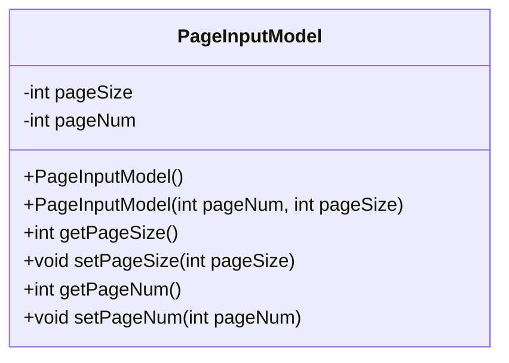
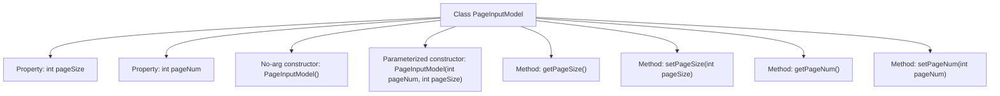

# Basic Information

|      |      |
|------|------|
| Name | PageInputModel |
| Language | .java |
| Code Path | WeFe/common/java/common-data-storage/src/main/java/com/welab/wefe/common/data/storage/model/PageInputModel.java |
| Package Name | com.welab.wefe.common.data.storage.model |
| Dependencies | [] |
| Brief Description | Pagination input model class, containing page number and page size attributes, providing constructor methods and getter/setter. |

# Description

PageInputModel is a input model class designed for paginated queries, containing two private integer fields: pageSize and pageNum, which represent the number of records per page and the current page number, respectively. The class provides a no-argument constructor and a parameterized constructor, supporting the initialization of pagination parameters through the constructor. Additionally, standard getter and setter methods are provided for both fields, allowing external access and modification of the pagination parameter values. This model class encapsulates the basic parameters required for paginated queries, facilitating their transfer and usage in pagination operations.

# Class Summary

| Name   | Type  | Description |
|-------|------|-------------|
| PageInputModel | class | The PageInputModel class includes properties for page number and page size, providing constructors and getter/setter methods. |

## Class PageInputModel

|      |      |
|------|------|
| Access Modifier | public |
| Type | class |
| Name | PageInputModel |
| Description | The PageInputModel class includes properties for page number and page size, providing constructors and getter/setter methods. |

### UML Class Diagram

This code defines a class named PageInputModel, which encapsulates input parameters for paginated queries. The class contains two private fields: pageSize and pageNum, representing the number of records per page and the current page number, respectively. It provides a no-argument constructor, a parameterized constructor, and corresponding getter and setter methods. The primary purpose of this class is to serve as a Data Transfer Object (DTO) for passing pagination parameters in paginated query scenarios, ensuring encapsulation and maintainability of pagination information.

### Internal Method Call Graph

This code defines a class named PageInputModel, which encapsulates input parameters for paginated queries. The class contains two private properties: pageSize and pageNum, representing the page size and page number respectively. It provides a no-argument constructor, a parameterized constructor, and corresponding getter and setter methods. The design purpose of this class is to standardize the passing of pagination query parameters, ensuring data encapsulation and security, and facilitating the transfer of pagination information between different layers.

### Field List

| Name  | Type  | Description |
|-------|-------|------|
| pageSize | int | The private integer variable pageSize is used to define the page size. |
| pageNum | int | The private integer variable pageNum is used to represent the page number. |

### Method List

| Name  | Type  | Description |
|-------|-------|------|
| setPageNum | void | Method to set the current page number, with the parameter being pageNum. |
| getPageNum | int | Methods to obtain the current page number, returning the value of the integer variable pageNum. |
| setPageSize | void | This is a Java method used to set the page size, which assigns the passed pageSize parameter to the class's pageSize member variable. |
| getPageSize | int | Methods to obtain the current page size, returning the value of the integer variable pageSize. |

