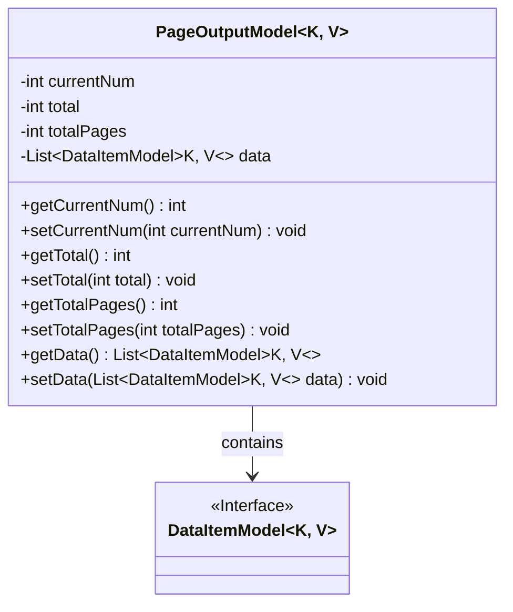

# Basic Information

|      |      |
|------|------|
| Name | PageOutputModel |
| Language | .java |
| Code Path | WeFe/common/java/common-data-storage/src/main/java/com/welab/wefe/common/data/storage/model/PageOutputModel.java |
| Package Name | com.welab.wefe.common.data.storage.model |
| Dependencies | ['java.util.ArrayList', 'java.util.List'] |
| Brief Description | Pagination output model class, containing current page number, total count, total pages, and data list, supporting generic key-value pair data items. |

# Description

PageOutputModel is a generic class designed to encapsulate paginated query results. It contains four core properties: currentNum represents the current page number, total indicates the total record count, totalPages denotes the total number of pages, and data is a generic list of DataItemModel that stores the data items of the current page. The class provides standard getter and setter methods for each property to ensure data access and modification. This model is suitable for business scenarios requiring paginated data display.

# Class Summary

| Name   | Type  | Description |
|-------|------|-------------|
| PageOutputModel | class | Pagination output model class, containing current page number, total count, total pages, and data list, supporting generic key-value pair data items. |

## Class PageOutputModel

|      |      |
|------|------|
| Access Modifier | public |
| Type | class |
| Name | PageOutputModel |
| Description | Pagination output model class, containing current page number, total count, total pages, and data list, supporting generic key-value pair data items. |

### UML Class Diagram

This code defines a generic class `PageOutputModel<K, V>` for representing a paginated output data model. The class includes pagination information such as current page number, total records, total pages, and a generic data list `data` whose element type is an implementation of the `DataItemModel<K, V>` interface. These properties can be accessed and modified via getter and setter methods. The class diagram clearly illustrates the containment relationship between `PageOutputModel` and `DataItemModel`, reflecting the core structure of the paginated data model.

### Internal Method Call Graph

```mermaid
graph TD
    A["Generic Class PageOutputModel<K, V>"]
    B["Private Property: int currentNum"]
    C["Private Property: int total"]
    D["Private Property: int totalPages"]
    E["Private Property: List<DataItemModel<K, V>> data"]
    F["Method: getCurrentNum()"]
    G["Method: setCurrentNum(int)"]
    H["Method: getTotal()"]
    I["Method: setTotal(int)"]
    J["Method: getTotalPages()"]
    K["Method: setTotalPages(int)"]
    L["Method: getData()"]
    M["Method: setData(List<DataItemModel<K, V>>)"]

    A --> B
    A --> C
    A --> D
    A --> E
    A --> F
    A --> G
    A --> H
    A --> I
    A --> J
    A --> K
    A --> L
    A --> M
```

This flowchart illustrates the structure of the generic class PageOutputModel, which consists of 4 private properties and 8 public methods. The properties include current page number (currentNum), total record count (total), total page count (totalPages), and data list (data), each with corresponding getter and setter methods. The data list uses the generic type DataItemModel<K,V> to store paginated data items, embodying a data encapsulation pattern for paginated query results that is applicable to various business scenarios requiring paginated display.

### Field List

| Name  | Type  | Description |
|-------|-------|------|
| totalPages | int | Private integer variable, records the total number of pages. |
| data = new ArrayList<>() | List<DataItemModel<K, V>> | Declare a private list named data, storing elements of type DataItemModel<K, V>, initialized as an ArrayList instance. |
| currentNum | int | private int currentNum |
| total | int | private int total |

### Method List

| Name  | Type  | Description |
|-------|-------|------|
| getData | List<DataItemModel<K, V>> | This is a Java method with a return type of List<DataItemModel<K, V>>, named getData, which directly returns the member variable data. |
| setData | void | Set the data item list with parameters as a collection of type DataItemModel<K, V>. |
| getTotal | int | The method returns the value of the integer variable total. |
| setCurrentNum | void | This is a Java method used to set the value of the class member variable currentNum. The method takes an integer parameter currentNum and assigns it to the member variable of the same name in the current object. |
| setTotal | void | Set the value of the total variable. |
| getTotalPages | int | The method to obtain the total number of pages directly returns the value of the totalPages variable. |
| getCurrentNum | int | The method returns the current value currentNum. |
| setTotalPages | void | The method to set the total number of pages assigns the input parameter totalPages to the member variable of the class with the same name. |

