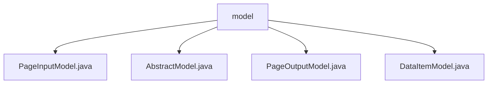

# Basic Information

|      |      |
|------|------|
| Name | model |
| Language | .java |
| Code Path | WeFe/common/java/common-data-storage/src/main/java/com/welab/wefe/common/data/storage/model |
| Package Name | docs.common.java.common-data-storage.src.main.java.com.welab.wefe.common.data.storage.model |
| Brief Description | The PageInputModel encapsulates pagination parameters pageSize and pageNum. The AbstractModel abstract class manages the eventDate field. The generic PageOutputModel class stores paginated result data. The generic DataItemModel class encapsulates key-value pair data. |

# Description

## Overview  
The core responsibility of this module is to provide foundational model support for data storage and paginated queries, similar to entity base classes in ORM. The interface specifications include standard access methods for paginated input (PageInputModel), paginated output (PageOutputModel), and key-value data items (DataItemModel). Key data structures include pagination parameters (pageSize/pageNum), a date partition field (eventDate), and generic key-value pairs (k/v). The only external dependency is the Java standard library. For example, PageOutputModel carries paginated data through a generic list of DataItemModel.  

## Primary Business Scenarios  
The module supports typical paginated query workflows: PageInputModel passes query parameters → service layer processing → PageOutputModel returns paginated results. The interaction pattern adopts standardized Getter/Setter access, such as managing partition dates via setEventDate(). It is suitable for scenarios requiring time-partitioned storage (e.g., log systems) or paginated display of key-value data. API types include basic CRUD operations, such as DataItemModel's implementation of generic key-value pair storage and retrieval.

### Package Internal Structure View

This flowchart illustrates the data storage model structure under the common-data-storage module in the WeFe project. The root node is the model folder, which contains four Java model class files: PageInputModel, AbstractModel, PageOutputModel, and DataItemModel. These class files are directly located under the model directory without deeper nesting relationships, forming a simple flat structure.

# File List

| Name   | Type  | Description |
|-------|------|-------------|
| [PageInputModel.java](PageInputModel.md) | file | Pagination input model class, containing page number and page size attributes, providing constructor methods and getter/setter. |
| [AbstractModel.java](AbstractModel.md) | file | The abstract class AbstractModel contains a protected field of type Date named eventDate, and provides getter and setter methods for accessing and modifying this field. |
| [PageOutputModel.java](PageOutputModel.md) | file | Pagination output model class, including current page number, total count, total pages, and data list, supporting generic key-value pair data items. |
| [DataItemModel.java](DataItemModel.md) | file | The DataItemModel is a generic class that inherits from AbstractModel, containing a key of type K and a value of type V, providing constructors and getter/setter methods. |

