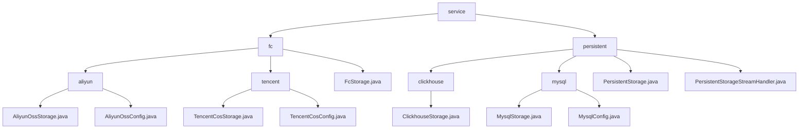

# Basic Information

|      |      |
|------|------|
| Name | service |
| Language | .java |
| Code Path | WeFe/common/java/common-data-storage/src/main/java/com/welab/wefe/common/data/storage/service |
| Package Name | docs.common.java.common-data-storage.src.main.java.com.welab.wefe.common.data.storage.service |
| Brief Description | The multi-cloud storage module supports Alibaba Cloud OSS/OTS and Tencent Cloud COS, providing a unified interface `putAll` to enable multi-threaded uploads, sharding, and callbacks. It relies on various cloud SDKs and serialization tools.  The multi-database module supports ClickHouse and MySQL, offering CRUD operations, batch processing, and table management. Unified interfaces include `put`, `get`, `delete`, etc., and depend on JDBC drivers and connection pools. |

# Description

## Overview  
The core responsibility of this module is to implement unified data storage across multi-cloud platforms (Aliyun OSS/OTS, Tencent Cloud COS) and multi-database systems (ClickHouse/MySQL), supporting efficient batch operations, dynamic sharding, and cross-platform persistence. Interface specifications are aggregated into `putAll` batch writes, standard CRUD operations, and table management APIs, resembling an adapter pattern. Key data structures include sharding strategies (e.g., row count/file size limits), connection configurations (e.g., `ClickhouseConfig`/`AliyunOssConfig`), and serialization parameters. External dependencies encompass mainstream cloud SDKs (Aliyun/Tencent Cloud), JDBC drivers, and Druid connection pools. For example, Aliyun implements dynamic sharding via `hashKeyToPartition`, while ClickHouse supports stream processing.  

## Primary Business Scenarios  
The module is suitable for hybrid scenarios involving multi-cloud storage and heterogeneous databases, adopting a mixed mode of sharded uploads and adapters. A typical workflow includes: configuration initialization (singleton pattern) → data sharding/serialization → multi-threaded or stream processing → callback/progress tracking. For instance, Aliyun OTS partitions by hash, MySQL performs paginated queries, and ClickHouse processes binary streams via `PersistentStorageStreamHandler`. Integration cases span from cloud initialization with `initWithAliyun` to big data processing with `getByStream`, forming an end-to-end solution. The interaction mode is uniformly configuration-driven, supporting hybrid calls of atomic operations and batch APIs.

### Package Internal Structure View

This flowchart illustrates the hierarchical structure of the data storage service, with the root node being "service", which comprises two main branches: "fc" and "persistent". The "fc" branch is further divided into implementations for "aliyun" and "tencent" cloud storage, while the "persistent" branch includes implementations for "clickhouse" and "mysql" database storage. Each child node contains specific implementation classes or configuration files, clearly reflecting the organizational relationships between different storage types.

# File List

| Name   | Type  | Description |
|-------|------|-------------|
| [persistent](persistent/_module.md) | package | ClickhouseStorage inherits from PersistentStorage, implementing CRUD, batch operations, paginated queries, and table management, with support for serialization and streaming. Similarly, MysqlStorage relies on JDBC to connect to MySQL. PersistentStorage serves as the abstract base class, encapsulating database operations and supporting both ClickHouse and MySQL. The PersistentStorageStreamHandler interface defines methods for batch data processing. |
| [fc](fc/_module.md) | package | The module implements efficient data storage for Alibaba Cloud OSS/OTS and Tencent Cloud COS, supporting chunked uploads, multi-threaded processing, and fault tolerance mechanisms. It provides batch write interfaces such as `ossPutAll` and `cosPutAll`, which rely on the corresponding SDKs. A dynamic chunking strategy is adopted, such as file size and row count limits. It is suitable for big data asynchronous storage scenarios, supporting configuration management and callback handling. The `FcStorage` abstract class provides a singleton initialization method. |

