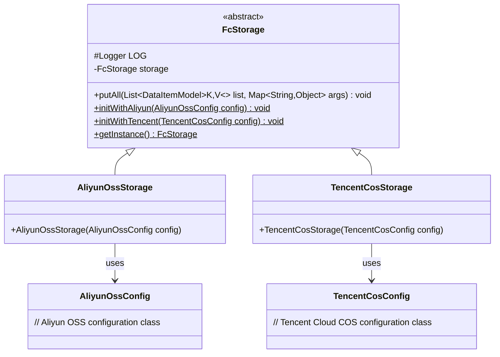
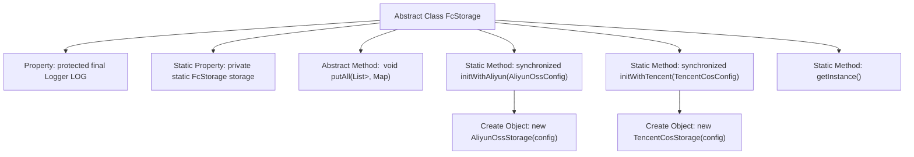

# Basic Information

|      |      |
|------|------|
| Name | FcStorage |
| Language | .java |
| Code Path | WeFe/common/java/common-data-storage/src/main/java/com/welab/wefe/common/data/storage/service/fc/FcStorage.java |
| Package Name | com.welab.wefe.common.data.storage.service.fc |
| Dependencies | ['com.welab.wefe.common.data.storage.model.DataItemModel', 'com.welab.wefe.common.data.storage.service.fc.aliyun.AliyunOssConfig', 'com.welab.wefe.common.data.storage.service.fc.aliyun.AliyunOssStorage', 'com.welab.wefe.common.data.storage.service.fc.tencent.TencentCosConfig', 'com.welab.wefe.common.data.storage.service.fc.tencent.TencentCosStorage', 'org.slf4j.Logger', 'org.slf4j.LoggerFactory', 'java.util.List', 'java.util.Map'] |
| Brief Description | The abstract class FcStorage provides storage functionality, supports initialization with Alibaba Cloud and Tencent Cloud configurations, obtains instances through static methods, and includes an abstract method for batch data writing. |

# Description

This is an abstract class named FcStorage, designed to implement storage functionality. The class contains a protected logger object and a static FcStorage instance. It provides two static synchronized methods, initWithAliyun and initWithTencent, for initializing storage configurations for Alibaba Cloud OSS and Tencent Cloud COS respectively, and creating corresponding storage instances. A getInstance method is also provided to retrieve the current storage instance. The abstract method putAll is used for batch data storage, accepting a list of data items and a parameter dictionary, and may throw exceptions. The class is designed as a singleton pattern, allowing instance updates through reinitialization when configurations change.

# Class Summary

| Name   | Type  | Description |
|-------|------|-------------|
| FcStorage | class | The abstract class FcStorage provides storage operations, supports initialization with Alibaba Cloud and Tencent Cloud configurations, and obtains instances via getInstance. It includes the putAll method and logging functionality. |

## Class FcStorage

|      |      |
|------|------|
| Access Modifier | public abstract |
| Type | class |
| Name | FcStorage |
| Description | The abstract class FcStorage provides storage operations, supports initialization with Alibaba Cloud and Tencent Cloud configurations, and obtains instances via getInstance. It includes the putAll method and logging functionality. |

### UML Class Diagram

This code demonstrates a class diagram structure featuring the abstract class FcStorage and its two concrete implementations: AliyunOssStorage and TencentCosStorage. As the base class, FcStorage defines a logger, static storage instance, and core abstract method putAll, while providing three static methods for initialization and instance retrieval. The two subclasses correspond to Alibaba Cloud OSS and Tencent Cloud COS storage implementations respectively, initialized through different configuration classes. This design achieves storage functionality abstraction and multi-platform support, managing a singleton instance via static factory methods.

### Internal Method Call Graph

This code defines an abstract class FcStorage, which includes a logger, a static storage instance, and three key methods. The two static initialization methods (initWithAliyun and initWithTencent) are used to create different cloud storage implementations (Aliyun OSS or Tencent COS), with synchronization ensuring thread safety. The getInstance method provides a global access point, while putAll is an abstract batch storage method to be implemented by subclasses. This design enables configurable switching of storage backends and follows the singleton access pattern.

### Field List

| Name  | Type  | Description |
|-------|-------|------|
| LOG = LoggerFactory.getLogger(this.getClass()) | Logger | A protected final log object LOG is defined in the class for recording log information of the current class. |
| storage | FcStorage | Private static storage variable `storage`, of type `FcStorage`. |

### Method List

| Name  | Type  | Description |
|-------|-------|------|
| initWithAliyun | void | Synchronize static methods to initialize storage instances using Alibaba Cloud configurations. |
| initWithTencent | void | This is a synchronous static method used to initialize Tencent Cloud COS storage, which accepts configuration parameters and creates a storage instance. |
| putAll | void | Abstract method putAll, which accepts a generic list of DataItemModel and a Map parameter, may throw exceptions. |
| getInstance | FcStorage | This is a static method that returns the singleton object storage. |

