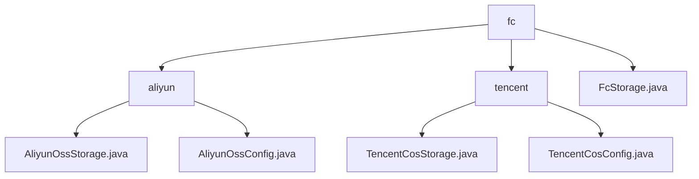

# Basic Information

|      |      |
|------|------|
| Name | fc |
| Language | .java |
| Code Path | WeFe/common/java/common-data-storage/src/main/java/com/welab/wefe/common/data/storage/service/fc |
| Package Name | docs.common.java.common-data-storage.src.main.java.com.welab.wefe.common.data.storage.service.fc |
| Brief Description | The module implements efficient data storage for Alibaba Cloud OSS/OTS and Tencent Cloud COS, supporting chunked uploads, multi-threaded processing, and fault tolerance mechanisms. It provides batch write interfaces such as `ossPutAll` and `cosPutAll`, which rely on the corresponding SDKs. A dynamic chunking strategy is adopted, such as file size and row count limits. It is suitable for big data asynchronous storage scenarios, supporting configuration management and callback handling. The `FcStorage` abstract class provides a singleton initialization method. |

# Description

## Overview  
The core responsibility of this module is to enable efficient data storage across multiple cloud platforms (Alibaba Cloud OSS/OTS, Tencent Cloud COS), supporting batch writing, dynamic sharding, and fault tolerance. The interface specification is unified as the `putAll` method (abstracted from the `FcStorage` class), with implementations including Alibaba Cloud's `ossPutAll`/`otsPutAll` and Tencent Cloud's `cosPutAll`, all of which support multi-threaded uploads, hash partitioning, and callback mechanisms. Key data structures are aggregated into sharding strategies (e.g., Alibaba Cloud's row limit, Tencent Cloud's 4MB file limit) and configuration parameters (e.g., storage buckets, key management). External dependencies include Alibaba Cloud OSS/OTS SDK, Tencent Cloud COS SDK, and the Pickler serialization tool. For example, `AliyunOssConfig` automatically generates Endpoint URLs, while `TencentCosConfig` manages partitioning rules.  

## Key Business Scenarios  
The module is suitable for cross-cloud big data asynchronous storage scenarios, adopting a shard upload bus-like pattern. A typical workflow includes: configuration initialization (e.g., singleton `FcStorage`) → data sharding (by row count/file size) → multi-threaded upload (e.g., Alibaba Cloud dynamic sharding, Tencent Cloud SHA1 hashing) → callback processing. For instance, Alibaba Cloud calculates OTS partitions via `hashKeyToPartition`, while Tencent Cloud restricts single files to no more than 4MB. Integration cases cover the entire lifecycle, from `initWithAliyun`/`initWithTencent` initialization to `SampleCallback` result processing, forming an end-to-end multi-cloud adaptation solution.

### Package Internal Structure View

This flowchart illustrates the hierarchical relationship between configuration and implementation classes of different cloud service providers (Alibaba Cloud and Tencent Cloud) in a file storage service. The root node `fc` contains two subdirectories, `aliyun` and `tencent`, corresponding to the storage implementation classes of the two cloud providers, respectively. Additionally, the `fc` directory includes a generic `FcStorage.java` file. Each cloud provider directory contains both a storage implementation class and a configuration class, forming a clear tree-like structure.

# File List

| Name   | Type  | Description |
|-------|------|-------------|
| [FcStorage.java](FcStorage.md) | file | The abstract class FcStorage provides storage functionality, supports initialization with Alibaba Cloud and Tencent Cloud configurations, obtains instances through static methods, and includes an abstract method for batch data writing. |
| [tencent](tencent/_module.md) | package | The `TencentCosStorage` class inherits from `FcStorage` and implements batch data storage for Tencent Cloud COS, supporting sharding, multi-threaded uploads, and hash partitioning. The `TencentCosConfig` class manages COS authentication configurations, including keys, bucket names, and regions. |
| [aliyun](aliyun/_module.md) | package | The `AliyunOssStorage` class inherits from `FcStorage` and implements data storage for Alibaba Cloud OSS and OTS, including sharding configuration and batch storage methods `ossPutAll` and `otsPutAll`. The `AliyunOssConfig` class manages OSS configurations, containing parameters such as access keys and bucket names, with its constructor automatically generating internal endpoint URLs. |

