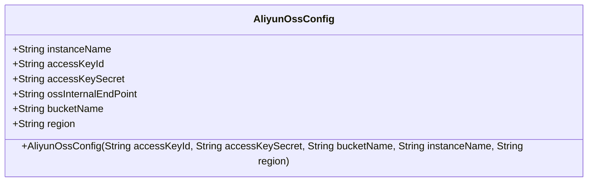

# Basic Information

|      |      |
|------|------|
| Name | AliyunOssConfig |
| Language | .java |
| Code Path | WeFe/common/java/common-data-storage/src/main/java/com/welab/wefe/common/data/storage/service/fc/aliyun/AliyunOssConfig.java |
| Package Name | com.welab.wefe.common.data.storage.service.fc.aliyun |
| Dependencies | ['org.springframework.util.Assert'] |
| Brief Description | Aliyun OSS configuration class, containing fields such as instance name, access key, bucket name, region, etc. The constructor validates non-null values and generates an internal endpoint URL. |

# Description

The content describes a Java class named AliyunOssConfig, which is used to configure Alibaba Cloud Object Storage Service. The class contains six member variables: instanceName, accessKeyId, accessKeySecret, ossInternalEndPoint, bucketName, and region. The constructor takes five parameters (accessKeyId, accessKeySecret, bucketName, instanceName, and region) and performs non-null validation on these parameters. Inside the constructor, the ossInternalEndPoint URL is automatically generated based on the region. This class is primarily used to store and manage configuration information for Alibaba Cloud OSS.

# Class Summary

| Name   | Type  | Description |
|-------|------|-------------|
| AliyunOssConfig | class | Aliyun OSS Configuration Class, containing fields such as instance name, access key, bucket name, region, etc. The constructor validates non-null values and generates an internal endpoint URL. |

## Class AliyunOssConfig

|      |      |
|------|------|
| Access Modifier | public |
| Type | class |
| Name | AliyunOssConfig |
| Description | Aliyun OSS Configuration Class, containing fields such as instance name, access key, bucket name, region, etc. The constructor validates non-null values and generates an internal endpoint URL. |

### UML Class Diagram

This code defines an Alibaba Cloud OSS configuration class, which includes public fields such as instance name, access key ID, access key secret, OSS internal endpoint, bucket name, and region. The constructor initializes these fields through parameters, performs non-null validation on key parameters, and automatically generates the OSS internal endpoint URL. This class is primarily used to store and manage configuration information related to Alibaba Cloud Object Storage Service (OSS), ensuring that necessary parameters are correctly set upon creation.

### Internal Method Call Graph

```mermaid
graph TD
    A["Class AliyunOssConfig"]
    B["Property: String instanceName"]
    C["Property: String accessKeyId"]
    D["Property: String accessKeySecret"]
    E["Property: String ossInternalEndPoint"]
    F["Property: String bucketName"]
    G["Property: String region"]
    H["Constructor: AliyunOssConfig(...)"]
    I["Assertion: Assert.notNull(accessKeyId)"]
    J["Assertion: Assert.notNull(accessKeySecret)"]
    K["Assertion: Assert.notNull(bucketName)"]
    L["Assertion: Assert.notNull(instanceName)"]
    M["Assertion: Assert.notNull(region)"]
    N["Assignment: this.accessKeyId = accessKeyId"]
    O["Assignment: this.accessKeySecret = accessKeySecret"]
    P["Assignment: this.bucketName = bucketName"]
    Q["Assignment: this.region = region"]
    R["Assignment: this.instanceName = instanceName"]
    S["Construct endPoint: 'https://oss-' + region + '-internal.aliyuncs.com'"]

    A --> B
    A --> C
    A --> D
    A --> E
    A --> F
    A --> G
    A --> H
    H --> I
    H --> J
    H --> K
    H --> L
    H --> M
    H --> N
    H --> O
    H --> P
    H --> Q
    H --> R
    H --> S
```

This flowchart illustrates the structure of the AliyunOssConfig class and its constructor logic. The class contains 6 string properties. The constructor accepts 5 parameters, performs null checks, then completes property assignments and automatically generates the ossInternalEndPoint. The process clearly demonstrates the complete workflow from parameter validation to property initialization, with particular emphasis on the dynamic concatenation logic for Alibaba Cloud OSS internal endpoint URLs.

### Field List

| Name  | Type  | Description |
|-------|-------|------|
| bucketName | String | Declare a public string variable bucketName. |
| ossInternalEndPoint | String | Declare a public string variable ossInternalEndPoint to store the OSS internal endpoint address. |
| accessKeyId | String | Defined a public string variable accessKeyId. |
| accessKeySecret | String | Declared a public string variable accessKeySecret. |
| instanceName | String | Declare a public string variable instanceName. |
| region | String | Declare a public string variable region. |

### Method List

| Name  | Type  | Description |
|-------|-------|------|

