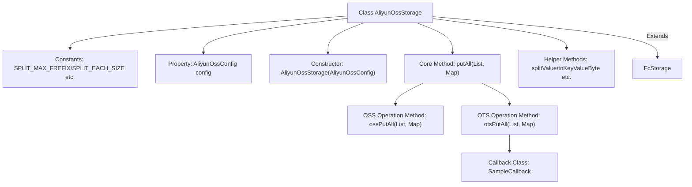
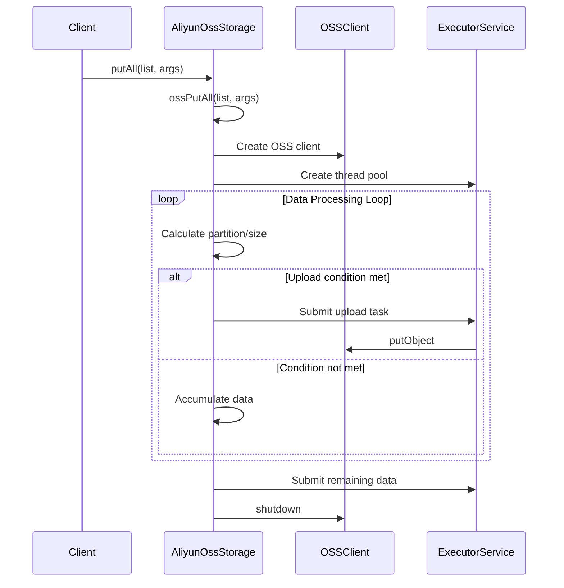

# Basic Information

|      |      |
|------|------|
| Name | AliyunOssStorage |
| Language | .java |
| Code Path | WeFe/common/java/common-data-storage/src/main/java/com/welab/wefe/common/data/storage/service/fc/aliyun/AliyunOssStorage.java |
| Package Name | com.welab.wefe.common.data.storage.service.fc.aliyun |
| Dependencies | ['com.alicloud.openservices.tablestore', 'com.alicloud.openservices.tablestore.model', 'com.alicloud.openservices.tablestore.writer.WriterConfig', 'com.aliyun.oss.ClientBuilderConfiguration', 'com.aliyun.oss.OSS', 'com.aliyun.oss.OSSClientBuilder', 'com.google.protobuf.ByteString', 'com.welab.wefe.common.data.storage.common.IntermediateDataFlag', 'com.welab.wefe.common.data.storage.model.DataItemModel', 'com.welab.wefe.common.data.storage.service.fc.FcStorage', 'com.welab.wefe.common.proto.IntermediateDataOuterClass', 'net.razorvine.pickle.Pickler', 'org.apache.commons.codec.digest.DigestUtils', 'org.apache.commons.lang.ArrayUtils', 'java.io.ByteArrayInputStream', 'java.io.IOException', 'java.math.BigDecimal', 'java.math.BigInteger', 'java.nio.charset.StandardCharsets', 'java.security.MessageDigest', 'java.util', 'java.util.concurrent', 'java.util.concurrent.atomic.AtomicLong'] |
| Brief Description | Alibaba Cloud OSS storage class supports sharded data storage, with a maximum single file size of 4MB, 500-1000 rows, multi-threaded uploads, and includes OTS table storage functionality. |

# Description

The AliyunOssStorage class inherits from FcStorage and is used to implement data storage functionality for Alibaba Cloud OSS and OTS. This class includes configuration parameters for OSS and OTS, such as chunk size, maximum file line limits, etc. The main methods include ossPutAll and otsPutAll, which are used for batch data storage to OSS and OTS, respectively. The ossPutAll method uploads data via multi-threading, dynamically splitting chunks based on file size and line limits, and generates unique filenames. The otsPutAll method writes chunked data to OTS tables, supporting retry policies and callback handling. The class also includes helper methods such as splitValue for data chunking, hashKeyToPartition for partition calculation, and an internal callback class SampleCallback for processing OTS write results. Overall, it implements an efficient and reliable large-scale data storage solution.

# Class Summary

| Name   | Type  | Description |
|-------|------|-------------|
| AliyunOssStorage | class | Alibaba Cloud OSS Storage Class, inherits from FcStorage, supports data sharding storage with a maximum of 4MB per file and a minimum of 500 to a maximum of 1000 rows of data. It provides multi-threaded upload and OTS table storage functionalities, including data sharding, hash partitioning, and callback processing. |

## Class AliyunOssStorage

|      |      |
|------|------|
| Access Modifier | public |
| Type | class |
| Name | AliyunOssStorage |
| Description | Alibaba Cloud OSS Storage Class, inherits from FcStorage, supports data sharding storage with a maximum of 4MB per file and a minimum of 500 to a maximum of 1000 rows of data. It provides multi-threaded upload and OTS table storage functionalities, including data sharding, hash partitioning, and callback processing. |

### UML Class Diagram

```mermaid
classDiagram
    class FcStorage {
        <<abstract>>
    }

    class AliyunOssStorage {
        -String SPLIT_MAX_FREFIX
        -int SPLIT_EACH_SIZE
        -int OBJECT_MAX_DATA_COUNT
        -int OBJECT_MIN_DATA_COUNT
        -int OBJECT_FILE_MAX_SIZE
        -AliyunOssConfig config
        +AliyunOssStorage(AliyunOssConfig config)
        +~K,V~ void putAll(List~DataItemModel~K,V~~ list, Map~String,Object~ args)
        -~K,V~ void ossPutAll(List~DataItemModel~K,V~~ list, Map~String,Object~ args)
        -~K,V~ void otsPutAll(List~DataItemModel~K,V~~ list, Map~String,Object~ args)
        +List~byte[]~ splitValue(byte[] vBytes)
        -~K,V~ void ossPutAll(List~DataItemModel~K,V~~ list, String bucketName, String namespace, String name, Integer partitions, OSS ossClient)
        +static String getOssFileName(String namespace, String name, Integer partition, int fileCount)
        +static byte[] toKeyValueByte(byte[] key, byte[] value)
        -~K,V~ void otsPutAll(List~DataItemModel~K,V~~ list, String namespace, String name, Integer partitions, TableStoreWriter tablestoreWriter)
        +static int hashKeyToPartition(byte[] key, int partitions)
        +static BigInteger byteArrayToInt(byte[] array)
    }

    class AliyunOssConfig {
        +String ossInternalEndPoint
        +String accessKeyId
        +String accessKeySecret
        +String bucketName
        +String instanceName
    }

    class DataItemModel~K, V~ {
        +K getK()
        +V getV()
    }

    class IntermediateDataOuterClass {
        <<inner>>
    }

    class OSS {
        <<Interface>>
        +void putObject(String bucketName, String objectName, InputStream input)
        +void shutdown()
    }

    class OSSClientBuilder {
        +OSS build(String endpoint, String accessKeyId, String accessKeySecret, ClientBuilderConfiguration conf)
    }

    class ClientBuilderConfiguration {
        +void setMaxErrorRetry(int maxErrorRetry)
    }

    class AsyncClient {
        +AsyncClient(String endpoint, String accessKeyId, String accessKeySecret, String instanceName, ClientConfiguration cc)
    }

    class TableStoreWriter {
        <<Interface>>
        +void addRowChange(RowChange rowChange)
        +void flush()
        +void close()
    }

    class DefaultTableStoreWriter {
        +DefaultTableStoreWriter(AsyncClient asyncClient, String dstNamespace, WriterConfig config, TableStoreCallback callback, ExecutorService executor)
    }

    class SampleCallback {
        -AtomicLong succeedCount
        -AtomicLong failedCount
        +void onCompleted(RowChange req, ConsumedCapacity res)
        +void onFailed(RowChange req, Exception ex)
    }

    AliyunOssStorage --|> FcStorage : Inheritance
    AliyunOssStorage --> AliyunOssConfig : Uses
    AliyunOssStorage --> DataItemModel : Processes
    AliyunOssStorage --> OSS : Invokes
    AliyunOssStorage --> OSSClientBuilder : Creates
    AliyunOssStorage --> AsyncClient : Uses
    AliyunOssStorage --> TableStoreWriter : Uses
    AliyunOssStorage --> SampleCallback : Uses
    OSSClientBuilder --> ClientBuilderConfiguration : Configures
    DefaultTableStoreWriter --|> TableStoreWriter : Implements
    SampleCallback ..|> TableStoreCallback : Implements
```

This code demonstrates an Aliyun OSS storage implementation class AliyunOssStorage, which inherits from the abstract class FcStorage. Its main functionalities include data sharding processing and batch uploading to OSS or OTS (Table Store), featuring robust error handling mechanisms and concurrency control. The class structure comprises configuration classes, client builders, callback handlers, and other components, achieving efficient parallel uploading through thread pools. It supports features like data sharding, hash partitioning, and size control, making it suitable for large-scale data storage scenarios. Key methods include splitValue for data sharding, ossPutAll/otsPutAll for batch uploading, and hashKeyToPartition for partition calculation.

### Internal Method Call Graph

This code implements an Alibaba Cloud OSS storage service class with main functionalities including: 1) Data chunking processing via the splitValue method; 2) Multi-threaded batch uploading triggered automatically based on data volume; 3) Support for two storage modes (OSS object storage and OTS table storage); 4) Comprehensive partition calculation, retry mechanism, and callback handling. The flowchart illustrates the class structure and main method invocation relationships, while the sequence diagram details the core data upload process including client calls, OSS connection establishment, and multi-threaded task submission.

### Field List

| Name  | Type  | Description |
|-------|-------|------|
| config | AliyunOssConfig | The private variable `config`, of type `AliyunOssConfig`. |
| SPLIT_EACH_SIZE = 1024 * 1024 | int | Define the constant SPLIT_EACH_SIZE as 1MB in size. |
| OBJECT_MAX_DATA_COUNT = 1000 | int | Private static constant, the maximum data volume for an object is 1000. |
| SPLIT_MAX_FREFIX = "MAX_" | String | Define a static constant string SPLIT_MAX_FREFIX with the value "MAX_". |
| OBJECT_MIN_DATA_COUNT = 500 | int | The static constant OBJECT_MIN_DATA_COUNT defines the minimum data volume as 500. |
| OBJECT_FILE_MAX_SIZE = 1024 * 1024 * 4 | int | Define a private static constant to limit the maximum size of object files to 4MB. |

### Method List

| Name  | Type  | Description |
|-------|-------|------|
| getOssFileName | String | Generate OSS file names in the format: namespace/name/partition/UUID_fileCount. |
| toKeyValueByte | byte[] | Concatenate the key and value into a byte array, adding line breaks in between and at the end. |
| putAll | void | The Java method `putAll` accepts a list of data items and a parameter map, invokes `ossPutAll` to handle batch storage operations, and may throw exceptions. |
| ossPutAll | void | The method `ossPutAll` stores data into OSS by partitions, utilizing multi-threaded batch uploads. It triggers an upload when either the size or row count condition is met, then processes the remaining data and cleans up resources. |
| otsPutAll | void | The method `otsPutAll` performs batch data writing to an OTS table, with configurations including connection parameters, retry policies, batch size, concurrency settings, etc. It utilizes an asynchronous client and thread pool for processing, while tracking success and failure counts. |
| splitValue | List<byte[]> | Split the byte array into a list according to the specified size, handling the remaining part separately, and return the list of split byte arrays. |
| ossPutAll | void | The method `ossPutAll` receives a data list and parameters, extracts the target namespace, name, and number of partitions from the parameters, configures the OSS client, sets the retry count to 5, and finally calls the method of the same name to process the data. |
| otsPutAll | void | The method `otsPutAll` batch writes a list of data items into TableStore. For each data item, it serializes the key-value pairs, distributes them by partition hash, splits large values, and writes them in batches. Finally, it flushes and closes the writer. |
| hashKeyToPartition | int | This method maps byte array keys to specified partitions through SHA1 hashing and complex computations. It first verifies that the partition count is a positive number, then generates the partition index based on large-number arithmetic and bitwise operations to ensure uniform distribution. |
| byteArrayToInt | BigInteger | Convert a byte array to a big integer by first copying the array and reversing the byte order (big-endian to little-endian), then generating an unsigned big integer. |

