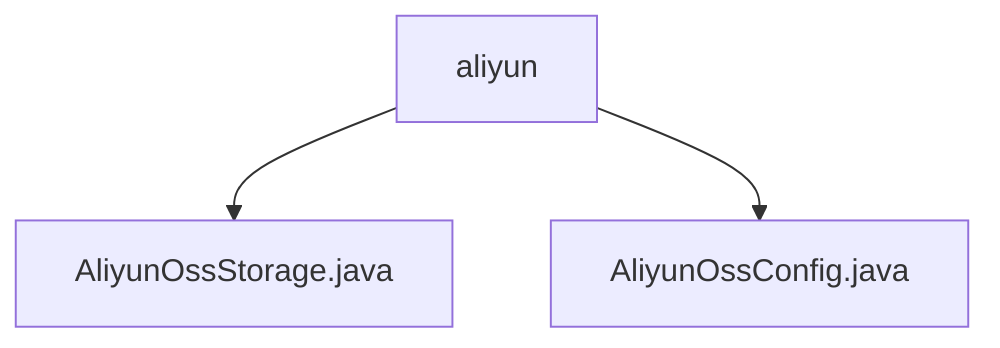

# Basic Information

|      |      |
|------|------|
| Name | aliyun |
| Language | .java |
| Code Path | WeFe/common/java/common-data-storage/src/main/java/com/welab/wefe/common/data/storage/service/fc/aliyun |
| Package Name | docs.common.java.common-data-storage.src.main.java.com.welab.wefe.common.data.storage.service.fc.aliyun |
| Brief Description | The `AliyunOssStorage` class inherits from `FcStorage` and implements data storage for Alibaba Cloud OSS and OTS, including sharding configuration and batch storage methods `ossPutAll` and `otsPutAll`. The `AliyunOssConfig` class manages OSS configurations, containing parameters such as access keys and bucket names, with its constructor automatically generating internal endpoint URLs. |

# Description

## Overview  
The core responsibility of this module is to enable efficient data storage with Alibaba Cloud OSS and OTS, supporting batch writes, dynamic sharding, and fault tolerance. The interface specifications include `ossPutAll` (multi-threaded sharded upload to OSS) and `otsPutAll` (sharded writes to OTS tables), both featuring retry and callback mechanisms. Key data structures encompass OSS configuration parameters (e.g., `bucketName`, `region`) and OTS sharding strategies (e.g., shard size, row limits). External dependencies are limited to Alibaba Cloud OSS/OTS SDKs. For example, `AliyunOssConfig` automatically generates internal Endpoint URLs via its constructor.  

## Primary Business Scenarios  
The module is designed for asynchronous large-scale data storage scenarios, resembling an event bus pattern. A typical workflow involves: data sharding → multi-threaded upload → callback processing. For instance, `ossPutAll` dynamically shards files based on size, while `otsPutAll` calculates partitions via `hashKeyToPartition`. Integration examples include configuration management (e.g., non-null validation for `AliyunOssConfig`) and storage execution (e.g., `SampleCallback` handling OTS results), forming an end-to-end solution.

### Package Internal Structure View

This flowchart illustrates the relationship between two core configuration files of Alibaba Cloud's file storage service. The root node is the `aliyun` folder, which contains two implementation classes: `AliyunOssStorage.java` and `AliyunOssConfig.java`. These files handle OSS storage operations and configuration management, respectively. Together, they form the foundational functional modules of Alibaba Cloud's Object Storage Service (OSS), reflecting the design principle of separating storage service implementation from configuration.

# File List

| Name   | Type  | Description |
|-------|------|-------------|
| [AliyunOssStorage.java](AliyunOssStorage.md) | file | Alibaba Cloud OSS storage class supports data sharding storage, with a maximum single file size of 4MB, 500-1000 rows, multi-threaded upload, and includes OTS table storage functionality. |
| [AliyunOssConfig.java](AliyunOssConfig.md) | file | Aliyun OSS configuration class, containing fields such as instance name, access key, bucket name, region, etc. The constructor validates non-null values and generates an internal endpoint URL. |

