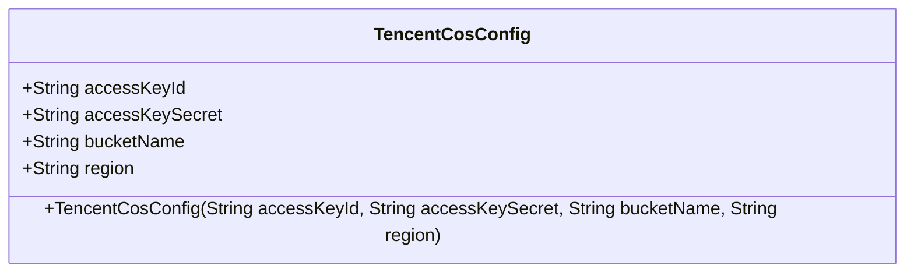
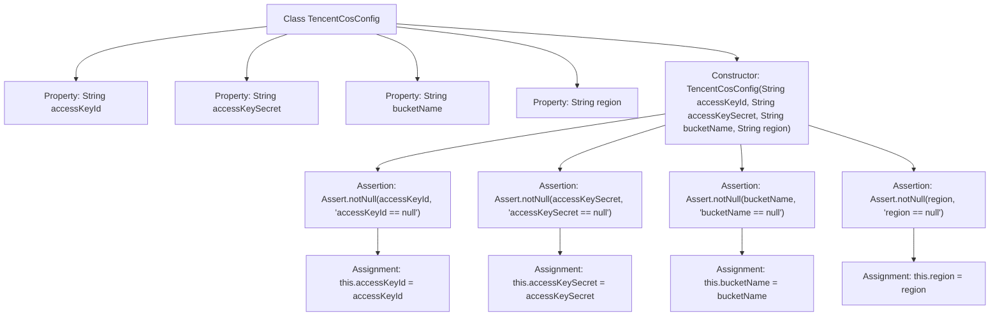

# Basic Information

|      |      |
|------|------|
| Name | TencentCosConfig |
| Language | .java |
| Code Path | WeFe/common/java/common-data-storage/src/main/java/com/welab/wefe/common/data/storage/service/fc/tencent/TencentCosConfig.java |
| Package Name | com.welab.wefe.common.data.storage.service.fc.tencent |
| Dependencies | ['org.springframework.util.Assert'] |
| Brief Description | Tencent Cloud COS configuration class, containing fields for Secret ID, Secret Key, bucket name, and region. Validates non-null values during construction and assigns them. |

# Description

This is a Tencent Cloud Object Storage configuration class containing four key fields: Access Key ID, Access Key, Bucket Name, and Region. The constructor receives these four parameters, performs non-null validation, and assigns them. The class is used to store and manage authentication and configuration information required for Tencent Cloud COS services.

# Class Summary

| Name   | Type  | Description |
|-------|------|-------------|
| TencentCosConfig | class | Tencent Cloud COS configuration class, containing fields for Secret ID, Secret Key, bucket name, and region. The constructor validates non-null values before assignment. |

## Class TencentCosConfig

|      |      |
|------|------|
| Access Modifier | public |
| Type | class |
| Name | TencentCosConfig |
| Description | Tencent Cloud COS configuration class, containing fields for Secret ID, Secret Key, bucket name, and region. The constructor validates non-null values before assignment. |

### UML Class Diagram

This code defines a class named TencentCosConfig, which is used to store configuration information for Tencent Cloud Object Storage (COS). The class contains four public string fields: accessKeyId (access key ID), accessKeySecret (access key), bucketName (bucket name), and region (region). The constructor takes these four parameters and assigns their values to the corresponding fields after ensuring they are not null via the Assert.notNull method. This class is primarily used to centrally manage the authentication and location information required for COS services, providing foundational configuration support for subsequent cloud storage operations.

### Internal Method Call Graph

This code defines a class named TencentCosConfig for storing configuration information of Tencent Cloud Object Storage (COS). The class contains four string properties: accessKeyId, accessKeySecret, bucketName, and region. The constructor accepts these four parameters, performs non-null validation using the Assert.notNull method to ensure all configuration items are not empty, and then assigns the parameter values to the corresponding member variables. The design of this class is primarily used to provide necessary configuration parameter validation and storage functionality when initializing the Tencent Cloud COS client.

### Field List

| Name  | Type  | Description |
|-------|-------|------|
| accessKeyId | String | Declare a public string variable accessKeyId. |
| accessKeySecret | String | Declared a public string variable named accessKeySecret. |
| bucketName | String | The public string variable bucketName is used for the bucket name. |
| region | String | Declare a public string variable region. |

### Method List

| Name  | Type  | Description |
|-------|-------|------|

