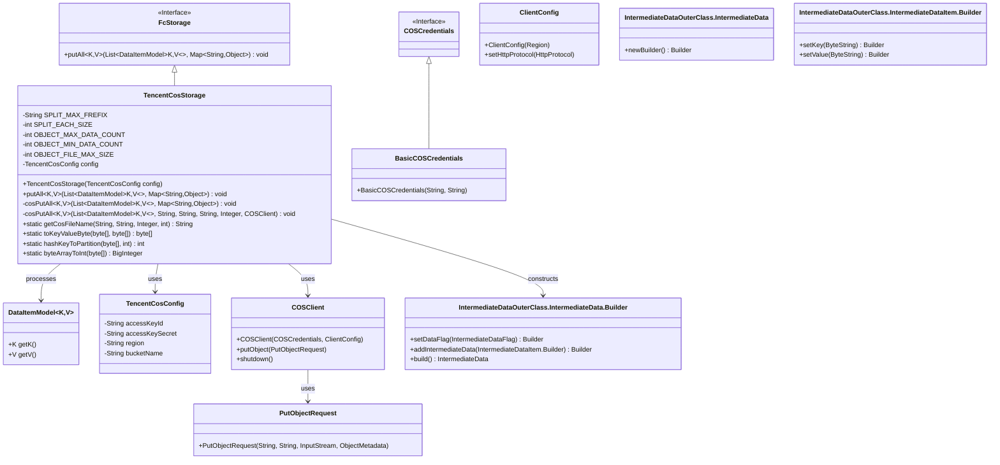
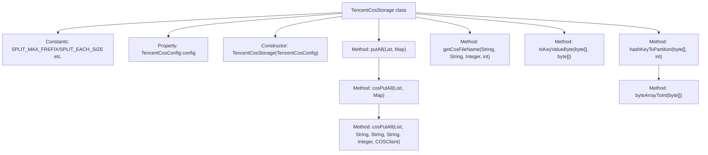
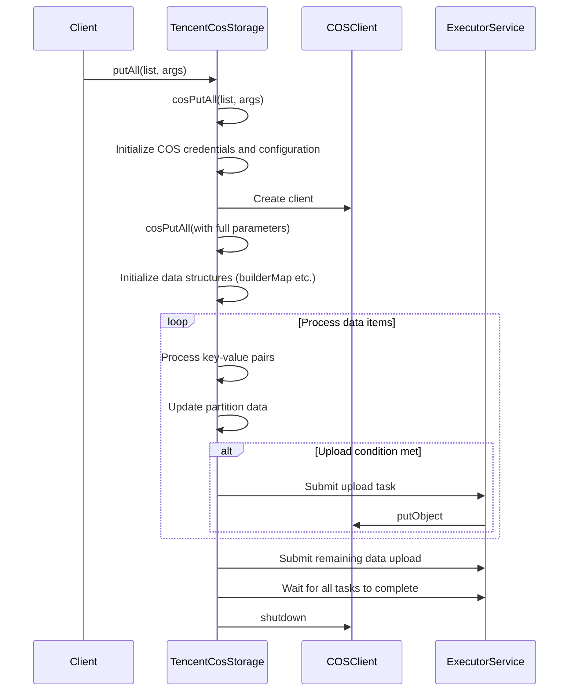

# Basic Information

|      |      |
|------|------|
| Name | TencentCosStorage |
| Language | .java |
| Code Path | WeFe/common/java/common-data-storage/src/main/java/com/welab/wefe/common/data/storage/service/fc/tencent/TencentCosStorage.java |
| Package Name | com.welab.wefe.common.data.storage.service.fc.tencent |
| Dependencies | ['com.google.protobuf.ByteString', 'com.qcloud.cos.COSClient', 'com.qcloud.cos.ClientConfig', 'com.qcloud.cos.auth.BasicCOSCredentials', 'com.qcloud.cos.auth.COSCredentials', 'com.qcloud.cos.http.HttpProtocol', 'com.qcloud.cos.model.ObjectMetadata', 'com.qcloud.cos.model.PutObjectRequest', 'com.qcloud.cos.region.Region', 'com.welab.wefe.common.data.storage.common.IntermediateDataFlag', 'com.welab.wefe.common.data.storage.model.DataItemModel', 'com.welab.wefe.common.data.storage.service.fc.FcStorage', 'com.welab.wefe.common.proto.IntermediateDataOuterClass', 'net.razorvine.pickle.Pickler', 'org.apache.commons.codec.digest.DigestUtils', 'org.apache.commons.lang.ArrayUtils', 'java.io.ByteArrayInputStream', 'java.math.BigDecimal', 'java.math.BigInteger', 'java.nio.charset.StandardCharsets', 'java.security.MessageDigest', 'java.util', 'java.util.concurrent'] |
| Brief Description | The TencentCosStorage class inherits from FcStorage and is used to upload data in batches to Tencent Cloud COS. It supports partition-based storage, with a maximum single file size of 4MB and a row limit of 500-1000. It utilizes multi-threaded uploading, including key configuration, data serialization, and hash partition logic. |

# Description

The `TencentCosStorage` class inherits from `FcStorage` and is designed for batch data storage to Tencent Cloud COS. Its core functionalities include initializing the COS client, data sharding, and multi-threaded uploads. The class defines constants such as file segmentation size, maximum/minimum row limits, and file size constraints. The `cosPutAll` method implements batch data processing, dynamically generating filenames and uploading based on partitions, row counts, and file sizes. Data serialization utilizes the Pickler tool, supporting key-value pair merging into byte arrays. A hash partitioning algorithm ensures even data distribution, implemented via SHA1 and specific mathematical computations. The upload process employs thread pools for performance optimization, enforcing file size limits (≤4MB) and row counts (500–1000). Finally, resources are cleaned up and the client is closed.

# Class Summary

| Name   | Type  | Description |
|-------|------|-------------|
| TencentCosStorage | class | The `TencentCosStorage` class inherits from `FcStorage` and is used to upload data in batches to Tencent Cloud COS. It supports multi-threaded uploads, with a maximum single file size of 4MB and a row limit of 500-1000. It includes features such as key configuration, partition calculation, and data serialization. |

## Class TencentCosStorage

|      |      |
|------|------|
| Access Modifier | public |
| Type | class |
| Name | TencentCosStorage |
| Description | The `TencentCosStorage` class inherits from `FcStorage` and is used to upload data in batches to Tencent Cloud COS. It supports multi-threaded uploads, with a maximum single file size of 4MB and a row limit of 500-1000. It includes features such as key configuration, partition calculation, and data serialization. |

### UML Class Diagram

This code describes a Tencent Cloud COS storage implementation class TencentCosStorage, which inherits from the FcStorage interface. Its main functionality is to upload data to Tencent Cloud COS storage service after partitioning. The class diagram shows the core classes and their relationships: TencentCosStorage interacts with Tencent Cloud through COSClient, uses IntermediateData.Builder to construct data, and relies on TencentCosConfig to obtain configuration information. The code implements complex logic such as data partitioning, serialization, and concurrent uploading, improving upload efficiency through thread pools while strictly controlling single file size and row count limits.

### Internal Method Call Graph

This code implements a batch data upload feature for Tencent Cloud COS storage service. The flowchart illustrates the class structure relationships, while the sequence diagram details the complete process from invoking the putAll method to final data upload. The code employs an intelligent sharding strategy to handle large-volume uploads, dynamically determining when to trigger uploads based on data size and row count, and utilizes a thread pool to parallelize data uploads across multiple partitions, ensuring efficient and reliable storage of data to the COS service.

### Field List

| Name  | Type  | Description |
|-------|-------|------|
| OBJECT_MIN_DATA_COUNT = 500 | int | private static final int MIN_DATA_OBJECTS = 500; |
| config | TencentCosConfig | Private Tencent Cloud COS configuration object. |
| SPLIT_EACH_SIZE = 1024 * 1024 | int | Define the constant SPLIT_EACH_SIZE with a value of 1MB (1048576 bytes). |
| SPLIT_MAX_FREFIX = "MAX_" | String | Define a static constant string SPLIT_MAX_FREFIX with the value "MAX_" for prefix identification. |
| OBJECT_MAX_DATA_COUNT = 1000 | int | The static constant OBJECT_MAX_DATA_COUNT defines the maximum data volume as 1000. |
| OBJECT_FILE_MAX_SIZE = 1024 * 1024 * 4 | int | Define private static constants to limit the maximum size of object files to 4MB. |

### Method List

| Name  | Type  | Description |
|-------|-------|------|
| cosPutAll | void | The method `cosPutAll` stores data by partitions and uploads them to COS in batches. It dynamically adjusts upload conditions based on data size and row count, utilizes multithreading to improve efficiency, and finally cleans up resources. |
| cosPutAll | void | The method `cosPutAll` receives a data list and parameters, initializes the Tencent Cloud COS client, sets the HTTPS protocol, and calls the method of the same name to handle data storage. Key parameters include namespace, function name, and partition count. |
| putAll | void | This method overrides the parent class method, accepts a list of data items and a parameter map, invokes cosPutAll to handle batch insertion operations, and may throw exceptions. |
| getCosFileName | String | Generate COS filename: namespace/name/partition/UUID_cnt file count |
| toKeyValueByte | byte[] | Concatenate the key and value into a byte array, adding line breaks in between and at the end. |
| hashKeyToPartition | int | The static method `hashKeyToPartition` maps a byte array `key` to a specified partition range `partitions` through SHA1 hashing and complex calculations. The partition count must be a positive number; otherwise, an exception will be thrown. |
| byteArrayToInt | BigInteger | This method converts a byte array into a big integer. First, it copies the array, reverses the byte order (big-endian to little-endian), and then uses the BigInteger constructor to generate an unsigned integer. |

