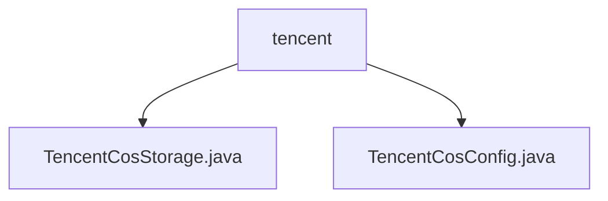

# Basic Information

|      |      |
|------|------|
| Name | tencent |
| Language | .java |
| Code Path | WeFe/common/java/common-data-storage/src/main/java/com/welab/wefe/common/data/storage/service/fc/tencent |
| Package Name | docs.common.java.common-data-storage.src.main.java.com.welab.wefe.common.data.storage.service.fc.tencent |
| Brief Description | The `TencentCosStorage` class inherits from `FcStorage` and implements batch data storage for Tencent Cloud COS, supporting sharding, multi-threaded uploads, and hash partitioning. The `TencentCosConfig` class manages COS authentication configurations, including keys, bucket names, and regions. |

# Description

## Overview  
The core responsibility of this module is to implement batch data storage for Tencent Cloud COS, supporting data sharding, multi-threaded uploads, and hash partitioning. Interface specifications include initializing the COS client, dynamic batch uploading (e.g., the `cosPutAll` method), and resource cleanup. Key data structures involve file segmentation size limits (4MB), row count ranges (500-1000), and serialized key-value pair byte arrays. External dependencies include the Tencent Cloud COS SDK and the Pickler serialization tool. For example, the SHA1 algorithm ensures even data distribution, while thread pools optimize upload performance.  

## Primary Business Scenarios  
The module handles large-scale data storage scenarios, similar to a sharded upload model: dynamically splitting data by row count and file size before parallel uploading to COS. Typical workflows include configuring authentication details (e.g., the `TencentCosConfig` class manages keys and buckets), data serialization, hash partitioning, and multi-threaded transfers. For instance, filenames are generated based on partitioning rules to ensure no single file exceeds 4MB or falls outside the 500-1000 row range. Integration examples demonstrate full lifecycle management, from configuration initialization to resource release.

### Package Internal Structure View

This flowchart illustrates the relationship between two core configuration files of the Tencent COS storage service. The root node "tencent" contains two Java class files: TencentCosStorage.java implements storage service functionality, while TencentCosConfig.java handles configuration management. Together, these two files form the foundational implementation modules of Tencent Cloud Object Storage service.

# File List

| Name   | Type  | Description |
|-------|------|-------------|
| [TencentCosStorage.java](TencentCosStorage.md) | file | The `TencentCosStorage` class inherits from `FcStorage` and is used to upload data in batches to Tencent Cloud COS. It supports partition-based storage, with a maximum single file size of 4MB and a row limit of 500-1000. It utilizes multi-threaded uploading, including key configuration, data serialization, and hash partitioning logic. |
| [TencentCosConfig.java](TencentCosConfig.md) | file | Tencent Cloud COS configuration class, containing fields for Secret ID, Secret Key, bucket name, and region. Validates non-null values during construction and assigns them. |

