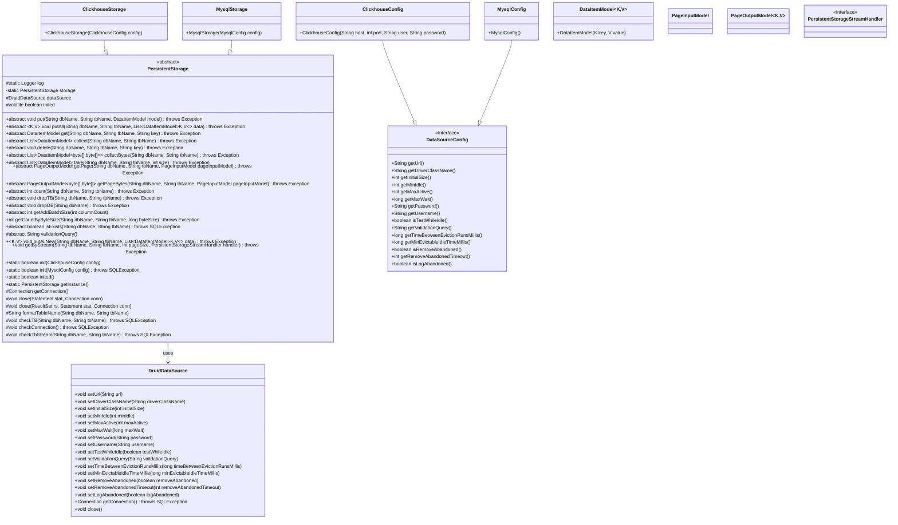

# Basic Information

|      |      |
|------|------|
| Name | PersistentStorage |
| Language | .java |
| Code Path | WeFe/common/java/common-data-storage/src/main/java/com/welab/wefe/common/data/storage/service/persistent/PersistentStorage.java |
| Package Name | com.welab.wefe.common.data.storage.service.persistent |
| Dependencies | ['com.alibaba.druid.pool.DruidDataSource', 'com.welab.wefe.common.data.storage.model.DataItemModel', 'com.welab.wefe.common.data.storage.model.PageInputModel', 'com.welab.wefe.common.data.storage.model.PageOutputModel', 'com.welab.wefe.common.data.storage.service.persistent.clickhouse.ClickhouseStorage', 'com.welab.wefe.common.data.storage.service.persistent.mysql.MysqlConfig', 'com.welab.wefe.common.data.storage.service.persistent.mysql.MysqlStorage', 'com.welab.wefe.common.wefe.dto.storage.ClickhouseConfig', 'com.welab.wefe.common.wefe.dto.storage.DataSourceConfig', 'org.slf4j.Logger', 'org.slf4j.LoggerFactory', 'java.sql', 'java.util.List'] |
| Brief Description | The abstract class `PersistentStorage` defines persistent storage operations, including methods for data addition, deletion, query, modification, paginated queries, and table/database management. It supports initialization for both ClickHouse and MySQL, utilizing the Druid connection pool to manage database connections. |

# Description

This is an abstract class named PersistentStorage, designed to implement persistent storage functionality. It includes multiple abstract methods such as CRUD operations (put, delete, get, collect, etc.), paginated queries (getPage), and table operations (dropTB, dropDB). The class provides a static initialization method supporting both Clickhouse and MySQL database configurations, utilizing the Druid connection pool for data source management. It contains auxiliary methods for connection management, resource release, and table checks, offering global access through a singleton pattern. The class primarily encapsulates basic database operations, supports batch processing and streaming queries, and features connection pool configuration and initialization state management capabilities.

# Class Summary

| Name   | Type  | Description |
|-------|------|-------------|
| PersistentStorage | class | The abstract class `PersistentStorage` defines persistent storage operations, including abstract methods for data insertion, deletion, query, update, paginated queries, and table/database management. It supports initialization for both ClickHouse and MySQL, utilizing the Druid connection pool to manage database connections. |

## Class PersistentStorage

|      |      |
|------|------|
| Access Modifier | public abstract |
| Type | class |
| Name | PersistentStorage |
| Description | The abstract class `PersistentStorage` defines persistent storage operations, including abstract methods for data insertion, deletion, query, update, paginated queries, and table/database management. It supports initialization for both ClickHouse and MySQL, utilizing the Druid connection pool to manage database connections. |

### UML Class Diagram

This code describes an abstract class `PersistentStorage` that defines the core interfaces and basic functionalities for persistent storage, including CRUD operations, paginated queries, and table management. The class has two concrete implementations, `ClickhouseStorage` and `MysqlStorage`, initialized via static factory methods. The class diagram illustrates its relationships with data source configurations, connection pools, and various data models, reflecting an abstract design for multi-database support. Core functionalities include connection management, table validation, resource release, and support for generic data type operations.

### Internal Method Call Graph

```mermaid
graph TD
    A["Abstract Class PersistentStorage"]
    B["Static Property: Logger log"]
    C["Static Property: PersistentStorage storage"]
    D["Instance Property: DruidDataSource dataSource"]
    E["Instance Property: boolean inited"]
    F["Constructor: protected PersistentStorage()"]
    G["Static Method: init(ClickhouseConfig)"]
    H["Static Method: init(MysqlConfig)"]
    I["Static Method: inited()"]
    J["Static Method: getInstance()"]
    K["Static Method: buildDruidDataSource()"]
    L["Instance Method: getConnection()"]
    M["Instance Method: close(Statement, Connection)"]
    N["Instance Method: close(ResultSet, Statement, Connection)"]
    O["Instance Method: formatTableName()"]
    P["Instance Method: checkTB()"]
    Q["Instance Method: checkConnection()"]
    R["Instance Method: checkTbStream()"]
    S["Abstract Method Section: put/putAll/get/collect etc. (12 total)"]

    A --> B
    A --> C
    A --> D
    A --> E
    A --> F
    A --> G
    A --> H
    A --> I
    A --> J
    A --> K
    A --> L
    A --> M
    A --> N
    A --> O
    A --> P
    A --> Q
    A --> R
    A -.-> S
    G --> K
    H --> K
    P --> L
    P --> M
    Q --> L
    Q --> M
    R --> L
    R --> M
```

This code defines an abstract class PersistentStorage, primarily used for database persistence operations. The class includes static initialization methods, connection pool management, resource release functions, and defines 12 abstract methods for specific storage operations. Key processes include: initializing different database configurations via init methods, managing database connections using connection pools, providing table checking and connection validation functions, and requiring subclasses to implement specific storage operations through the template method pattern. The class design adopts the singleton pattern and supports both Clickhouse and MySQL database implementations.

### Field List

| Name  | Type  | Description |
|-------|-------|------|
| inited = false | boolean | Declare a public volatile boolean variable inited with an initial value of false. |
| storage | PersistentStorage | Private static persistent storage object. |
| log = LoggerFactory.getLogger(PersistentStorage.class) | Logger | Initialization of persistent storage class logger. |
| dataSource | DruidDataSource | Declare a public variable named dataSource of type DruidDataSource. |

### Method List

| Name  | Type  | Description |
|-------|-------|------|
| inited | boolean | This method checks whether the storage has been initialized and returns a boolean value indicating the status. |
| main | void | Initialize a Java code connection to a ClickHouse database, store key-value pair data, and query to return a list. |
| collectBytes | List<DataItemModel<byte[], byte[]>> | Abstract method: Collects byte data, takes the database name and table name as parameters, returns a list of byte-type data items, and may throw exceptions. |
| take | List<DataItemModel> | Abstract method: Retrieves a specified number of data items from a designated database table, returns a list, and may throw exceptions. |
| getCountByByteSize | int | The method `getCountByByteSize` returns a fixed value of 1000 based on the database name, table name, and byte size, and may throw an exception. |
| getByStream | void | The method getByStream retrieves a data stream from a specified database table, with parameters including the database name, table name, page size, and stream processor, and may throw exceptions. |
| isExists | boolean | Check if a database table exists, with parameters being the database name and table name, returns a boolean value, and may throw an SQL exception. |
| getConnection | Connection | Methods for obtaining a database connection: attempt to acquire a connection from the data source, catch and log SQL exceptions, and finally return the connection object. |
| getPageBytes | PageOutputModel<byte[], byte[]> | Abstract method for retrieving paginated byte data: Inputs the database name, table name, and pagination parameters, returns a paginated result as a byte array, and may throw exceptions. |
| init | boolean | Synchronize static method to initialize MySQL storage, check configurations, and rebuild the data source, returning the initialization status. |
| formatTableName | String | This method is used to format database table names, returning a string in the format `database_name`.`table_name`. |
| count | int | Abstract method `count`, which takes a database name and a table name as input, returns an integer result, and may throw exceptions. |
| getPage | PageOutputModel | Retrieve the page data of a specified database table, with pagination parameters as input and a page model as output, which may throw exceptions. |
| init | boolean | Synchronize the static method `init` to initialize Clickhouse storage. Returns `true` if the configuration is successful, or `false` and logs an error message if it fails. |
| checkTB | void | The method `checkTB` is used to check and create a table with a structure containing the fields `eventDate`, `k`, `v`, and `id`. It uses the MergeTree engine, partitions by `eventDate`, and sorts by `id`, finally closing the connection. |
| collect | List<DataItemModel> | Abstract method `collect`, which takes a database name and table name as input, returns a list of `DataItemModel`, and may throw exceptions. |
| checkConnection | void | Check database connection validity: acquire connection, execute validation SQL, and finally close resources. |
| dropDB | void | Abstract method dropDB, which takes a database name parameter and may throw an exception. |
| validationQuery | String | Abstract method that returns the query string used for validation. |
| putAllNew | void | Java Method: Batch insert new data into a specified database table, with parameters including the database name, table name, and a list of data items. May throw exceptions. |
| getAddBatchSize | int | Abstract method that returns the batch addition size based on the number of columns. |
| getInstance | PersistentStorage | This is a static method that returns the singleton instance storage of the PersistentStorage class. |
| checkTbStream | void | Check and create the table if it does not exist, including the fields eventDate, k, v, using the MergeTree engine, partitioned by date, without sorting, and with an index granularity of 8192. |
| buildDruidDataSource | DruidDataSource | This method constructs a DruidDataSource instance based on the configuration, setting properties such as URL, driver, connection pool parameters, username and password, and connection validation. |
| close | void | Methods for closing database resources, which accept Statement and Connection objects as parameters and internally invoke overloaded methods to handle the closing operations. |
| put | void | Abstract method: Inserts a data model into the specified database table, may throw exceptions. |
| close | void | Method for closing database resources: Close ResultSet, Statement, and Connection in sequence, catch and log SQLException. |
| delete | void | Abstract method `delete`, used to remove data corresponding to the specified key in a given database and table, may throw exceptions. |
| putAll | void | Abstract method `putAll`: Writes key-value pair data in batches to the specified database table, with parameters including the database name, table name, and a list of data items. May throw exceptions. |
| dropTB | void | Abstract method `dropTB`, used to delete a specified table in a database, requires passing the database name and table name, and may throw an exception. |
| get | DataItemModel | Abstract method `get`, which retrieves a `DataItemModel` by `dbName`, `tbName`, and `key`, may throw exceptions. |

