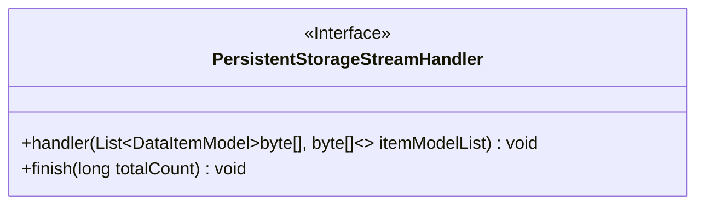
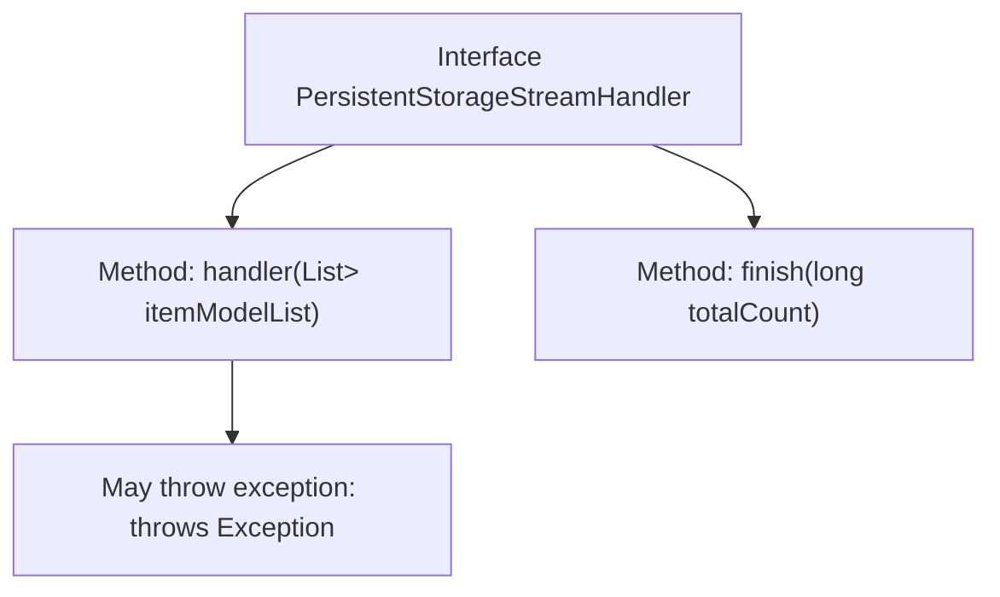

# Basic Information

|      |      |
|------|------|
| Name | PersistentStorageStreamHandler |
| Language | .java |
| Code Path | WeFe/common/java/common-data-storage/src/main/java/com/welab/wefe/common/data/storage/service/persistent/PersistentStorageStreamHandler.java |
| Package Name | com.welab.wefe.common.data.storage.service.persistent |
| Dependencies | ['com.welab.wefe.common.data.storage.model.DataItemModel', 'java.util.List'] |
| Brief Description | The interface PersistentStorageStreamHandler defines two methods: handler processes a list of data items and may throw exceptions, while finish notifies the total processed count upon completion. |

# Description

The interface defines a persistent storage stream processor, comprising two core methods. The handler method is responsible for processing a list of data items, with its parameter being a list of data models containing key-value pair byte arrays, and may throw exceptions. The finish method is invoked upon stream processing completion, accepting the total processed data volume as a parameter. This interface is suitable for scenarios requiring batch processing of binary data and progress tracking.

# Class Summary

| Name   | Type  | Description |
|-------|------|-------------|
| PersistentStorageStreamHandler | interface | Persistent storage stream processing interface, including methods for batch processing data items and callback methods upon completion. Processing may throw exceptions, and the total data volume is returned upon completion. |

## Class PersistentStorageStreamHandler

|      |      |
|------|------|
| Access Modifier | public |
| Type | interface |
| Name | PersistentStorageStreamHandler |
| Description | Persistent storage stream processing interface, including methods for batch processing data items and callback methods upon completion. Processing may throw exceptions, and the total data volume is returned upon completion. |

### UML Class Diagram

This code defines an interface named `PersistentStorageStreamHandler`, which includes two methods: `handler` for processing a list of data items (with generic type `DataItemModel<byte[], byte[]>`), potentially throwing exceptions; and `finish` for notifying the total processed count upon operation completion. This interface is suitable for scenarios requiring persistent storage and stream processing, emphasizing batch data handling and completion callback mechanisms.

### Internal Method Call Graph

This flowchart illustrates the structure of the PersistentStorageStreamHandler interface, which includes two core methods: handler for processing binary data model lists with potential exception throwing, and finish for notifying the total record count upon stream processing completion. Arrows clearly indicate the hierarchical relationship between the interface and its methods, with exception declaration separately listed as an additional attribute of the handler method.

### Field List

| Name  | Type  | Description |
|-------|-------|------|

### Method List

| Name  | Type  | Description |
|-------|-------|------|
| finish | void | The function `finish` accepts a long integer parameter `totalCount`, representing the total count upon completion. |
| handler | void | Methods for processing lists of byte array data items, which may throw exceptions. |

