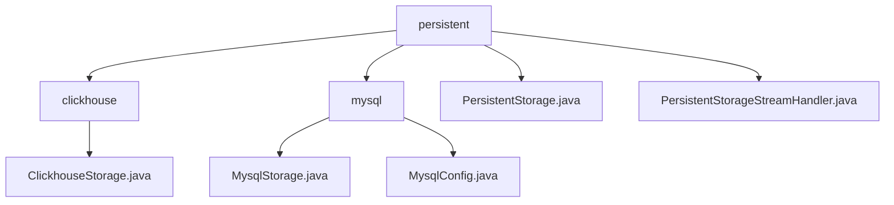

# Basic Information

|      |      |
|------|------|
| Name | persistent |
| Language | .java |
| Code Path | WeFe/common/java/common-data-storage/src/main/java/com/welab/wefe/common/data/storage/service/persistent |
| Package Name | docs.common.java.common-data-storage.src.main.java.com.welab.wefe.common.data.storage.service.persistent |
| Brief Description | ClickhouseStorage inherits from PersistentStorage, implementing CRUD, batch operations, paginated queries, and table management, with support for serialization and streaming. Similarly, MysqlStorage relies on JDBC to connect to MySQL. PersistentStorage serves as the abstract base class, encapsulating database operations and supporting both ClickHouse and MySQL. The PersistentStorageStreamHandler interface defines methods for batch data processing. |

# Description

## Overview  
The core responsibility of this module is to implement universal persistent storage across multiple databases (ClickHouse/MySQL), providing standard CRUD operations, batch processing, and table management functionalities. The interface specifications are unified into data operations (put/get/delete), batch processing (putAll/collect), paginated queries (getPage), and table maintenance (dropTB/dropDB), with support for byte stream processing (similar to an event bus pattern). Key data structures include ClickhouseConfig and MysqlConfig, which contain connection parameters and JDBC configurations. External dependencies include JDBC drivers for ClickHouse and MySQL, as well as the Druid connection pool. For example, ClickhouseStorage supports object serialization, while PersistentStorageStreamHandler implements binary stream processing.

## Primary Business Scenarios  
This module is suitable for heterogeneous database persistence scenarios, resembling an adapter pattern. Typical workflows include: configuring connections via *Config, inheriting PersistentStorage to implement specific storage (such as MySQL paginated queries or ClickHouse stream processing). Examples include using putAll for batch insertion or getByStream for handling large datasets. An integration case involves managing resources through the Druid connection pool, combining atomic operations with batch APIs. The interaction model is unified as configuration initialization + singleton access, supporting stream processors (e.g., PersistentStorageStreamHandler) to track processing progress.

### Package Internal Structure View

This flowchart illustrates the structural relationships within the persistence layer of the data storage service. The root node "persistent" contains two database-type subdirectories (clickhouse and mysql) along with two core class files. The clickhouse directory includes its dedicated storage implementation class, while the mysql directory comprises both storage implementation and configuration classes. The overall structure clearly reflects the hierarchical relationships between storage implementations for different database types and the core abstract classes.

# File List

| Name   | Type  | Description |
|-------|------|-------------|
| [mysql](mysql/_module.md) | package | The `MysqlStorage` class inherits from `PersistentStorage`, implementing CRUD operations, batch operations, paginated queries, and table management functionalities for MySQL databases. The `MysqlConfig` class inherits from `DataSourceConfig`, configuring MySQL connection parameters and constructing JDBC connection strings. |
| [PersistentStorage.java](PersistentStorage.md) | file | The abstract class `PersistentStorage` defines persistent storage operations, including methods for data insertion, deletion, querying, and modification, paginated queries, table and database management, etc. It supports initialization for both ClickHouse and MySQL, and uses the Druid connection pool to manage database connections. |
| [PersistentStorageStreamHandler.java](PersistentStorageStreamHandler.md) | file | The interface PersistentStorageStreamHandler defines two methods: handler processes a list of data items and may throw exceptions, while finish notifies the total processed count upon completion. |
| [clickhouse](clickhouse/_module.md) | package | The ClickhouseStorage class inherits from PersistentStorage and implements database operations such as CRUD, batch insertion, paginated queries, and streaming processing, supporting byte and object serialization. |

