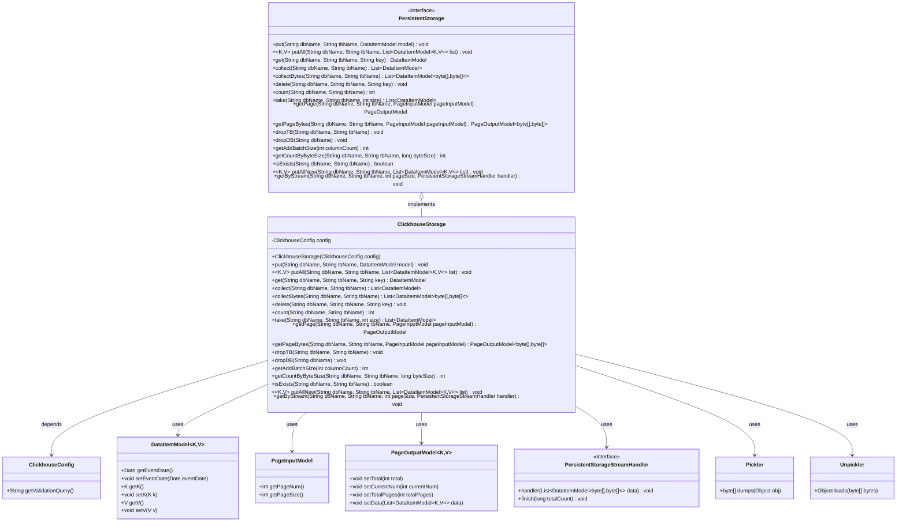
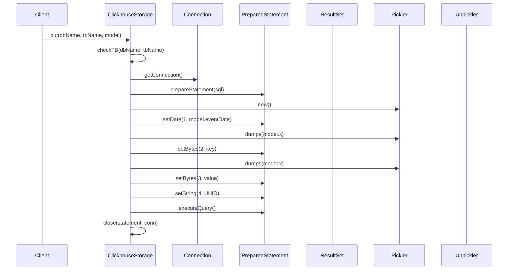

# Basic Information

|      |      |
|------|------|
| Name | ClickhouseStorage |
| Language | .java |
| Code Path | WeFe/common/java/common-data-storage/src/main/java/com/welab/wefe/common/data/storage/service/persistent/clickhouse/ClickhouseStorage.java |
| Package Name | com.welab.wefe.common.data.storage.service.persistent.clickhouse |
| Dependencies | ['com.welab.wefe.common.data.storage.model.DataItemModel', 'com.welab.wefe.common.data.storage.model.PageInputModel', 'com.welab.wefe.common.data.storage.model.PageOutputModel', 'com.welab.wefe.common.data.storage.service.persistent.PersistentStorage', 'com.welab.wefe.common.data.storage.service.persistent.PersistentStorageStreamHandler', 'com.welab.wefe.common.wefe.dto.storage.ClickhouseConfig', 'net.razorvine.pickle.Pickler', 'net.razorvine.pickle.Unpickler', 'java.math.BigDecimal', 'java.math.RoundingMode', 'java.sql', 'java.util.ArrayList', 'java.util.List', 'java.util.UUID'] |
| Brief Description | The ClickhouseStorage class inherits from PersistentStorage, implementing database operations such as CRUD, batch insertion, paginated queries, and stream processing, with support for byte and object serialization. |

# Description

The ClickhouseStorage class inherits from PersistentStorage and implements various database operation methods. Its primary functionalities include single data insertion (put), batch insertion (putAll), data query (get, collect), paginated query (getPage), data deletion (delete), table counting (count), table deletion (dropTB), and database deletion (dropDB). It supports byte array and object serialization processing, utilizing Pickler and Unpickler for data conversion. The class provides streaming query (getByStream) for handling large data volumes, supporting pagination and batch operations. It includes features such as table existence checking (isExists) and data volume calculation by byte size (getCountByByteSize). It connects to the ClickHouse database via JDBC and manages connection resources to ensure proper closure.

# Class Summary

| Name   | Type  | Description |
|-------|------|-------------|
| ClickhouseStorage | class | The ClickhouseStorage class inherits from PersistentStorage, providing CRUD operations for Clickhouse databases. It supports batch insertion, paginated queries, streaming reads, and other functionalities. |

## Class ClickhouseStorage

|      |      |
|------|------|
| Access Modifier | public |
| Type | class |
| Name | ClickhouseStorage |
| Description | The ClickhouseStorage class inherits from PersistentStorage, providing CRUD operations for Clickhouse databases. It supports batch insertion, paginated queries, streaming reads, and other functionalities. |

### UML Class Diagram

This class diagram illustrates the relationship between the ClickhouseStorage class and its related components. ClickhouseStorage inherits from the PersistentStorage interface, implementing CRUD operations, paginated queries, and batch processing for ClickHouse databases. It relies on ClickhouseConfig for configuration information, uses DataItemModel as a data carrier, performs serialization operations via Pickler/Unpickler, and supports pagination (PageInputModel/PageOutputModel) and streaming processing (PersistentStorageStreamHandler). The design demonstrates clear separation of responsibilities and modular thinking, with interface definitions standardizing behavioral contracts for storage operations.

### Internal Method Call Graph

```mermaid
graph TD
    A["Class ClickhouseStorage"]
    B["Attribute: ClickhouseConfig config"]
    C["Constructor: ClickhouseStorage(ClickhouseConfig config)"]
    D["Method: void put(String dbName, String tbName, DataItemModel model)"]
    E["Method: void putAll(String dbName, String tbName, List<DataItemModel> list)"]
    F["Method: DataItemModel get(String dbName, String tbName, String key)"]
    G["Method: List<DataItemModel> collect(String dbName, String tbName)"]
    H["Method: List<DataItemModel> collectBytes(String dbName, String tbName)"]
    I["Method: void delete(String dbName, String tbName, String key)"]
    J["Method: int count(String dbName, String tbName)"]
    K["Method: List<DataItemModel> take(String dbName, String tbName, int size)"]
    L["Method: PageOutputModel getPage(String dbName, String tbName, PageInputModel pageInputModel)"]
    M["Method: PageOutputModel getPageBytes(String dbName, String tbName, PageInputModel pageInputModel)"]
    N["Method: void dropTB(String dbName, String tbName)"]
    O["Method: void dropDB(String dbName)"]
    P["Method: int getAddBatchSize(int columnCount)"]
    Q["Method: int getCountByByteSize(String dbName, String tbName, long byteSize)"]
    R["Method: boolean isExists(String dbName, String tbName)"]
    S["Method: String validationQuery()"]
    T["Method: void putAllNew(String dbName, String tbName, List<DataItemModel> list)"]
    U["Method: void getByStream(String dbName, String tbName, int pageSize, PersistentStorageStreamHandler handler)"]

    A --> B
    A --> C
    A --> D
    A --> E
    A --> F
    A --> G
    A --> H
    A --> I
    A --> J
    A --> K
    A --> L
    A --> M
    A --> N
    A --> O
    A --> P
    A --> Q
    A --> R
    A --> S
    A --> T
    A --> U
```

This code implements the ClickhouseStorage class, which inherits from PersistentStorage and provides various operations for the ClickHouse database. The flowchart illustrates the main methods and attribute structure of the class, including core functionalities such as data insertion, querying, and deletion. The sequence diagram details the execution flow of the put method, covering the entire process from parameter validation to connection acquisition, SQL preparation, data serialization, query execution, and resource release. The class encapsulates JDBC operations for ClickHouse, offering advanced features like data serialization, batch processing, and paginated queries while ensuring proper resource deallocation.

### Field List

| Name  | Type  | Description |
|-------|-------|------|
| config | ClickhouseConfig | Private ClickHouse configuration object. |

### Method List

| Name  | Type  | Description |
|-------|-------|------|
| collect | List<DataItemModel> | The method queries data from the database in descending order by ID, parses it into a list of DataItemModel, and returns the result. It handles connection and resource closure. |
| count | int | This method is used to count the number of records in a specified database table by executing an SQL query to retrieve the result, and finally closing the relevant resources. |
| dropTB | void | This method is used to delete a specified table in the database by executing a DROP TABLE statement via a JDBC connection, then closing the connection upon completion. An Exception is thrown if an error occurs. |
| take | List<DataItemModel> | The method retrieves up to `size` pieces of data from the specified database table. If `size` is negative, it defaults to 0, and returns a list of data. |
| delete | void | The method connects to the database via JDBC, executes an SQL statement to delete the record with the specified key from the target table, serializes the key using Pickler, and finally closes the connection. Exceptions are handled by the caller. |
| getPage | PageOutputModel | This method queries database table data based on pagination parameters and returns paginated results. It first counts the total records, then performs a paginated query sorted by ID in descending order. After processing the result set, it sets the pagination information and returns the results. Finally, it closes the database connection. |
| put | void | This method inserts data into the specified database table, checks the table name, establishes a connection, executes the SQL insert operation, handles key-value serialization, generates a random ID, and finally closes the resources. |
| collectBytes | List<DataItemModel<byte[], byte[]>> | This method queries data from the specified database table and returns a list of DataItemModel objects containing byte array key-value pairs. It executes the SQL query via a JDBC connection, iterates through the result set to construct model objects, and finally closes the resources. Exceptions are handled by the caller. |
| dropDB | void | This method is used to delete a specified database by obtaining a connection, executing SQL statements, and releasing resources. Exceptions are thrown when errors occur to ensure proper resource deallocation. |
| get | DataItemModel | This method retrieves data items from a specified table through database queries, processes keys and values using Pickler, and returns a DataItemModel object containing date, key, and value. |
| getPageBytes | PageOutputModel<byte[], byte[]> | This method queries database table data based on pagination parameters and returns a paginated result containing the total record count, current page number, total page count, and data list. The data is stored in byte array format, and the database connection is closed after processing is completed. |
| putAll | void | This method is used to batch insert data into a specified database table, including steps such as checking the table, obtaining a connection, setting up a transaction, constructing SQL, serializing key-value pairs, executing batch processing, and committing the transaction, before finally closing the resources. |
| getAddBatchSize | int | The method calculates the batch size for data insertion based on the number of columns, using the formula of 150,000 divided by the column count. |
| getCountByByteSize | int | The method calculates the number of data entries based on byte size, queries the first record of the table to obtain the size of a single data entry, computes the optimal number of pages, and invokes the parent class method in case of exceptions. |
| isExists | boolean | This method checks whether the specified database and table exist by querying the number of active records in the system table system.parts. If the count is greater than 0, they exist. Finally, the connection is closed. |
| validationQuery | String | Rewrite the method to return the validation query statement from the configuration. |
| putAllNew | void | The method `putAllNew` performs batch insertion of data into a specified table. After verifying the table's existence, it establishes a connection, uses prepared statements to set dates and serialize key-value pairs, and finally commits the transaction and closes the resources. |
| getByStream | void | The method streams query results from a database table, processes data page by page, and invokes a callback function. It optimizes memory usage through pagination and releases resources upon completion. |

