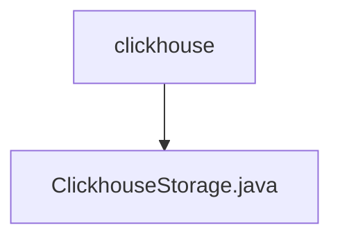

# Basic Information

|      |      |
|------|------|
| Name | clickhouse |
| Language | .java |
| Code Path | WeFe/common/java/common-data-storage/src/main/java/com/welab/wefe/common/data/storage/service/persistent/clickhouse |
| Package Name | docs.common.java.common-data-storage.src.main.java.com.welab.wefe.common.data.storage.service.persistent.clickhouse |
| Brief Description | The ClickhouseStorage class inherits from PersistentStorage and implements database operations such as CRUD, batch insertion, paginated queries, and streaming processing, supporting byte and object serialization. |

# Description

The ClickhouseStorage class inherits from PersistentStorage and implements various database operation methods. Its primary functionalities include single-record insertion (put), batch insertion (putAll), data query (get, collect), paginated query (getPage), data deletion (delete), table counting (count), table deletion (dropTB), and database deletion (dropDB). It supports byte array and object serialization processing, utilizing Pickler and Unpickler for data conversion. The class provides streaming query (getByStream) for handling large datasets, with support for pagination and batch operations. Additional features include table existence checks (isExists) and data volume calculation by byte size (getCountByByteSize). It connects to the ClickHouse database via JDBC and manages connection resources to ensure proper closure.

### Package Internal Structure View

This flowchart illustrates the hierarchical relationship between the clickhouse directory and the ClickhouseStorage.java file. As the parent directory, clickhouse contains a single child file, ClickhouseStorage.java, indicating a typical single-file storage structure often used for implementation classes of specific storage services. Such a concise hierarchy is common in data storage modules, facilitating maintenance and extensibility.

# File List

| Name   | Type  | Description |
|-------|------|-------------|
| [ClickhouseStorage.java](ClickhouseStorage.md) | file | The ClickhouseStorage class inherits from PersistentStorage, implementing database operations such as CRUD, batch insertion, paginated queries, and stream processing, while supporting byte and object serialization. |

