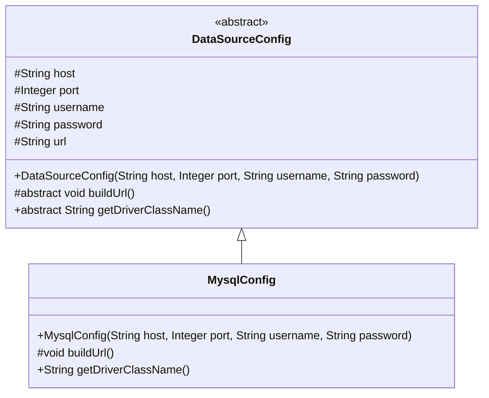
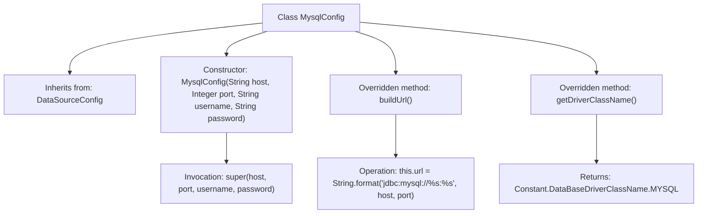

# Basic Information

|      |      |
|------|------|
| Name | MysqlConfig |
| Language | .java |
| Code Path | WeFe/common/java/common-data-storage/src/main/java/com/welab/wefe/common/data/storage/service/persistent/mysql/MysqlConfig.java |
| Package Name | com.welab.wefe.common.data.storage.service.persistent.mysql |
| Dependencies | ['com.welab.wefe.common.data.storage.common.Constant', 'com.welab.wefe.common.wefe.dto.storage.DataSourceConfig'] |
| Brief Description | MysqlConfig extends DataSourceConfig, initializes database connection parameters through the constructor, overrides buildUrl to generate the MySQL connection URL, and returns the MySQL driver class name. |

# Description

The MysqlConfig class inherits from DataSourceConfig and is used to configure MySQL database connections. The constructor accepts parameters for the host address, port number, username, and password, which are passed to the parent class. This class overrides the buildUrl method to construct the MySQL JDBC connection string in the format jdbc:mysql://host:port. It also overrides the getDriverClassName method, returning the constant for the MySQL driver class name.

# Class Summary

| Name   | Type  | Description |
|-------|------|-------------|
| MysqlConfig | class | MysqlConfig extends DataSourceConfig, initializes database connection parameters through the constructor, overrides buildUrl to generate a MySQL connection string, and returns the MySQL driver class name. |

## Class MysqlConfig

|      |      |
|------|------|
| Access Modifier | public |
| Type | class |
| Name | MysqlConfig |
| Description | MysqlConfig extends DataSourceConfig, initializes database connection parameters through the constructor, overrides buildUrl to generate a MySQL connection string, and returns the MySQL driver class name. |

### UML Class Diagram

This code demonstrates a MySQL database configuration class `MysqlConfig` inheriting from the abstract base class `DataSourceConfig`. The `DataSourceConfig` defines basic database connection parameters (host, port, etc.) and abstract methods, while `MysqlConfig` implements the specific MySQL connection URL construction and driver class name retrieval. The class diagram clearly illustrates this inheritance relationship, where the abstract class is marked with `<<abstract>>`, protected members are denoted with `#`, and it implements the template method pattern design structure.

### Internal Method Call Graph

This code demonstrates a MysqlConfig class that inherits from the DataSourceConfig class. Its core functionalities include: initializing database connection parameters through the constructor, overriding the buildUrl() method to construct a MySQL-specific JDBC connection string, and overriding the getDriverClassName() method to return the MySQL driver class name. The flowchart clearly illustrates the class inheritance relationship, method overriding logic, and key operational steps, showcasing the encapsulated implementation of MySQL database connection configuration.

### Field List

| Name  | Type  | Description |
|-------|-------|------|

### Method List

| Name  | Type  | Description |
|-------|-------|------|
| getDriverClassName | String | Rewrite the method to return the MySQL database driver class name. |
| buildUrl | void | Rewrite the method `buildUrl` to concatenate the MySQL database connection URL using `host` and `port`. |

