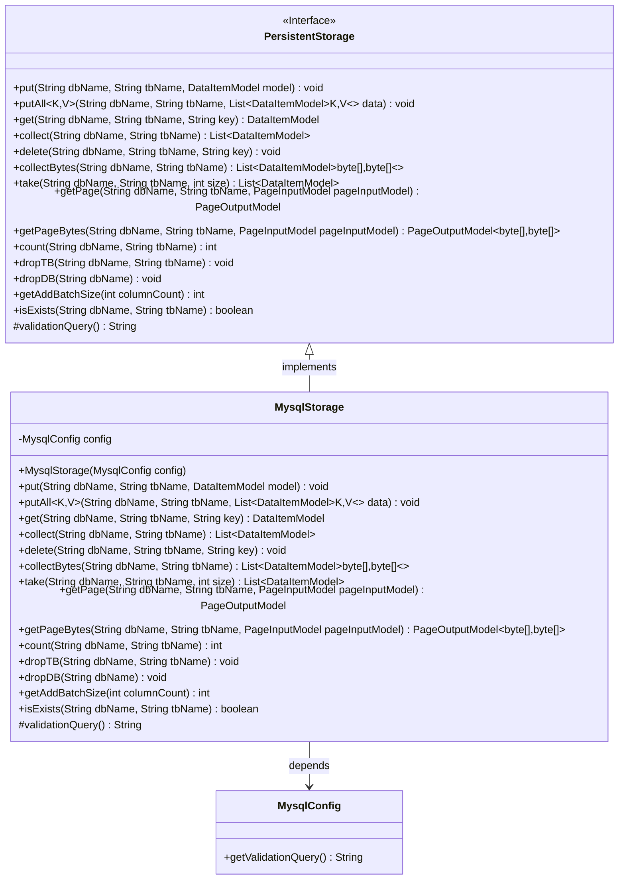

# Basic Information

|      |      |
|------|------|
| Name | MysqlStorage |
| Language | .java |
| Code Path | WeFe/common/java/common-data-storage/src/main/java/com/welab/wefe/common/data/storage/service/persistent/mysql/MysqlStorage.java |
| Package Name | com.welab.wefe.common.data.storage.service.persistent.mysql |
| Dependencies | ['com.welab.wefe.common.data.storage.model.DataItemModel', 'com.welab.wefe.common.data.storage.model.PageInputModel', 'com.welab.wefe.common.data.storage.model.PageOutputModel', 'com.welab.wefe.common.data.storage.service.persistent.PersistentStorage', 'java.sql.SQLException', 'java.util.List'] |
| Brief Description | The MysqlStorage class inherits from PersistentStorage, implementing database operations such as CRUD, paginated queries, batch operations, etc., and relies on MysqlConfig for configuration. |

# Description

The `MysqlStorage` class inherits from `PersistentStorage` and is designed to implement persistent storage operations for MySQL databases. It receives a `MysqlConfig` configuration object through its constructor and includes basic CRUD operations such as `put`, `get`, and `delete`, as well as batch operations like `putAll` and `collect`. The class supports paginated queries with `getPage` and byte data operations with `collectBytes`/`getPageBytes`. It provides table existence checks via `isExists` and statistical functionality through `count`. Additionally, it includes database table management methods such as `dropTB`/`dropDB`, batch size calculation via `getAddBatchSize`, and connection validation queries with `validationQuery`. All methods default to empty implementations or return `null`/`0`/`false`.

# Class Summary

| Name   | Type  | Description |
|-------|------|-------------|
| MysqlStorage | class | MysqlStorage inherits from PersistentStorage, implementing database operations such as addition, deletion, query, modification, paginated queries, and table existence checks, configured using MysqlConfig. |

## Class MysqlStorage

|      |      |
|------|------|
| Access Modifier | public |
| Type | class |
| Name | MysqlStorage |
| Description | MysqlStorage inherits from PersistentStorage, implementing database operations such as addition, deletion, query, modification, paginated queries, and table existence checks, configured using MysqlConfig. |

### UML Class Diagram

This code demonstrates a MySQL storage implementation class MysqlStorage, which inherits from the PersistentStorage interface. MysqlStorage provides basic database operation functionalities including CRUD operations, paginated queries, batch operations, etc. The class contains a MysqlConfig configuration object for obtaining database validation query statements. All methods currently have empty implementations or return default values, requiring concrete implementation based on actual business logic. The design follows the interface-oriented programming principle, supports operations on multiple data types through generics, and provides specialized methods for byte stream processing.

### Internal Method Call Graph

```mermaid
graph TD
    A["Class MysqlStorage"]
    B["Inherits: PersistentStorage"]
    C["Attribute: MysqlConfig config"]
    D["Constructor: MysqlStorage(MysqlConfig config)"]
    E["Method: put(String dbName, String tbName, DataItemModel model)"]
    F["Method: putAll(String dbName, String tbName, List<DataItemModel<K, V>> data)"]
    G["Method: get(String dbName, String tbName, String key)"]
    H["Method: collect(String dbName, String tbName)"]
    I["Method: delete(String dbName, String tbName, String key)"]
    J["Method: collectBytes(String dbName, String tbName)"]
    K["Method: take(String dbName, String tbName, int size)"]
    L["Method: getPage(String dbName, String tbName, PageInputModel pageInputModel)"]
    M["Method: getPageBytes(String dbName, String tbName, PageInputModel pageInputModel)"]
    N["Method: count(String dbName, String tbName)"]
    O["Method: dropTB(String dbName, String tbName)"]
    P["Method: dropDB(String dbName)"]
    Q["Method: getAddBatchSize(int columnCount)"]
    R["Method: isExists(String dbName, String tbName)"]
    S["Method: validationQuery()"]

    A --> B
    A --> C
    A --> D
    A --> E
    A --> F
    A --> G
    A --> H
    A --> I
    A --> J
    A --> K
    A --> L
    A --> M
    A --> N
    A --> O
    A --> P
    A --> Q
    A --> R
    A --> S
    S --> T["Calls: config.getValidationQuery()"]
```

This flowchart illustrates the structure of the MysqlStorage class and its method invocation relationships. MysqlStorage inherits from PersistentStorage, contains an attribute config of type MysqlConfig, and is initialized via a constructor. The class defines multiple database operation methods such as put, get, delete, etc., as well as auxiliary methods like count, isExists, etc. The validationQuery method calls the getValidationQuery method of the config object. Together, these methods form a complete MySQL database storage operation interface.

### Field List

| Name  | Type  | Description |
|-------|-------|------|
| config | MysqlConfig | Private MySQL Configuration Object |

### Method List

| Name  | Type  | Description |
|-------|-------|------|
| collectBytes | List<DataItemModel<byte[], byte[]>> | Rewrite the collectBytes method to return a list of byte data items from the specified database table, currently it returns empty. |
| delete | void | Java Method: Deletes the data corresponding to the specified key in the given database and table, may throw exceptions. |
| count | int | Rewrite the count method to accept database name and table name parameters, return a fixed value of 0, and may throw exceptions. |
| dropDB | void | Java method: Deletes the specified database, may throw exceptions. |
| dropTB | void | Rewrite the method `dropTB` to drop a specified table in the database, which may throw exceptions. |
| get | DataItemModel | This is a Java method that overrides the get method, accepting parameters for the database name, table name, and key value, and returns a DataItemModel object. The current implementation returns null. |
| getAddBatchSize | int | Method override, returns adding batch size as 0 without considering column count. |
| getPageBytes | PageOutputModel<byte[], byte[]> | The method `getPageBytes` takes a database name, table name, and pagination input model as parameters, and returns paginated byte data. Currently, it returns an empty value. |
| take | List<DataItemModel> | Method override, retrieves a list of data items from the specified database table, with parameters including database name, table name, and quantity. Temporarily returns empty and may throw exceptions. |
| putAll | void | Rewrite the putAll method to accept a database name, table name, and a list of data items, which may throw exceptions. |
| collect | List<DataItemModel> | Java Method: Collects database table data and returns a list of DataItemModel. Parameters are dbName and tbName. Returns null if not yet implemented. |
| put | void | This is a Java method override for inserting a data model into a specified database table, which may throw exceptions. |
| getPage | PageOutputModel | The method `getPage` takes a database name, table name, and pagination parameters as input, and returns paginated results. Currently, it returns `null`. |
| isExists | boolean | Methods to check if a database table exists, defaulting to return false. |
| validationQuery | String | Rewrite the method to return the validation query statement from the configuration. |

