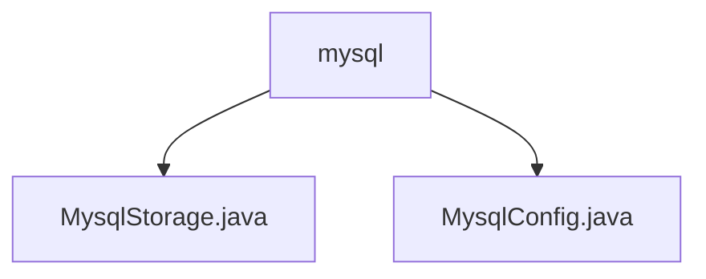

# Basic Information

|      |      |
|------|------|
| Name | mysql |
| Language | .java |
| Code Path | WeFe/common/java/common-data-storage/src/main/java/com/welab/wefe/common/data/storage/service/persistent/mysql |
| Package Name | docs.common.java.common-data-storage.src.main.java.com.welab.wefe.common.data.storage.service.persistent.mysql |
| Brief Description | The `MysqlStorage` class inherits from `PersistentStorage`, implementing CRUD operations, batch operations, paginated queries, and table management functionalities for MySQL databases. The `MysqlConfig` class inherits from `DataSourceConfig`, configuring MySQL connection parameters and constructing JDBC connection strings. |

# Description

## Overview  
The core responsibility of this module is to implement persistent storage operations for MySQL databases, providing basic CRUD functionality and table management capabilities. The interface specifications include data operations (put/get/delete), batch processing (putAll/collect), paginated queries (getPage/getPageBytes), and table maintenance (dropTB/dropDB). The key data structure is MysqlConfig, which contains connection parameters such as host and port. The only external dependency is the MySQL JDBC driver. For example, MysqlStorage supports byte data operations, and MysqlConfig automatically constructs JDBC connection strings.  

## Main Business Scenarios  
The module is suitable for scenarios requiring MySQL persistence, similar to a general data warehouse pattern. Typical workflows include configuring connections via MysqlConfig and performing CRUD operations using MysqlStorage. Examples include paginated data queries or batch record insertion. An integration case involves inheriting the PersistentStorage base class to implement MySQL adaptation, supporting validation queries and batch size calculations. The interaction mode initializes through configuration objects and provides a hybrid API for atomic operations and batch processing.

### Package Internal Structure View

This flowchart illustrates the file structure of the MySQL persistence storage service. The root node is the mysql directory, which contains two Java class files: MysqlStorage.java implements storage functionality, while MysqlConfig.java handles configuration information. This structure reflects a typical service-layer implementation pattern, separating core functionality from configuration management under the same package path.

# File List

| Name   | Type  | Description |
|-------|------|-------------|
| [MysqlStorage.java](MysqlStorage.md) | file | The `MysqlStorage` class inherits from `PersistentStorage` and implements database operations such as CRUD, paginated queries, batch operations, etc., relying on the `MysqlConfig` configuration. |
| [MysqlConfig.java](MysqlConfig.md) | file | MysqlConfig extends DataSourceConfig, initializes database connection parameters through the constructor, overrides buildUrl to generate a MySQL connection URL, and returns the MySQL driver class name. |

