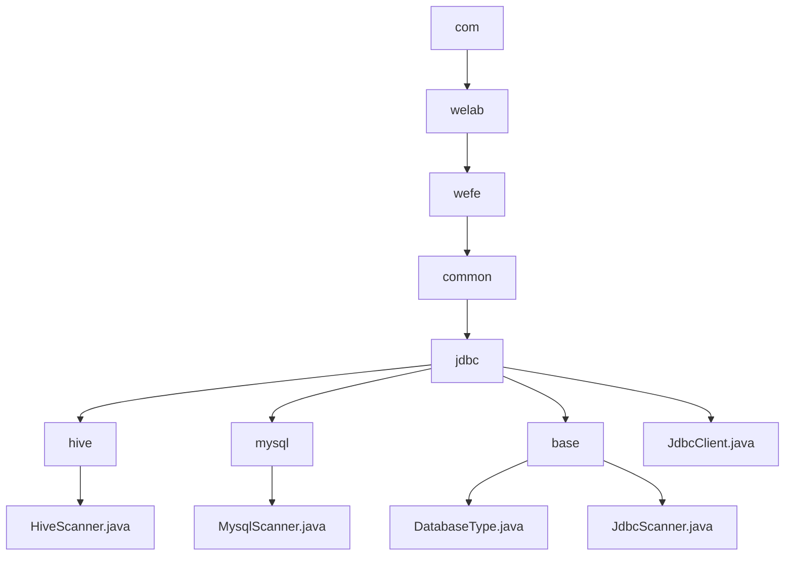

# Basic Information

|      |      |
|------|------|
| Name | com |
| Language | .java |
| Code Path | WeFe/common/java/common-jdbc/src/main/java/com |
| Package Name | docs.common.java.common-jdbc.src.main.java.com |
| Brief Description | HiveScanner and MysqlScanner are subclasses of JdbcScanner, designed for Hive and MySQL queries respectively. JdbcScanner is an abstract base class that encapsulates the JDBC query process and supports multi-database adaptation. JdbcClient encapsulates JDBC operations, supports various databases, and provides connection management, batch writing, and streaming query functionalities. |

# Description

## Overview  
The core responsibility of this module is to provide a unified JDBC operation framework for multiple databases, including type identification, connection management, and data scanning functionalities. The DatabaseType enum defines six database types, while JdbcScanner serves as an abstract base class implementing a query process similar to a result set iterator. JdbcClient encapsulates complete JDBC operations. Key data structures include the DatabaseType enum, scanner classes containing Connection/ResultSet, and JdbcClient configuration parameters. The only external dependency is the standard JDBC interface. For example, HiveScanner optimizes queries through prepared statements, and MysqlScanner enhances performance by setting a special fetch size.  

## Primary Business Scenarios  
This module is suitable for batch data operations across databases, such as multi-source data synchronization in ETL tools. A typical workflow involves: establishing a connection via JdbcClient, executing streaming queries with JdbcScanner to avoid memory overflow, or performing batch writes to improve efficiency. For instance, when reading tens of millions of data rows from Hive, maxRows can be used for pagination control. The interaction mode supports the standard "connect-query-iterate-close" process and prepared statement optimization, offering features like table structure retrieval and field projection. The API includes factory patterns for creating JdbcClient, template method patterns for implementing scanner subclasses (e.g., MysqlScanner), and the Closeable interface for resource management.

### Package Internal Structure View

This flowchart illustrates the hierarchical Java package structure of the common-jdbc module in the WeFe project. Starting from the root package `com`, it expands to sub-packages `welab`, `wefe`, `common`, and `jdbc`. The `jdbc` package contains three sub-packages: `hive`, `mysql`, and `base`, corresponding to different database type scanners and foundational classes. Finally, it displays key class files in each sub-package, such as `HiveScanner.java`, `MysqlScanner.java`, etc.

# File List

| Name   | Type  | Description |
|-------|------|-------------|
| [welab](welab/_module.md) | package | HiveScanner and MysqlScanner are subclasses of JdbcScanner, designed for Hive and MySQL queries respectively. JdbcScanner is an abstract base class that encapsulates the JDBC query process and supports multi-database adaptation. JdbcClient encapsulates JDBC operations, supports various databases, and provides connection management, batch writing, and streaming query capabilities. |

