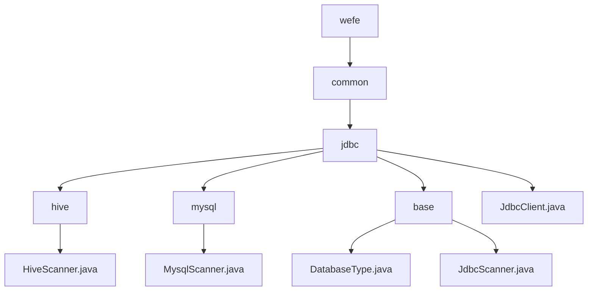

# Basic Information

|      |      |
|------|------|
| Name | wefe |
| Language | .java |
| Code Path | WeFe/common/java/common-jdbc/src/main/java/com/welab/wefe |
| Package Name | docs.common.java.common-jdbc.src.main.java.com.welab.wefe |
| Brief Description | HiveScanner and MysqlScanner are subclasses of JdbcScanner, designed for Hive and MySQL queries respectively. JdbcScanner is an abstract base class that encapsulates the JDBC query process and supports multi-database adaptation. JdbcClient encapsulates JDBC operations, supports various databases, and provides connection management, batch writing, and streaming query capabilities. |

# Description

## Overview  
The core responsibility of this module is to provide a unified JDBC operation framework for multiple databases, including type identification, connection management, and data scanning functionality. The `DatabaseType` enum defines six database types, while `JdbcScanner` serves as an abstract base class implementing a query process similar to a result set iterator. `JdbcClient` encapsulates complete JDBC operations. Key data structures include the `DatabaseType` enum, scanner classes containing `Connection`/`ResultSet`, and `JdbcClient` configuration parameters. The only external dependency is the standard JDBC interface. For example, `HiveScanner` optimizes queries through prepared statements, and `MysqlScanner` enhances performance by setting a special fetch size.  

## Primary Business Scenarios  
This module is suitable for batch data operations across databases, such as multi-source data synchronization in ETL tools. A typical workflow involves: establishing a connection via `JdbcClient`, executing streaming queries with `JdbcScanner` to avoid memory overflow, or performing batch writes for efficiency. For instance, when reading tens of millions of rows from Hive, pagination can be controlled via `maxRows`. The interaction mode supports the standard "connect-query-iterate-close" workflow and prepared statement optimization, offering features like table structure retrieval and field projection. The API includes factory patterns for creating `JdbcClient`, template method patterns for implementing scanner subclasses (e.g., `MysqlScanner`), and the `Closeable` interface for resource management.

### Package Internal Structure View

This flowchart illustrates the hierarchical structure of the common-jdbc module in the WeFe project. Starting from the root directory `wefe`, it expands to the `common` and `jdbc` directories. The `jdbc` directory contains three subdirectories: `hive`, `mysql`, and `base`, each housing corresponding Java files. The outermost `jdbc` directory also directly includes the `JdbcClient.java` file. The entire structure clearly reflects the classification relationships of database-related components.

# File List

| Name   | Type  | Description |
|-------|------|-------------|
| [common](common/_module.md) | package | HiveScanner and MysqlScanner are subclasses of JdbcScanner, designed for Hive and MySQL queries respectively. JdbcScanner is an abstract base class that encapsulates the JDBC query process and supports multi-database adaptation. JdbcClient encapsulates JDBC operations, supports various databases, and provides connection management, batch writing, and streaming query functionalities. |

