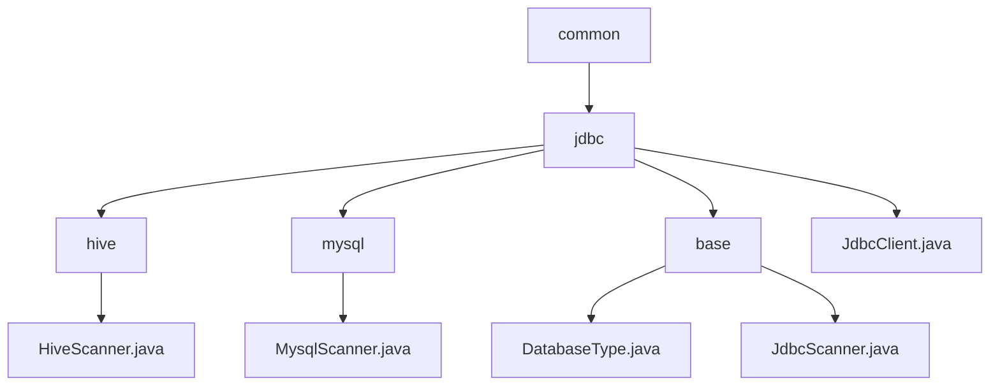

# Basic Information

|      |      |
|------|------|
| Name | common |
| Language | .java |
| Code Path | WeFe/common/java/common-jdbc/src/main/java/com/welab/wefe/common |
| Package Name | docs.common.java.common-jdbc.src.main.java.com.welab.wefe.common |
| Brief Description | HiveScanner and MysqlScanner are subclasses of JdbcScanner, designed for Hive and MySQL queries respectively. JdbcScanner is an abstract base class that encapsulates the JDBC query process and supports multi-database adaptation. JdbcClient encapsulates JDBC operations, supports various databases, and provides connection management, batch writing, and streaming query functionalities. |

# Description

## Overview  
The core responsibility of this module is to provide a unified JDBC operation framework for multiple databases, including type identification, connection management, and data scanning functionality. The DatabaseType enum defines 6 database types, while JdbcScanner serves as an abstract base class implementing a query flow similar to a result set iterator. JdbcClient encapsulates complete JDBC operations. Key data structures include the DatabaseType enum, scanner classes containing Connection/ResultSet, and JdbcClient configuration parameters. The only external dependency is the standard JDBC interface. For example, HiveScanner optimizes queries through prepared statements, and MysqlScanner enhances performance by setting a special fetch size.  

## Primary Business Scenarios  
The module is suitable for cross-database batch data operation scenarios, such as multi-source data synchronization in ETL tools. A typical workflow involves: establishing a connection via JdbcClient, performing streaming queries with JdbcScanner to avoid memory overflow, or executing batch writes for efficiency. For instance, when reading tens of millions of records from Hive, pagination can be controlled via maxRows. The interaction mode supports both the standard "connect-query-iterate-close" flow and prepared statement optimization, offering features like table structure retrieval and field projection. The API includes factory patterns for creating JdbcClient, template method patterns for implementing scanner subclasses (e.g., MysqlScanner), and Closeable resource management interfaces.

### Package Internal Structure View

This flowchart illustrates the hierarchical structure of the common-jdbc module in the WeFe project. Starting from the root directory `common`, it branches to the `jdbc` directory, which further divides into three subdirectories: `hive`, `mysql`, and `base`. Each subdirectory contains corresponding scanner implementation classes, such as `HiveScanner.java` and `MysqlScanner.java`. The `base` directory includes the database type and base scanner classes, while the `jdbc` directory directly contains the `JdbcClient.java` file. The overall structure clearly demonstrates the functional division for different database types.

# File List

| Name   | Type  | Description |
|-------|------|-------------|
| [jdbc](jdbc/_module.md) | package | HiveScanner and MysqlScanner are subclasses of JdbcScanner, designed for Hive and MySQL queries respectively. JdbcScanner is an abstract base class that encapsulates the JDBC query process and supports multi-database adaptation. JdbcClient encapsulates JDBC operations, supports various databases, and provides connection management, batch writing, and streaming query functionalities. |

