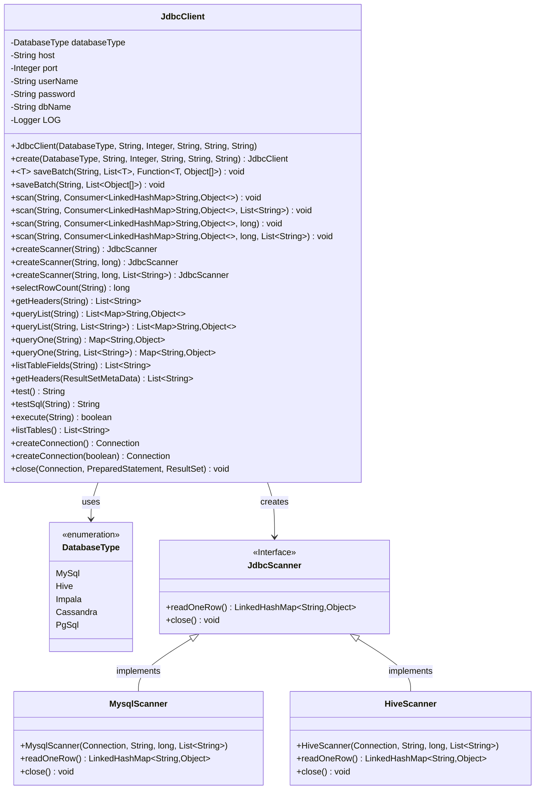

# Basic Information

|      |      |
|------|------|
| Name | JdbcClient |
| Language | .java |
| Code Path | WeFe/common/java/common-jdbc/src/main/java/com/welab/wefe/common/jdbc/JdbcClient.java |
| Package Name | com.welab.wefe.common.jdbc |
| Dependencies | ['com.welab.wefe.common.StatusCode', 'com.welab.wefe.common.exception.StatusCodeWithException', 'com.welab.wefe.common.jdbc.base.DatabaseType', 'com.welab.wefe.common.jdbc.base.JdbcScanner', 'com.welab.wefe.common.jdbc.hive.HiveScanner', 'com.welab.wefe.common.jdbc.mysql.MysqlScanner', 'com.welab.wefe.common.util.StringUtil', 'org.slf4j.Logger', 'org.slf4j.LoggerFactory', 'java.sql', 'java.util.ArrayList', 'java.util.LinkedHashMap', 'java.util.List', 'java.util.Map', 'java.util.function.Consumer', 'java.util.function.Function'] |
| Brief Description | JdbcClient is a JDBC utility class that supports databases such as MySQL and Hive, providing functionalities like batch writing, streaming queries, and table operations, along with connection management, exception handling, and performance monitoring. |

# Description

JdbcClient is a class that encapsulates JDBC operations, supporting various database types such as MySQL, Hive, Impala, and others. It provides functionalities including connection management, batch data writing, streaming query scanning, and result set processing. Key methods involve creating connections, batch-saving data, executing queries and processing results, as well as retrieving table structures and field information. It supports streaming reads for large datasets to prevent memory overflow. Instances are created via factory methods, requiring specifications for database type, host, port, username, password, and database name. Internally, it utilizes prepared statements and connection pools for resource management, featuring comprehensive error handling and logging. It is suitable for scenarios requiring efficient and stable operations across multiple databases.

# Class Summary

| Name   | Type  | Description |
|-------|------|-------------|
| JdbcClient | class | JdbcClient is a JDBC utility class that supports databases such as MySQL and Hive. It provides functionalities like batch writing, streaming queries, and table field retrieval, while encapsulating connection management and resource release. |

## Class JdbcClient

|      |      |
|------|------|
| Access Modifier | public |
| Type | class |
| Name | JdbcClient |
| Description | JdbcClient is a JDBC utility class that supports databases such as MySQL and Hive. It provides functionalities like batch writing, streaming queries, and table field retrieval, while encapsulating connection management and resource release. |

### UML Class Diagram

This class diagram illustrates the core structure and relationships of JdbcClient. JdbcClient is a database operation utility class that encapsulates various database operations, including batch writing, streaming queries, and result set processing. It supports multiple database types (MySQL/Hive/Impala, etc.) through the DatabaseType enumeration class and creates corresponding JdbcScanner implementations (MysqlScanner/HiveScanner) via factory methods to execute streaming queries. The diagram clearly presents the dependency relationships between JdbcClient and its components, as well as the inheritance relationships between interfaces and their implementations, demonstrating a well-layered design.

### Internal Method Call Graph

```mermaid
graph TD
    A["Class JdbcClient"]
    B["Static Property: Logger LOG"]
    C["Static Method: create(DatabaseType, String, Integer, String, String, String)"]
    D["Private Property: DatabaseType databaseType"]
    E["Private Property: String host"]
    F["Private Property: Integer port"]
    G["Private Property: String userName"]
    H["Private Property: String password"]
    I["Private Property: String dbName"]
    J["Constructor: JdbcClient(DatabaseType, String, Integer, String, String, String)"]
    K["Method: saveBatch(String, List<T>, Function<T, Object[]>)"]
    L["Method: saveBatch(String, List<Object[]>)"]
    M["Method: scan(String, Consumer<LinkedHashMap<String, Object>>)"]
    N["Method: scan(String, Consumer<LinkedHashMap<String, Object>>, List<String>)"]
    O["Method: scan(String, Consumer<LinkedHashMap<String, Object>>, long)"]
    P["Method: scan(String, Consumer<LinkedHashMap<String, Object>>, long, List<String>)"]
    Q["Method: createScanner(String)"]
    R["Method: createScanner(String, long)"]
    S["Method: createScanner(String, long, List<String>)"]
    T["Method: selectRowCount(String)"]
    U["Method: getHeaders(String)"]
    V["Method: queryList(String)"]
    W["Method: queryList(String, List<String>)"]
    X["Method: queryOne(String)"]
    Y["Method: queryOne(String, List<String>)"]
    Z["Method: listTableFields(String)"]
    AA["Static Method: getHeaders(ResultSetMetaData)"]
    AB["Method: test()"]
    AC["Method: testSql(String)"]
    AD["Method: execute(String)"]
    AE["Method: listTables()"]
    AF["Method: createConnection()"]
    AG["Method: createConnection(boolean)"]
    AH["Static Method: close(Connection, PreparedStatement, ResultSet)"]

    A --> B
    A --> C
    A --> D
    A --> E
    A --> F
    A --> G
    A --> H
    A --> I
    A --> J
    A --> K
    A --> L
    A --> M
    A --> N
    A --> O
    A --> P
    A --> Q
    A --> R
    A --> S
    A --> T
    A --> U
    A --> V
    A --> W
    A --> X
    A --> Y
    A --> Z
    A --> AA
    A --> AB
    A --> AC
    A --> AD
    A --> AE
    A --> AF
    A --> AG
    A --> AH

    K --> L
    M --> P
    N --> P
    O --> P
    Q --> R
    R --> S
    V --> W
    X --> Y
    Z --> U
    AB --> AC
    AC --> AD
    AF --> AG
```

This code demonstrates a complete JDBC client implementation, featuring core functionalities including database connection management, batch data operations, streaming data scanning, query execution, and result processing. The key workflow involves establishing database connections via createConnection, performing CRUD operations through various methods, and finally releasing resources via the close method. Notably, its batch processing mechanism (committing every 50,000 records) and streaming scan design effectively handle large-scale data scenarios. The class structure is well-organized, comprising 18 primary methods and 4 static utility methods, supporting multiple database types distinguished through enumeration.

### Field List

| Name  | Type  | Description |
|-------|-------|------|
| host | String | Private string variable host |
| LOG = LoggerFactory.getLogger(JdbcClient.class) | Logger | Declare a protected static constant logger for logging output in the JdbcClient class. |
| databaseType | DatabaseType | Private database type variable `databaseType`. |
| password | String | Private string type variable password. |
| userName | String | Declare a private string variable userName. |
| dbName | String | The private string variable dbName is used to store the database name. |
| port | Integer | Private integer port variable. |

### Method List

| Name  | Type  | Description |
|-------|-------|------|
| queryOne | Map<String, Object> | The Java method `queryOne` accepts a SQL string parameter. When no additional parameters are provided, it calls an overloaded method and returns a `Map<String, Object>`, potentially throwing an exception. |
| scan | void | This is a Java method designed to scan SQL query results, which accepts an SQL statement, a list of return fields, and a result processing function as parameters, and may throw exceptions. |
| testSql | String | This method tests the execution of SQL statements, returning null on success, or catching exceptions and logging them on failure, then returning the exception class name and message. |
| queryList | List<Map<String, Object>> | This method executes an SQL query and returns a list of results. The parameters are the SQL statement and the list of return fields, with the results returned in the form of a list of Maps. An Exception is thrown in case of an error. |
| scan | void | Scan SQL query results, read data row by row and process it through the consumer, support maximum row limit and specified return fields, log exceptions and ensure the scanner is closed. |
| createScanner | JdbcScanner | Create a JdbcScanner instance, execute SQL queries and limit the maximum number of rows read, which may throw exceptions. |
| listTableFields | List<String> | This method retrieves all field names of a specified table by executing an SQL query and returns a list of fields. The parameter is the table name, and exceptions may be thrown. |
| create | JdbcClient | Create a static method for JdbcClient that accepts parameters for database type, host, port, username, password, and database name, then returns a new instance. |
| saveBatch | void | Java Method: Batch Save Model Data. Accepts SQL statements, a list of models, and a conversion function, converts the models into arrays, and then calls the batch save operation. Exceptions can be thrown. |
| createScanner | JdbcScanner | Method to create a JdbcScanner instance, which accepts an SQL statement parameter with a default offset of 0 and may throw exceptions. |
| saveBatch | void | Execute SQL operations in batches, commit transactions every 50,000 records, log execution time and details, and roll back with connection closure on exceptions. |
| scan | void | The Java method `scan` accepts an SQL string and a consumer function, then calls the overloaded method `scan` with the initial parameter 0. |
| getHeaders | List<String> | The method retrieves header information via SQL queries, sets fetchSize and maxRows to 1 to prevent memory overflow, and finally closes the database connection. Returns null in case of exceptions. |
| createScanner | JdbcScanner | Create a database scanner that returns a MySQL or Hive/Impala scanner instance based on the type, and throws an error if the type is not supported. |
| test | String | The method is named test, which invokes testSql to execute the SQL query "select 1" and may throw a StatusCodeWithException. |
| queryList | List<Map<String, Object>> | This method executes an SQL query and returns a list of results, with each result stored as a key-value pair. If there are no parameters, pass in null. Exceptions may be thrown. |
| execute | boolean | The method executes an SQL query, sets the fetch size and maximum rows to 1 to prevent memory overflow, handles exceptions, and ensures resource release. |
| listTables | List<String> | This method queries the database connection to retrieve and return a list of all table names, then closes the resources after handling any exceptions. |
| createConnection | Connection | Create a protected connection method, which does not enable special parameters by default and may throw exceptions. |
| createConnection | Connection | Create a database connection method that supports MySQL and Hive/Impala, loads the driver and constructs the URL based on the type, then returns the connection after handling exceptions. |
| close | void | Close the database connection, prepared statements, and result sets, catch and log exceptions, and finally nullify the objects. |
| getHeaders | List<String> | This method extracts column names from the database result set metadata, processes column names containing dots (taking the part after the dot), and returns a list of column names. |
| selectRowCount | long | Java Method: Retrieve row count via SQL query, handle exceptions and close resources, return the count result. |
| queryOne | Map<String, Object> | Query the database and return the first record, or null if no results are found. The method accepts an SQL query and a list of return fields, scans the results into a list, and then retrieves the first item. |
| scan | void | Java method `scan` accepts an SQL string, a result-processing Consumer, and a maximum row count, then delegates the query processing to an overloaded method, potentially throwing exceptions. |

