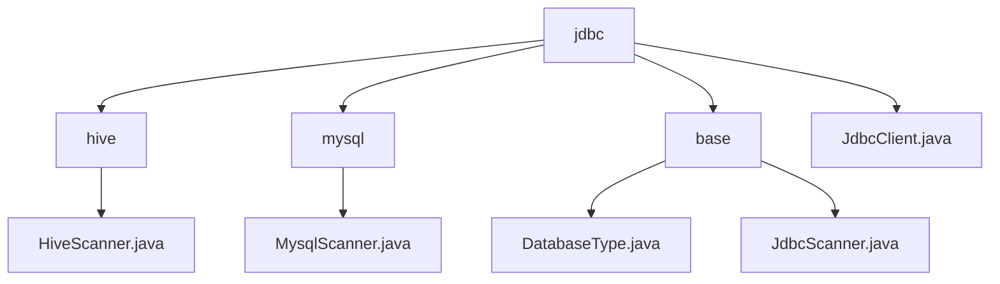

# Basic Information

|      |      |
|------|------|
| Name | jdbc |
| Language | .java |
| Code Path | WeFe/common/java/common-jdbc/src/main/java/com/welab/wefe/common/jdbc |
| Package Name | docs.common.java.common-jdbc.src.main.java.com.welab.wefe.common.jdbc |
| Brief Description | HiveScanner and MysqlScanner are subclasses of JdbcScanner, designed for Hive and MySQL queries respectively. JdbcScanner is an abstract base class that encapsulates the JDBC query process and supports multi-database adaptation. JdbcClient encapsulates JDBC operations, supports various databases, and provides connection management, batch writing, and streaming query functionalities. |

# Description

## Overview  
The core responsibility of this module is to provide a unified JDBC operation framework for multiple databases, including type identification, connection management, and data scanning functionalities. The DatabaseType enum defines six database types, while JdbcScanner serves as an abstract base class implementing a query flow similar to a result set iterator. JdbcClient encapsulates complete JDBC operations. Key data structures include the DatabaseType enum, scanner classes containing Connection/ResultSet, and JdbcClient configuration parameters. The only external dependency is the standard JDBC interface. For example, HiveScanner optimizes queries through prepared statements, and MysqlScanner enhances performance by setting special fetch sizes.  

## Primary Business Scenarios  
This module is suitable for batch data operations across databases, such as multi-source data synchronization in ETL tools. A typical workflow involves: establishing a connection via JdbcClient, performing streaming queries with JdbcScanner to avoid memory overflow, or executing batch writes for efficiency. For instance, when reading tens of millions of rows from Hive, maxRows can be used for pagination control. The interaction mode supports the standard "connect-query-iterate-close" flow and prepared statement optimizations, offering features like table structure retrieval and field projection. The API includes factory patterns for creating JdbcClient, template method patterns for implementing scanner subclasses (e.g., MysqlScanner), and Closeable resource management interfaces.

### Package Internal Structure View

This flowchart illustrates the code structure of the common-jdbc module in the WeFe project. The root node "jdbc" contains three subdirectories (hive, mysql, base) and the JdbcClient.java file. Each subdirectory includes corresponding Scanner implementation classes or foundational type files. The overall diagram presents a clear layered architecture of the JDBC utility module, reflecting the design for supporting different database types.

# File List

| Name   | Type  | Description |
|-------|------|-------------|
| [hive](hive/_module.md) | package | HiveScanner extends JdbcScanner, providing two constructor methods, overrides the execute method to set the result set type and fetch size, and supports a maximum row limit. |
| [JdbcClient.java](JdbcClient.md) | file | JdbcClient is a JDBC utility class that supports databases such as MySQL and Hive, providing functionalities like batch writing, streaming queries, and table operations, including connection management, exception handling, and performance monitoring. |
| [base](base/_module.md) | package | The DatabaseType enum defines multiple database types, some with annotations. JdbcScanner is an abstract class used for JDBC scanning, containing query, read, and close methods, requiring subclasses to implement execute. |
| [mysql](mysql/_module.md) | package | MysqlScanner extends JdbcScanner and provides two constructors, supporting the configuration of maximum rows to read and return fields. The execute method executes SQL queries, sets the cursor type to read-only forward-only, and optimizes large result set processing. |

