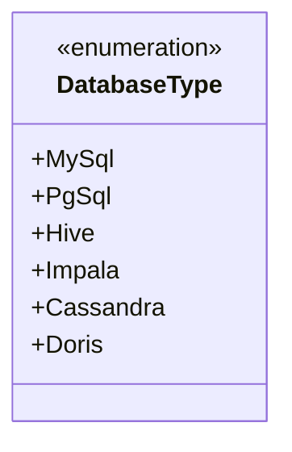
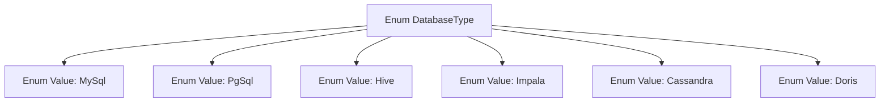

# Basic Information

|      |      |
|------|------|
| Name | DatabaseType |
| Language | .java |
| Code Path | WeFe/common/java/common-jdbc/src/main/java/com/welab/wefe/common/jdbc/base/DatabaseType.java |
| Package Name | com.welab.wefe.common.jdbc.base |
| Dependencies | [] |
| Brief Description | Define database type enumeration, including MySql, PgSql, Hive, Impala, Cassandra, and Doris. |

# Description

The content defines an enumeration type named DatabaseType, listing various database types. Specifically, it includes MySql, PgSql, Hive, Impala, Cassandra, and Doris. Among these, MySql, PgSql, Hive, Impala, and Cassandra have corresponding comment annotations, while Doris lacks any comments. Additionally, Oracle and Db2 are commented out and not included in the enumeration values. This enumeration may be used to identify or distinguish between different types of database systems.

# Class Summary

| Name   | Type  | Description |
|-------|------|-------------|
| DatabaseType | enum | Define a database type enumeration, including MySql, PgSql, Hive, Impala, Cassandra, and Doris. |

## Class DatabaseType

|      |      |
|------|------|
| Access Modifier | public |
| Type | enum |
| Name | DatabaseType |
| Description | Define a database type enumeration, including MySql, PgSql, Hive, Impala, Cassandra, and Doris. |

### UML Class Diagram

This code defines an enumeration type named DatabaseType, which includes six database type constants: MySql, PgSql, Hive, Impala, Cassandra, and Doris. The enumeration type is used to represent a set of fixed constant values, with each value corresponding to a specific database type. The comments indicate that Oracle and Db2 were originally planned to be included but are currently commented out. This enumeration can serve as a type-safe database identifier in program usage.

### Internal Method Call Graph

This flowchart illustrates the structure of the DatabaseType enum, which includes 7 predefined database type enum values. Each enum value is represented as an independent node and establishes a hierarchical relationship with the parent node DatabaseType. The annotation mentions some inactive enum values (Oracle, Db2) that are not reflected in the flowchart. This design is used to standardize database type identification and is suitable for scenarios requiring clear differentiation between various database systems.

### Field List

| Name  | Type  | Description |
|-------|-------|------|

### Method List

| Name  | Type  | Description |
|-------|-------|------|

