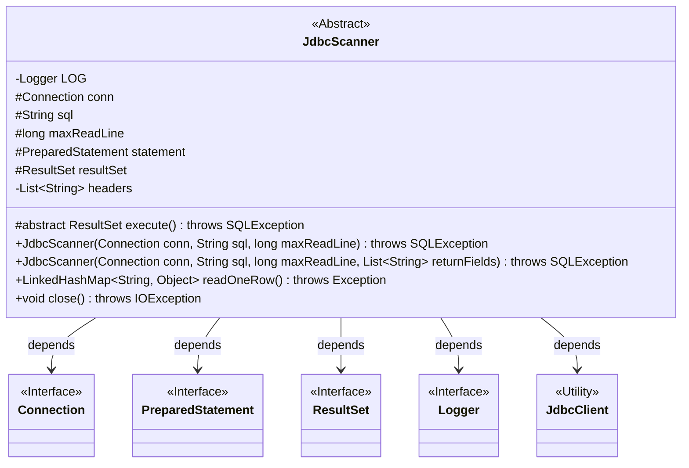
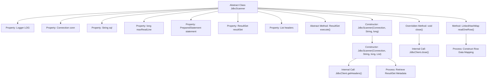

# Basic Information

|      |      |
|------|------|
| Name | JdbcScanner |
| Language | .java |
| Code Path | WeFe/common/java/common-jdbc/src/main/java/com/welab/wefe/common/jdbc/base/JdbcScanner.java |
| Package Name | com.welab.wefe.common.jdbc.base |
| Dependencies | ['com.welab.wefe.common.jdbc.JdbcClient', 'org.apache.commons.collections4.CollectionUtils', 'org.slf4j.Logger', 'org.slf4j.LoggerFactory', 'java.io.Closeable', 'java.io.IOException', 'java.sql', 'java.util.LinkedHashMap', 'java.util.List'] |
| Brief Description | The abstract class JdbcScanner implements the Closeable interface and is designed for JDBC queries. It includes attributes such as connection, SQL, and maximum row count. Queries are executed via the `execute` method, single rows of data are read using `readOneRow`, and resources are released through `close`. It supports custom return fields or defaults to all fields. |

# Description

JdbcScanner is an abstract class that implements the Closeable interface, designed for JDBC database scanning operations. It includes attributes such as connection objects, SQL statements, maximum read rows, as well as result sets and prepared statements. The constructor accepts connection, SQL, and row count parameters, executes the query, and initializes the result set and table headers. If no return fields are specified, all fields are retrieved. The readOneRow method reads the next row of data and returns a key-value map, or null if no data is available. The close method is used to close the connection, statements, and result set. The abstract method execute must be implemented by subclasses to perform the query.

# Class Summary

| Name   | Type  | Description |
|-------|------|-------------|
| JdbcScanner | class | The abstract class JdbcScanner implements Closeable, encapsulates JDBC query logic, supports custom return fields, and provides single-row reading and resource closing functionality. |

## Class JdbcScanner

|      |      |
|------|------|
| Access Modifier | public abstract |
| Type | class |
| Name | JdbcScanner |
| Description | The abstract class JdbcScanner implements Closeable, encapsulates JDBC query logic, supports custom return fields, and provides single-row reading and resource closing functionality. |

### UML Class Diagram

Class diagram description:
JdbcScanner is an abstract class designed for scanning data from JDBC data sources, implementing the Closeable interface to ensure resource release. It encapsulates core attributes such as database connection (Connection), SQL statements, maximum read rows, etc., and executes queries through the abstract execute() method to obtain result sets (ResultSet). Key functionalities include initializing result sets and header information during construction, reading data row by row into LinkedHashMap via readOneRow(), and closing all database resources through the close() method. This class depends on JDBC core interfaces (Connection/PreparedStatement/ResultSet), logging interface (Logger), and utility class JdbcClient.

### Internal Method Call Graph

This flowchart illustrates the complete structure of the abstract class JdbcScanner, including 5 core properties, 2 constructors, and 3 key methods. It achieves polymorphic queries through the abstract execute() method, automatically initializes the result set and handles return field logic in constructors, implements row-by-row conversion from ResultSet to LinkedHashMap via the readOneRow() method, and uniformly closes database resources with the close() method. The process highlights two core operational steps: metadata retrieval and row data construction.

### Field List

| Name  | Type  | Description |
|-------|-------|------|
| LOG = LoggerFactory.getLogger(this.getClass()) | Logger | A protected and immutable logger instance is defined in the class for logging output of the current class. |
| sql | String | Declared a protected string variable sql. |
| maxReadLine | long | Protected long integer variable used to limit the maximum length of read lines. |
| conn | Connection | The protected database connection object in the class. |
| statement = null | PreparedStatement | Declare a protected PreparedStatement variable named statement with an initial value of null. |
| resultSet = null | ResultSet | Declare a protected ResultSet variable named resultSet and initialize it to null. |
| headers | List<String> | Private immutable string list `headers`. |

### Method List

| Name  | Type  | Description |
|-------|-------|------|
| readOneRow | LinkedHashMap<String, Object> | This method reads a row of data from the database result set and converts it into a LinkedHashMap, where the keys are column names and the values are the corresponding data. Returns null if no data is available. |
| execute | ResultSet | The abstract method execute() returns a ResultSet and may throw an SQLException. |
| close | void | Rewrite the close method to invoke JdbcClient for closing database connections, statements, and result sets, which may throw an IOException. |

