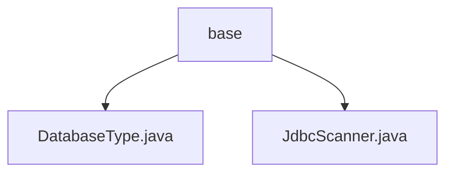

# Basic Information

|      |      |
|------|------|
| Name | base |
| Language | .java |
| Code Path | WeFe/common/java/common-jdbc/src/main/java/com/welab/wefe/common/jdbc/base |
| Package Name | docs.common.java.common-jdbc.src.main.java.com.welab.wefe.common.jdbc.base |
| Brief Description | The DatabaseType enum defines multiple database types, some with annotations. JdbcScanner is an abstract class used for JDBC scanning, containing query, read, and close methods, requiring subclasses to implement execute. |

# Description

## Overview  
The core responsibility of this module is to provide universal implementations for database type identification and JDBC scanning operations. The DatabaseType enum defines six database types, including MySql and PgSql, for inter-system type identification. JdbcScanner, as an abstract base class, encapsulates the JDBC query process in a result-set iterator-like pattern, supporting connection management, automatic field retrieval, and row-by-row reading. Key data structures include the DatabaseType enum and the scanner class containing Connection/ResultSet. The only external dependency is the standard JDBC interface. For example, the readOneRow method implements row data mapping, while subclasses must implement the execute method to complete customized queries.  

## Primary Business Scenarios  
This module is suitable for data scanning scenarios requiring multi-database adaptation, such as cross-database extraction in ETL tools. A typical workflow involves: initializing JdbcScanner with a connection and SQL, automatically retrieving result set metadata, and processing data row by row via iterative readOneRow calls. For instance, when reading millions of rows from MySql, memory usage can be controlled via the maxRows parameter. The interaction model follows the standard "connect-query-iterate-close" process, supporting full-field retrieval or specified column projection. API types include enum definitions, an abstract scanner base class, and the Closeable resource management interface.

### Package Internal Structure View

This flowchart illustrates the base package structure of the common-jdbc module in the WeFe project. The base directory contains two core class files: DatabaseType.java defines database type enumerations, and JdbcScanner.java implements JDBC scanning functionality. These two classes collectively form the foundational database operation components of the project, with a clear and concise hierarchical relationship.

# File List

| Name   | Type  | Description |
|-------|------|-------------|
| [DatabaseType.java](DatabaseType.md) | file | Define database type enumeration, including MySql, PgSql, Hive, Impala, Cassandra, and Doris. |
| [JdbcScanner.java](JdbcScanner.md) | file | The abstract class JdbcScanner implements the Closeable interface and is designed for JDBC queries. It includes attributes such as connection, SQL, and maximum row count. Queries are executed via the `execute` method, single rows are read using `readOneRow`, and resources are released with `close`. It supports custom return fields or defaults to all fields. |

