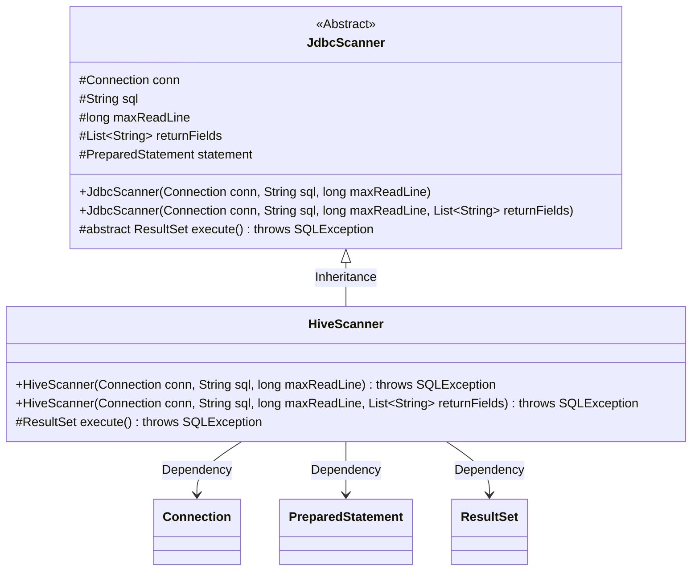
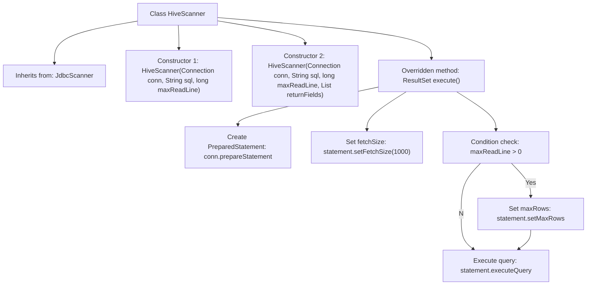

# Basic Information

|      |      |
|------|------|
| Name | HiveScanner |
| Language | .java |
| Code Path | WeFe/common/java/common-jdbc/src/main/java/com/welab/wefe/common/jdbc/hive/HiveScanner.java |
| Package Name | com.welab.wefe.common.jdbc.hive |
| Dependencies | ['com.welab.wefe.common.Convert', 'com.welab.wefe.common.jdbc.base.JdbcScanner', 'java.sql.Connection', 'java.sql.ResultSet', 'java.sql.SQLException', 'java.util.List'] |
| Brief Description | HiveScanner extends JdbcScanner, providing two constructor methods, overrides the execute method to set the result set type and fetch size, and supports a maximum row limit. |

# Description

HiveScanner is a class that inherits from JdbcScanner and is used to execute Hive database queries. It provides two constructors, which accept a database connection, SQL statement, maximum number of rows to read, and an optional list of return fields. This class overrides the execute method, configuring the result set to be read-only and forward-only through a prepared statement, with a fetch size of 1000. When maxReadLine is greater than 0, since Hive does not support setLargeMaxRows, it converts the value to an integer to set the maximum number of rows. Finally, it executes the query and returns the result set.

# Class Summary

| Name   | Type  | Description |
|-------|------|-------------|
| HiveScanner | class | HiveScanner extends JdbcScanner and provides two constructor methods, overriding the execute method to set Hive query parameters and execute them. |

## Class HiveScanner

|      |      |
|------|------|
| Access Modifier | public |
| Type | class |
| Name | HiveScanner |
| Description | HiveScanner extends JdbcScanner and provides two constructor methods, overriding the execute method to set Hive query parameters and execute them. |

### UML Class Diagram

This code demonstrates a class structure where HiveScanner inherits from the abstract class JdbcScanner. HiveScanner is specifically designed for Hive database queries, implementing custom query execution logic by overriding the execute() method, including parameters like fetchSize and maxRows. The class diagram clearly illustrates the inheritance relationship, class member variables and methods, as well as HiveScanner's dependencies on JDBC-related classes (Connection, PreparedStatement, ResultSet). HiveScanner provides two constructor methods, supporting initialization both with and without a return fields list.

### Internal Method Call Graph

This flowchart illustrates the inheritance relationship and main method invocation sequence of the HiveScanner class. As a subclass of JdbcScanner, it contains two constructors and an overridden execute() method. The core workflow of execute() includes: creating a PreparedStatement object, setting the result set fetch size, conditionally setting the maximum row limit based on the maxReadLine parameter, and finally executing the SQL query to return the result set. Special attention should be paid to the handling of Hive-specific characteristics, where setLargeMaxRows is not supported and replaced with setMaxRows.

### Field List

| Name  | Type  | Description |
|-------|-------|------|

### Method List

| Name  | Type  | Description |
|-------|-------|------|
| execute | ResultSet | Rewrite the execute method to create a read-only cursor SQL statement, set the fetch row count to 1000, limit the maximum rows if maxReadLine is greater than 0, and finally execute the query to return the result set. |

