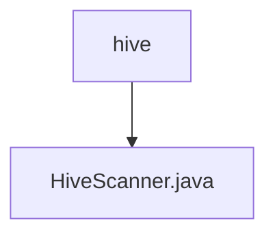

# Basic Information

|      |      |
|------|------|
| Name | hive |
| Language | .java |
| Code Path | WeFe/common/java/common-jdbc/src/main/java/com/welab/wefe/common/jdbc/hive |
| Package Name | docs.common.java.common-jdbc.src.main.java.com.welab.wefe.common.jdbc.hive |
| Brief Description | HiveScanner extends JdbcScanner, providing two constructor methods, overrides the execute method to set the result set type and fetch size, and supports a maximum row limit. |

# Description

HiveScanner is a class that inherits from JdbcScanner and is used to execute Hive database queries. It provides two constructors, which accept database connection, SQL statement, maximum number of rows to read, and an optional list of return fields. This class overrides the execute method, configuring the result set to be read-only and forward-only through a prepared statement, and sets a fetch size of 1000. When maxReadLine is greater than 0, since Hive does not support setLargeMaxRows, it converts the value to an integer to set the maximum number of rows. Finally, it executes the query and returns the result set.

### Package Internal Structure View

This flowchart illustrates the hierarchical relationship between the HiveScanner.java file and the hive directory. HiveScanner.java is a Java file located under the hive directory, forming a simple parent-child hierarchy. The diagram clearly presents the subordinate relationship of the file within the directory, aligning with the given path information.

# File List

| Name   | Type  | Description |
|-------|------|-------------|
| [HiveScanner.java](HiveScanner.md) | file | HiveScanner inherits from JdbcScanner, providing two constructor methods, overrides the execute method to set the result set type and fetch size, and supports maximum row count limitation. |

