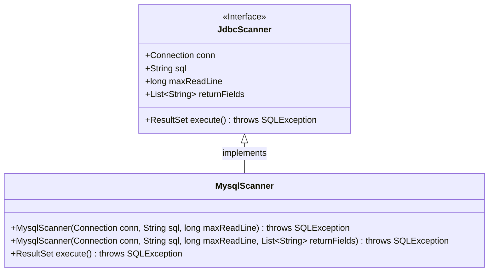
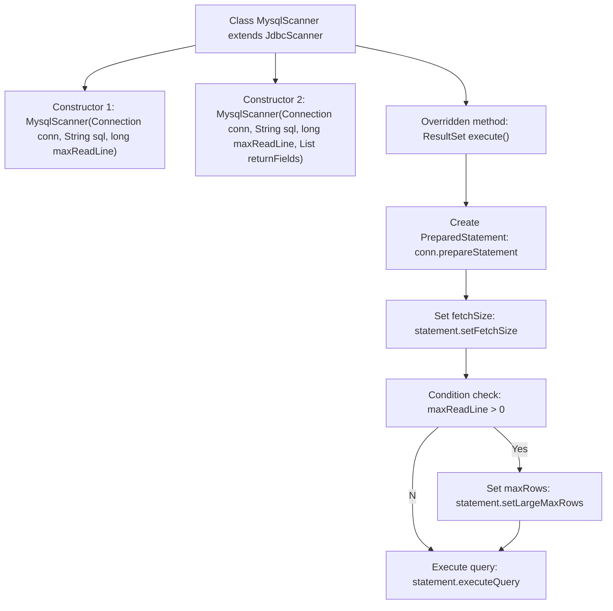

# Basic Information

|      |      |
|------|------|
| Name | MysqlScanner |
| Language | .java |
| Code Path | WeFe/common/java/common-jdbc/src/main/java/com/welab/wefe/common/jdbc/mysql/MysqlScanner.java |
| Package Name | com.welab.wefe.common.jdbc.mysql |
| Dependencies | ['com.welab.wefe.common.jdbc.base.JdbcScanner', 'java.sql.Connection', 'java.sql.ResultSet', 'java.sql.SQLException', 'java.util.List'] |
| Brief Description | MysqlScanner extends JdbcScanner and provides two constructor methods, supporting the setting of maximum read rows and return fields. The execute method executes SQL queries, sets the cursor type to read-only forward-only, and optimizes large result set processing. |

# Description

MysqlScanner is a MySQL database scanning class inherited from JdbcScanner, providing two constructor methods. The first constructor accepts parameters for database connection, SQL statement, and maximum read rows; the second constructor additionally accepts a return field list parameter. This class overrides the execute method, utilizing a read-only, forward-only type of result set and setting a special fetch size to optimize performance. When maxReadLine is greater than 0, it limits the maximum number of returned rows. Finally, the query is executed via a prepared statement and the result set is returned.

# Class Summary

| Name   | Type  | Description |
|-------|------|-------------|
| MysqlScanner | class | MysqlScanner extends JdbcScanner and provides two constructors, supporting the configuration of maximum rows to read and return fields. The execute method executes SQL queries, sets a read-only cursor and minimum fetchSize, with an optional limit on the maximum number of rows. |

## Class MysqlScanner

|      |      |
|------|------|
| Access Modifier | public |
| Type | class |
| Name | MysqlScanner |
| Description | MysqlScanner extends JdbcScanner and provides two constructors, supporting the configuration of maximum rows to read and return fields. The execute method executes SQL queries, sets a read-only cursor and minimum fetchSize, with an optional limit on the maximum number of rows. |

### UML Class Diagram

This code demonstrates a MySQL scanner class `MysqlScanner` inheriting from the `JdbcScanner` interface, implementing database query functionality. `MysqlScanner` initializes connection parameters through two constructors and overrides the `execute()` method to execute SQL queries, configuring the result set type as forward-only read mode while optimizing performance for large-volume queries. The class diagram clearly reflects the inheritance relationship and core methods, showcasing the encapsulation and extension of JDBC operations.

### Internal Method Call Graph

This code demonstrates a MySQL scanner class that inherits from the JDBC scanner base class. The flowchart clearly illustrates the overloaded relationship between two constructors and the implementation details of the core execute() method. The execute() method creates a forward-only read-only result set, optimizes large data volume reading by setting a specific fetchSize, dynamically controls the maximum returned rows based on the maxReadLine parameter, and finally executes the SQL query to return the result set. This design achieves efficient and controllable MySQL data scanning functionality.

### Field List

| Name  | Type  | Description |
|-------|-------|------|

### Method List

| Name  | Type  | Description |
|-------|-------|------|
| execute | ResultSet | Rewrite the execute method to create a read-only forward-only result set, set the minimum fetch size, optionally limit the maximum number of rows to read, and return the query result. |

