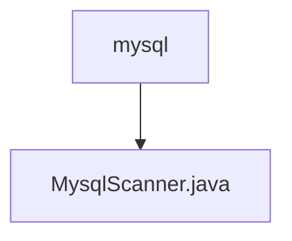

# Basic Information

|      |      |
|------|------|
| Name | mysql |
| Language | .java |
| Code Path | WeFe/common/java/common-jdbc/src/main/java/com/welab/wefe/common/jdbc/mysql |
| Package Name | docs.common.java.common-jdbc.src.main.java.com.welab.wefe.common.jdbc.mysql |
| Brief Description | MysqlScanner extends JdbcScanner and provides two constructors, supporting the configuration of maximum rows to read and return fields. The execute method executes SQL queries, sets the cursor type to read-only forward-only, and optimizes large result set processing. |

# Description

MysqlScanner is a MySQL database scanning class inherited from JdbcScanner, providing two constructors. The first constructor accepts parameters for database connection, SQL statement, and maximum read rows; the second constructor additionally takes a return field list parameter. This class overrides the execute method, utilizing a read-only, forward-only type result set and setting a special fetch size to optimize performance. When maxReadLine is greater than 0, it limits the maximum returned rows. Finally, it executes the query via a prepared statement and returns the result set.

### Package Internal Structure View

This flowchart illustrates the hierarchical structure of MySQL-related code, with the root node being the mysql directory, which contains a specific implementation file named MysqlScanner.java. This structure reflects a typical Java project package organization, where mysql serves as a functional module directory housing the concrete database scanner implementation class. The diagram succinctly and clearly presents a single-level containment relationship, adhering to Mermaid syntax standards with accurately named nodes.

# File List

| Name   | Type  | Description |
|-------|------|-------------|
| [MysqlScanner.java](MysqlScanner.md) | file | MysqlScanner extends JdbcScanner and provides two constructors, supporting the configuration of maximum rows to read and return fields. The execute method executes SQL queries, sets the cursor type to forward-only read mode, and optimizes large result set processing. |

