# Basic Information

|      |      |
|------|------|
| Name | welab |
| Language | .java |
| Code Path | WeFe/common/java/common-lang/src/main/java/com/welab |
| Package Name | docs.common.java.common-lang.src.main.java.com.welab |
| Brief Description | Java Configuration Management Toolset, which uniformly manages configurations and provides type-safe interfaces. Supports multi-environment configuration loading and type conversion, dependent on Log4j. The data processing toolset includes Excel parsing and text batch processing, supporting ETL and log analysis. The field validation platform implements sensitive data masking and format validation. The basic constants module defines key types and compression formats. The general utility library covers encryption, collection operations, and more. The HTTP communication module manages file downloads and request processing. The compression/decompression module supports multi-format processing. Functional interfaces support Lambda operations. The thread pool management tool provides task execution functionality. The validation class checks data type legality. The status code enumeration defines system error codes. The security tool generates random salt values. The time interval class handles time calculations. The batch consumer class implements batch data processing. The captcha generation class creates Base64 captchas. The information size class converts storage units. The data type conversion class handles multi-format conversions. The sampling log class controls log frequency. The timing utility class records code execution time. |

# Description

## Overview  
This module is a comprehensive library of Java foundational utilities and functional components, with core responsibilities including configuration management, data processing, field validation, HTTP communication, and other basic service support. It adopts a static utility class design pattern, providing type-safe interfaces and functional programming support. Key data structures include CompositeConfiguration (composite configuration), Excel worksheets/cells, regular rule libraries, and enum constants. External dependencies include Log4j, Apache HttpClient, BouncyCastle, etc. For example, the configuration module relies on Log4j, while the encryption module uses BouncyCastle to implement national cryptographic algorithms.  

The module integrates functionalities across multiple domains, resembling infrastructure middleware. For instance, the `Configurations` class manages multi-environment configurations, `ExcelReader` provides lightweight encapsulation of POI operations, and `FieldValidateUtil` handles sensitive data masking. Technical features include annotation-driven design (e.g., `@Check`), strategy enums (e.g., `SecretKeyType`), and stream processing (e.g., `BatchConsumer`). All components adhere to the "out-of-the-box" principle, such as `SecurityUtil` generating encryption salts and `TimeSpan` handling time interval calculations.  

## Key Business Scenarios  
Typical applications form three major closed loops:  
1) **Configuration and Security Loop**: Loading configurations via `ConfigurationManager` → validating with `FieldValidateUtil` → encrypting with `SecurityUtil`, e.g., reading database connection parameters and validating sensitive fields.  
2) **Data Processing Loop**: Combining `ExcelReader` parsing → batch processing with `BatchConsumer` → compressed storage with `File`, resembling an ETL pipeline.  
3) **Communication and Scheduling Loop**: API calls with `HttpClient` → asynchronous execution via `CommonThreadPool` → performance monitoring with `Stopwatch`.  

The unified interaction mode combines chained calls with annotation-driven design. For example, the Excel module follows a "load-iterate-close" workflow, while the validation module triggers rules via the `@Check` annotation. Functional completeness is reflected in coverage of national cryptographic algorithms (SM2/SM4), multi-protocol support (HTTP/ZIP), and full lifecycle management (e.g., configuration loading → usage → monitoring). Typical scenarios include:  
- Financial-grade data validation (ID cards/phone numbers).  
- High-concurrency file processing (chunked compression/download).  
- Secure communication (HTTPS + signature verification).  
For instance, `HttpRequest` automatically handles 302 redirects, and `Validator` validates date-time formats.

### Package Internal Structure View

```mermaid
graph TD
    wefe --> common
    common --> configuration
    common --> fastjson
    common --> enums
    common --> io
    common --> fieldvalidate
    common --> constant
    common --> util
    common --> exception
    common --> http
    common --> file
    common --> function
    common --> CommonThreadPool.java
    common --> Validator.java
    common --> StatusCode.java
    common --> SecurityUtil.java
    common --> TimeSpan.java
    common --> BatchConsumer.java
    common --> WeSpecCaptcha.java
    common --> InformationSize.java
    common --> Convert.java
    common --> SamplingLogger.java
    common --> Stopwatch.java
    configuration --> Configurations.java
    configuration --> ConfigurationManager.java
    fastjson --> LoggerValueFilter.java
    enums --> FilePublicLevel.java
    io --> excel
    io --> text
    excel --> ExcelReader.java
    text --> writer
    text --> reader
    writer --> delegate
    writer --> LocalTextFileWriter.java
    writer --> AbstractTextWriter.java
    delegate --> RecordToStringFunction.java
    delegate --> FileNameFunction.java
    reader --> TextFileIterator.java
    reader --> LocalTextFileReader.java
    reader --> AbstractTextReader.java
    fieldvalidate --> secret
    fieldvalidate --> annotation
    fieldvalidate --> StandardFieldType.java
    fieldvalidate --> FieldValidateUtil.java
    fieldvalidate --> FieldAssert.java
    fieldvalidate --> ReactionaryKeywords.java
    fieldvalidate --> AbstractCheckModel.java
    secret --> SecretValueFilter.java
    secret --> SecretUtil.java
    secret --> Secret.java
    secret --> MaskStrategy.java
    annotation --> Check.java
    constant --> SecretKeyType.java
    constant --> ZipType.java
    constant --> Constant.java
    util --> enums
    util --> MapUtil.java
    util --> ReflectionsUtil.java
    util --> IpAddressUtil.java
    util --> Sha1.java
    util --> ListUtil.java
    util --> StringUtil.java
    util --> EncryptUtils.java
    util --> SignUtil.java
    util --> UrlUtil.java
    util --> DateUtil.java
    util --> SM2Util.java
    util --> SM4Util.java
    util --> ClassUtils.java
    util --> JObject.java
    util --> Masker.java
    util --> OS.java
    util --> Base64Util.java
    util --> ZipUtil.java
    util --> Md5.java
    util --> ImageUtil.java
    util --> FileUtil.java
    util --> XmlUtil.java
    util --> CommentedProperties.java
    util --> AESUtil.java
    util --> RandomUtil.java
    util --> FileType.java
    util --> ThreadUtil.java
    util --> CopyUtil.java
    util --> GzipUtil.java
    util --> HostUtil.java
    util --> AsymmetricCryptoUtil.java
    util --> RSAUtil.java
    exception --> StatusCodeWithException.java
    http --> download
    http --> MyRedirectStrategy.java
    http --> HttpContentType.java
    http --> HttpMethod.java
    http --> HttpResponse.java
    http --> HttpRequest.java
    download --> DownloadResult.java
    download --> HttpDownloader.java
    download --> DownloadStatus.java
    file --> compression
    file --> decompression
    compression --> impl
    compression --> CompressionType.java
    compression --> AbstractCompression.java
    impl --> Zip.java
    impl --> Tgz.java
    decompression --> impl
    decompression --> dto
    decompression --> SuperDecompressor.java
    decompression --> AbstractDecompression.java
    impl --> Zip.java
    impl --> SevenZip.java
    impl --> Tgz.java
    dto --> DecompressionResult.java
    function --> CharFunction.java
    function --> ConsumerWithException.java
    function --> ToBooleanFunction.java
```

This flowchart illustrates the complete directory structure of the common-lang module in the WeFe project, starting from the top-level package com/welab/wefe/common and expanding hierarchically to various sub-packages and files. The diagram clearly presents the hierarchical relationships and dependencies among major functional modules such as configuration, utility classes, enums, IO operations, field validation, constants, exception handling, HTTP functionalities, file operations, and functional interfaces. Each node displays only the last-level directory or filename, maintaining the diagram's conciseness.

# File List

| Name   | Type  | Description |
|-------|------|-------------|
| [wefe](wefe/_module.md) | package | Java configuration management toolset, uniformly manages configurations and provides type-safe interfaces. Supports multi-environment configuration loading and type conversion, dependent on Log4j. The data processing toolset includes Excel parsing and text batch processing, supporting ETL and log analysis. The field validation platform implements sensitive data masking and format validation. The basic constants module defines key types and compression formats. The general utility library covers encryption, collection operations, etc. The HTTP communication module manages file downloads and request handling. The compression/decompression module supports multi-format processing. Functional interfaces support Lambda operations. The thread pool management tool provides task execution functionality. The validation class checks data type legality. The status code enumeration defines system error codes. The security tool generates random salt values. The time interval class handles time calculations. The batch consumer class implements batch data processing. The captcha generation class creates Base64 captchas. The information size class converts storage units. The data type conversion class handles multi-format conversions. The sampling log class controls log frequency. The timing utility class records code execution time. |

