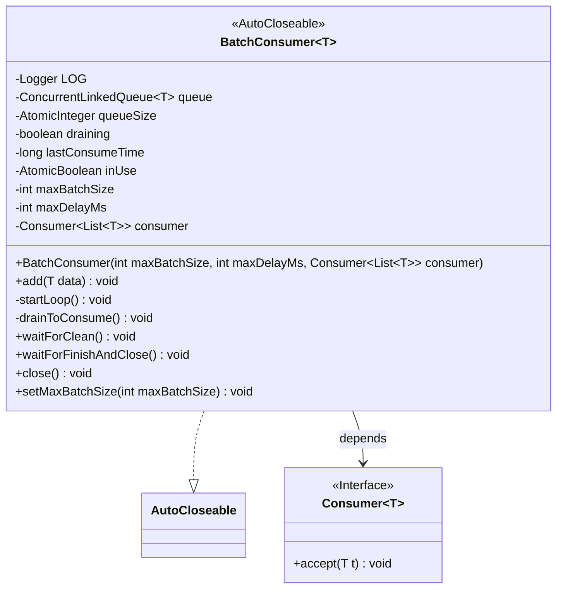
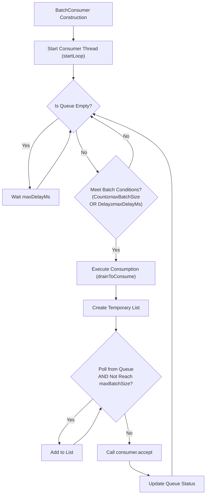
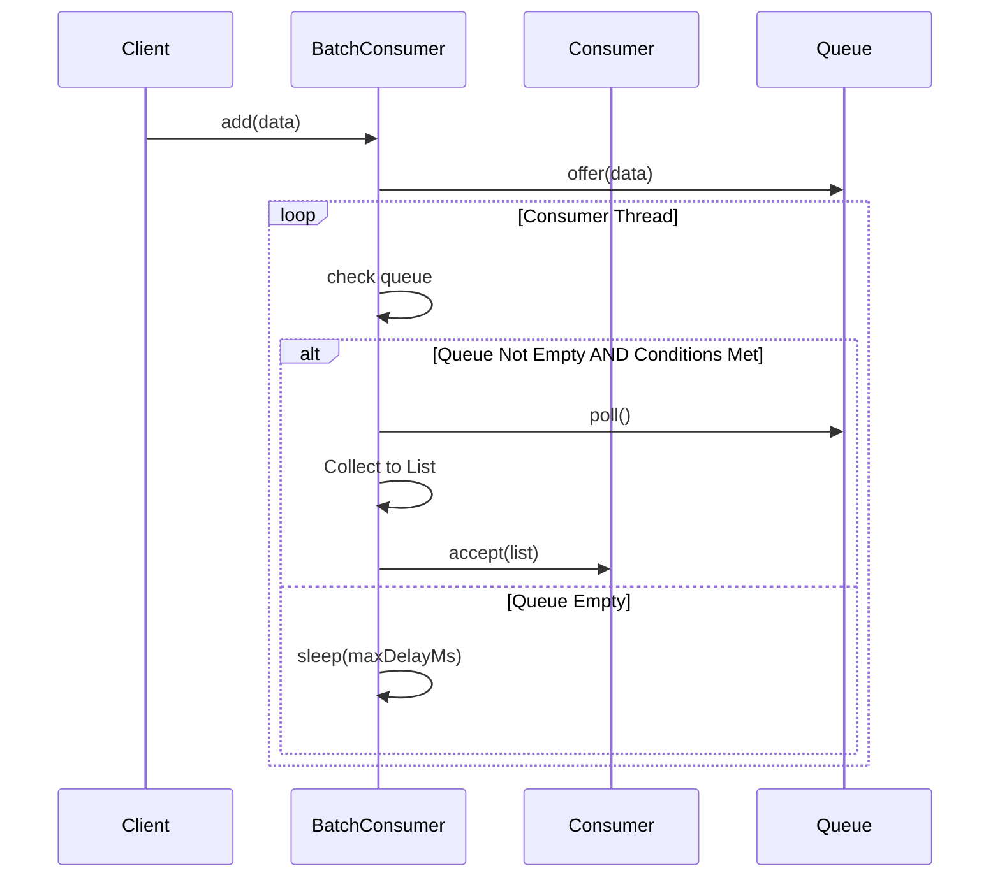
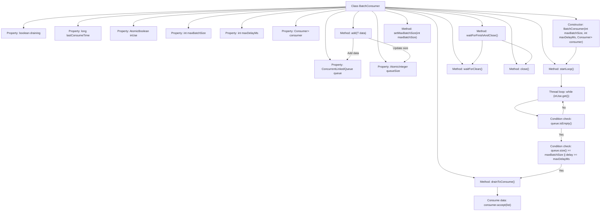
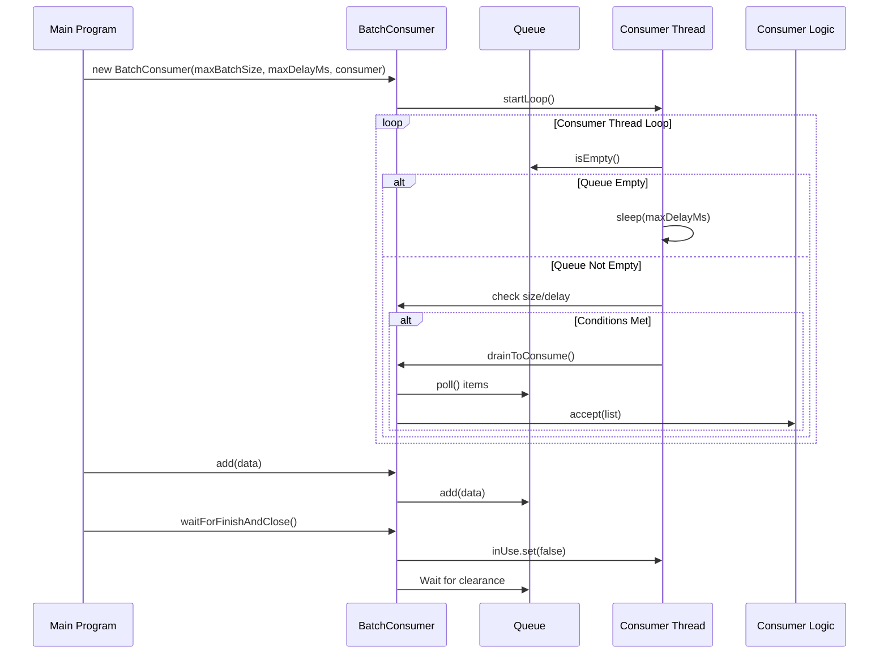

# Basic Information

|      |      |
|------|------|
| Name | BatchConsumer |
| Language | .java |
| Code Path | WeFe/common/java/common-lang/src/main/java/com/welab/wefe/common/BatchConsumer.java |
| Package Name | com.welab.wefe.common |
| Dependencies | ['org.slf4j.Logger', 'org.slf4j.LoggerFactory', 'java.util.ArrayList', 'java.util.List', 'java.util.concurrent.ConcurrentLinkedQueue', 'java.util.concurrent.atomic.AtomicBoolean', 'java.util.concurrent.atomic.AtomicInteger', 'java.util.function.Consumer'] |
| Brief Description | BatchConsumer is a utility class designed for batch processing of queue data, supporting configurable maximum batch size and delay thresholds. It is thread-safe and features automatic shutdown capability. |

# Description

BatchConsumer is a generic class that implements the AutoCloseable interface, designed for batch data consumption. It contains a thread-safe queue and controls batch consumption triggering conditions via maxBatchSize and maxDelayMs. The consumption logic is triggered when either the queue data volume reaches maxBatchSize or the waiting time exceeds maxDelayMs. The class provides an add method for data insertion and monitors queue status through a background thread. It also offers waitForClean and waitForFinishAndClose methods to ensure consumption completion. The lifecycle of the consumption thread is managed by the inUse flag, and dynamic adjustment of maxBatchSize is supported.

# Class Summary

| Name   | Type  | Description |
|-------|------|-------------|
| BatchConsumer | class | BatchConsumer is a utility class for batch processing queue data, supporting configurable maximum batch size and delay time, automatically triggering consumption logic, with thread safety and shutdown capability. |

## Class BatchConsumer

|      |      |
|------|------|
| Access Modifier | public |
| Type | class |
| Name | BatchConsumer |
| Description | BatchConsumer is a utility class for batch processing queue data, supporting configurable maximum batch size and delay time, automatically triggering consumption logic, with thread safety and shutdown capability. |

### UML Class Diagram

This code implements a generic batch consumer (BatchConsumer) using the producer-consumer pattern. The core mechanism involves a background thread periodically checking the queue, triggering batch consumption when accumulated data reaches maxBatchSize or waiting time exceeds maxDelayMs. The class diagram shows it implements AutoCloseable interface and depends on Consumer interface, featuring thread-safe queue management and state control. The flowchart clearly illustrates the main loop logic, while the sequence diagram presents interactions during data addition and consumption processes. The system ensures thread safety through atomic variables, providing queue clearance waiting and graceful shutdown functionality, making it suitable for high-throughput batch processing scenarios.

### Internal Method Call Graph

This flowchart illustrates the core structure and data flow of the BatchConsumer class. It is a batch data processing handler featuring thread-safe queue management, timed/quantitative consumption triggering mechanisms, and resource cleanup functions. The main workflow includes: 1) Starting the consumer thread upon initialization; 2) Performing queue control when adding data; 3) Triggering batch consumption based on quantity or time conditions in the consumer thread; 4) Ensuring queue clearance during shutdown. The sequence diagram specifically demonstrates the interaction processes of initialization, data addition, and consumption triggering, highlighting the coordination mechanisms in a multi-threaded environment.

### Field List

| Name  | Type  | Description |
|-------|-------|------|
| inUse = new AtomicBoolean(true) | AtomicBoolean | Declare an atomic boolean variable inUse with an initial value of true for thread-safe state control. |
| LOG = LoggerFactory.getLogger(this.getClass()) | Logger | A protected final log object LOG is defined in the class for recording log information of the current class. |
| draining = false | boolean | The variable `draining` indicates whether it is in the draining state, with an initial value of `false`. |
| lastConsumeTime | long | Private long integer variable, recording the last consumption time. |
| maxDelayMs | int | The private integer constant maxDelayMs represents the maximum delay in milliseconds. |
| queueSize = new AtomicInteger() | AtomicInteger | Define an atomic integer variable `queueSize` for thread-safe queue size counting. |
| maxBatchSize | int | Private integer variable used to store the maximum batch size. |
| consumer | Consumer<List<T>> | The private constant `consumer`, of type `Consumer<List<T>>`, is used to process a list of type T. |
| queue = new ConcurrentLinkedQueue<>() | ConcurrentLinkedQueue<T> | A thread-safe unbounded non-blocking queue, implemented based on linked lists, suitable for high-concurrency scenarios. |

### Method List

| Name  | Type  | Description |
|-------|-------|------|
| waitForClean | void | Waiting for the queue to clear: Continuously check if the queue is empty and no draining operation is in progress, waiting 500 milliseconds each time, and log the completion status. |
| startLoop | void | Start a loop thread to check if the queue is empty and sleep if so, triggering consumption when batch or time conditions are met, with an additional consumption attempt in extreme cases. |
| add | void | The method `add` receives data and returns if the data is empty. If the `BatchConsumer` is closed, it throws an exception. When the queue length exceeds three times the maximum batch size, it sleeps and waits. The data is added to the queue, and the queue size is updated. |
| waitForFinishAndClose | void | Method waits for cleanup to complete before closing, marked as unused. |
| drainToConsume | void | The method `drainToConsume` retrieves a batch of up to `maxBatchSize` elements from the queue and passes them to the `consumer` for processing. It records the time taken and the queue size, logs exceptions, and finally resets the `draining` flag. |
| close | void | The method close() sets the inUse flag to false and releases resources. |
| setMaxBatchSize | void | This method is used to set the maximum batch processing size, where the parameter maxBatchSize is assigned to the class member variable of the same name. |

