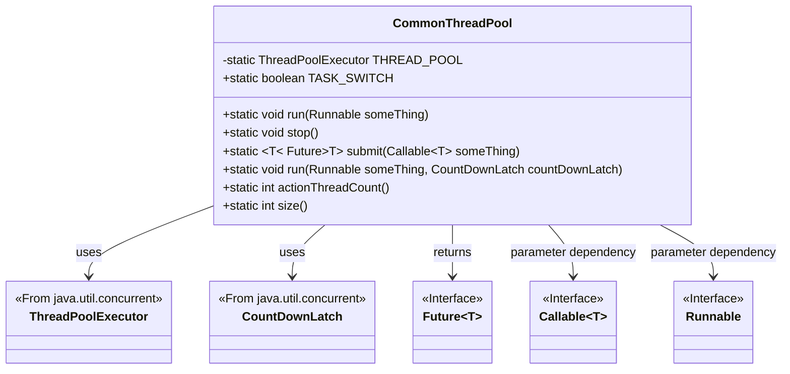
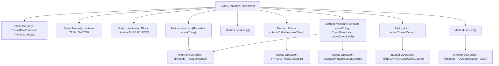

# Basic Information

|      |      |
|------|------|
| Name | CommonThreadPool |
| Language | .java |
| Code Path | WeFe/common/java/common-lang/src/main/java/com/welab/wefe/common/CommonThreadPool.java |
| Package Name | com.welab.wefe.common |
| Dependencies | ['java.util.concurrent'] |
| Brief Description | The CommonThreadPool class provides static thread pool management, supporting task execution, submission, termination, and status query. It utilizes LinkedBlockingQueue and CountDownLatch to implement asynchronous task control. |

# Description

This class implements a generic thread pool management utility, including a static thread pool instance and a task switch flag. During thread pool initialization, the minimum number of threads is set based on the number of processor cores, with a maximum of 100 threads, using a 100-millisecond keep-alive time and an unbounded blocking queue. It provides functionality to execute Runnable tasks and submit Callable tasks, supporting asynchronous task execution with CountDownLatch (automatically decrementing the count upon task completion). It includes query methods to retrieve the number of active threads and queue size. The stop feature is implemented by modifying the task switch flag, while the original thread pool shutdown logic is commented out.

# Class Summary

| Name   | Type  | Description |
|-------|------|-------------|
| CommonThreadPool | class | The CommonThreadPool class provides static thread pool management, supporting task execution, submission, termination, and status query. The core thread count equals the number of CPUs, with a maximum of 100 threads, using a LinkedBlockingQueue. |

## Class CommonThreadPool

|      |      |
|------|------|
| Access Modifier | public |
| Type | class |
| Name | CommonThreadPool |
| Description | The CommonThreadPool class provides static thread pool management, supporting task execution, submission, termination, and status query. The core thread count equals the number of CPUs, with a maximum of 100 threads, using a LinkedBlockingQueue. |

### UML Class Diagram

This code demonstrates a generic thread pool management class CommonThreadPool, which encapsulates the functionality of ThreadPoolExecutor. The class provides static methods to execute Runnable tasks, submit Callable tasks, control task switches, obtain active thread counts and queue sizes, etc. Through static initialization blocks, it creates a thread pool with default configurations: core threads equal to CPU cores, maximum threads of 100, using an unbounded queue. Notably, it supports task execution with CountDownLatch to ensure task completion notifications. The class diagram clearly illustrates relationships with key interfaces/classes from Java's concurrent package, including ThreadPoolExecutor, Future, Callable, etc.

### Internal Method Call Graph

This code implements a generic thread pool management class CommonThreadPool, providing thread task execution, stop control, task submission and other functions through static methods and properties. The flowchart illustrates the class structure, static initialization process, and invocation relationships between methods, including core operations such as thread pool task execution, asynchronous task submission, and active thread count retrieval. The commented-out code indicates configurable thread pool parameter adjustment capabilities, currently using processor core count as the base thread number.

### Field List

| Name  | Type  | Description |
|-------|-------|------|
| TASK_SWITCH = true | boolean | The static boolean variable TASK_SWITCH, with a default value of true, is used to control the task switch status. |
| THREAD_POOL | ThreadPoolExecutor | Private static thread pool executor THREAD_POOL. |

### Method List

| Name  | Type  | Description |
|-------|-------|------|
| submit | Future<T> | Java Method: Submitting a Callable Task Using a Thread Pool and Returning a Future Object. |
| stop | void | Stop the thread pool tasks, turn off the task switch, and comment out the original code for shutting down and rebuilding the thread pool. |
| run | void | The method uses a thread pool to execute the incoming Runnable tasks. |
| run | void | Multithreading utility method: Uses a thread pool to execute tasks and automatically decrements the count lock upon completion. Ensures task execution and lock release. |
| actionThreadCount | int | This method returns the current number of active threads in the thread pool. |
| size | int | Get the current number of tasks in the thread pool queue. |

