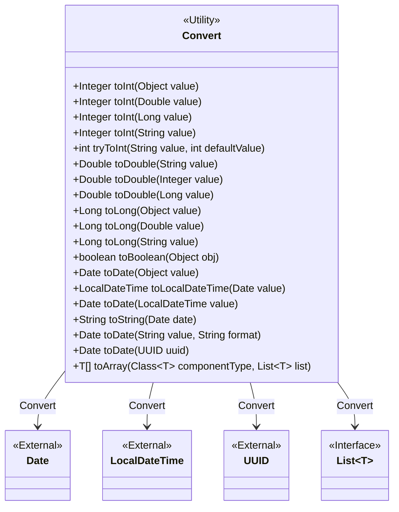

# Basic Information

|      |      |
|------|------|
| Name | Convert |
| Language | .java |
| Code Path | WeFe/common/java/common-lang/src/main/java/com/welab/wefe/common/Convert.java |
| Package Name | com.welab.wefe.common |
| Dependencies | ['com.welab.wefe.common.util.DateUtil', 'com.welab.wefe.common.util.StringUtil', 'java.lang.reflect.Array', 'java.math.BigInteger', 'java.text.ParseException', 'java.text.SimpleDateFormat', 'java.time.LocalDateTime', 'java.time.ZoneId', 'java.util.Date', 'java.util.List', 'java.util.UUID'] |
| Brief Description | The Convert class provides various type conversion methods: handling null values, supporting mutual conversion between types such as Integer, Double, Long, Boolean, Date, etc., including exception handling and default value settings. |

# Description

The Convert class provides various data type conversion methods, including mutual conversions between integers, floating-point numbers, Boolean values, date-time, arrays, and other types. Integer conversion supports conversion from objects, doubles, long integers, and strings, handles null values, and includes safe conversion methods. Floating-point conversion supports string, integer, and long integer inputs. Date-time conversion supports mutual conversion between Date, LocalDateTime, and strings, handling multiple formats. Array conversion supports list-to-array conversion. All methods include null checks to ensure safe and reliable conversion.

# Class Summary

| Name   | Type  | Description |
|-------|------|-------------|
| Convert | class | The Convert class provides various type conversion methods, including mutual conversions between Int, Double, Long, Boolean, Date, LocalDateTime, and Array, handling null values and providing exception handling. |

## Class Convert

|      |      |
|------|------|
| Access Modifier | public |
| Type | class |
| Name | Convert |
| Description | The Convert class provides various type conversion methods, including mutual conversions between Int, Double, Long, Boolean, Date, LocalDateTime, and Array, handling null values and providing exception handling. |

### UML Class Diagram

This class diagram illustrates the Convert utility class, which provides various methods for data type conversion including integer, floating-point, long integer, boolean, date-time, UUID, and array. The Convert class maintains no state, with all methods being static, and relies on external classes such as Date and LocalDateTime to perform type conversion. The diagram clearly depicts the conversion relationships between the Convert class and external types.

### Internal Method Call Graph

```mermaid
graph TD
    A["Class Convert"]
    B["Method: Integer toInt(Object value)"]
    C["Method: Integer toInt(Double value)"]
    D["Method: Integer toInt(Long value)"]
    E["Method: Integer toInt(String value)"]
    F["Method: int tryToInt(String value, int defaultValue)"]
    G["Method: Double toDouble(String value)"]
    H["Method: Double toDouble(Integer value)"]
    I["Method: Double toDouble(Long value)"]
    J["Method: Long toLong(Object value)"]
    K["Method: Long toLong(Double value)"]
    L["Method: Long toLong(String value)"]
    M["Method: boolean toBoolean(Object obj)"]
    N["Method: Date toDate(Object value)"]
    O["Method: LocalDateTime toLocalDateTime(Date value)"]
    P["Method: Date toDate(LocalDateTime value)"]
    Q["Method: String toString(Date date)"]
    R["Method: Date toDate(String value, String format)"]
    S["Method: Date toDate(UUID uuid)"]
    T["Method: T[] toArray(Class<T> componentType, List<T> list)"]

    A --> B
    B --> C
    B --> D
    B --> E
    B --> F
    A --> G
    A --> H
    A --> I
    A --> J
    J --> K
    J --> L
    A --> M
    A --> N
    A --> O
    A --> P
    A --> Q
    A --> R
    A --> S
    A --> T
```

This code represents a versatile type conversion utility class Convert, providing methods for converting between various data types. Key functionalities include: converting different object types to numeric types (Integer/Double/Long), boolean conversion, bidirectional conversion between datetime and strings, and array/list interconversion. All methods are static, support null value handling, with some methods featuring exception catching and default value return mechanisms. The code has a clear structure organized by data types, containing detailed parameter validation and type checking logic.

### Field List

| Name  | Type  | Description |
|-------|-------|------|

### Method List

| Name  | Type  | Description |
|-------|-------|------|
| toDouble | Double | Static methods convert a string to Double, returning null if the input is null, otherwise parsing it as a double-precision floating-point number. |
| toLong | Long | This method converts a string to a Long type, returning null if the input is null, otherwise truncating the part before the decimal point and converting it to a Long. |
| toLong | Long | Convert Double to Long, return null if the input is null, otherwise return its long value. |
| tryToInt | int | This method converts a string to an integer, returning a default value if the conversion fails. It first attempts to convert to a double-precision floating-point number and then to an integer, returning the preset default value when an exception is caught. |
| toDouble | Double | Static method converts Integer to Double, returns null if the input is null, otherwise returns the corresponding Double value. |
| toLocalDateTime | LocalDateTime | Convert a Date object to LocalDateTime in the system default timezone. |
| toDouble | Double | Convert a Long type to a Double type, returning null if the input is null. |
| toBoolean | boolean | The static method `toBoolean` converts an object to a boolean value by calling its `toString` method and then parsing the result as a boolean type before returning it. |
| toInt | Integer | Convert the object to an integer, handling null, Integer, Double, and Long types, while converting other types to strings before processing. |
| toLong | Long | Convert an object to Long type, handling null, Long, BigInteger, Double, and string inputs. |
| toDate | Date | Static methods convert objects into dates, returning null for null values, using Hutool tools for conversion. |
| toInt | Integer | Convert a string to an integer, return null if the input is empty, otherwise first convert to double precision and then to integer. |
| toInt | Integer | Convert Double to Integer, return null if the input is null, otherwise return the integer value part. |
| toDate | Date | Convert LocalDateTime to Date type using the system default timezone. |
| toString | String | This is a Java static method that converts a Date object into a string of the specified format, which is YYYY-MM-DDTHH:MM:SS.SSSZ. |
| toDate | Date | Convert a string to a date in the specified format, returning null for empty values or parsing failures. |
| toDate | Date | Convert the timestamp of a UUID into a Date object by subtracting a fixed offset and dividing by 10000 to obtain the time in milliseconds. |
| toArray | T[] | Convert a List to an array of the specified type, returning null if the List is null. Use Array.newInstance to create the array and populate it with data. |
| toInt | Integer | Static method converts Long to Integer, returns null if the input is null, otherwise calls Math.toIntExact for conversion. |

