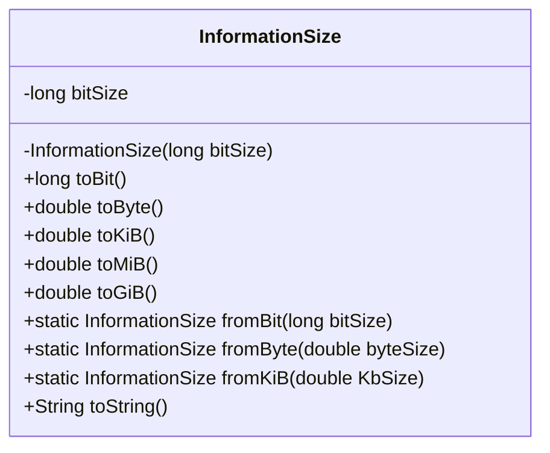
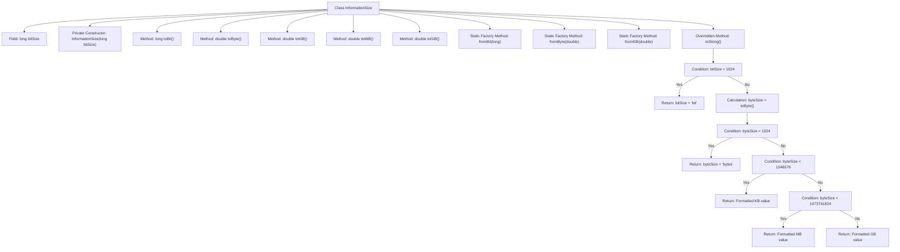

# Basic Information

|      |      |
|------|------|
| Name | InformationSize |
| Language | .java |
| Code Path | WeFe/common/java/common-lang/src/main/java/com/welab/wefe/common/InformationSize.java |
| Package Name | com.welab.wefe.common |
| Dependencies | ['java.math.BigDecimal', 'java.math.RoundingMode'] |
| Brief Description | The InformationSize class encapsulates bit size, providing conversion methods for bits, bytes, KiB, MiB, and GiB, supporting static creation and formatted output. |

# Description

This is a Java class designed to represent and convert information sizes. The class is named InformationSize, with its core attribute being bitSize, which stores the size in bits. It provides multiple unit conversion methods: toBit returns the value in bits, toByte returns the value in bytes, and toKiB/toMiB/toGiB return the values in kibibytes/mebibytes/gibibytes, respectively. The class supports object creation from different units: fromBit/fromByte/fromKiB. The toString method automatically selects an appropriate unit for output based on the size, formatted as a numerical value followed by a unit suffix. All conversion calculations use BigDecimal to ensure precision, with results rounded down to two decimal places.

# Class Summary

| Name   | Type  | Description |
|-------|------|-------------|
| InformationSize | class | The InformationSize class encapsulates bit size, providing conversion methods for bits, bytes, KiB, MiB, and GiB, supporting static creation and formatted output. |

## Class InformationSize

|      |      |
|------|------|
| Access Modifier | public |
| Type | class |
| Name | InformationSize |
| Description | The InformationSize class encapsulates bit size, providing conversion methods for bits, bytes, KiB, MiB, and GiB, supporting static creation and formatted output. |

### UML Class Diagram

This code defines an `InformationSize` class designed for handling data size conversions and representations across different units. The class encapsulates storage size based on bits as the fundamental unit and provides multiple unit conversion methods (bit/byte/KiB/MiB/GiB), including static factory methods for instance creation. The toString() method intelligently selects the most appropriate unit for formatted output, managing conversions from bits to GB-level units while ensuring numerical precision and rounding behavior meet expectations. All conversion calculations utilize BigDecimal to guarantee precision and avoid floating-point arithmetic errors.

### Internal Method Call Graph

This code represents a utility class for information size conversion, supporting mutual conversions between bits, bytes, kilobytes (KB), megabytes (MB), and gigabytes (GB). The class includes a private constructor and multiple static factory methods for object creation, along with methods to convert bits to different units. The toString() method automatically selects the most appropriate unit for formatted output based on the value size, ensuring readability. All conversion calculations use BigDecimal for precision and adopt FLOOR rounding mode with two decimal places.

### Field List

| Name  | Type  | Description |
|-------|-------|------|
| bitSize | long | The private long integer variable bitSize is used to store the bit size. |

### Method List

| Name  | Type  | Description |
|-------|-------|------|
| fromKiB | InformationSize | This method converts the input size in kilobytes to bytes and calls the fromByte method to generate an InformationSize object. |
| toMiB | double | Convert the number of bits to MiB, rounding down to two decimal places. |
| toByte | double | This method converts the number of bits to the number of bytes, retaining two decimal places and rounding down. |
| fromByte | InformationSize | The static method `fromByte` accepts a double-precision byte count, multiplies it by 8 to convert it into bits, and then creates and returns an `InformationSize` object. |
| toKiB | double | This method converts the number of bits into KiB units by dividing by 8 and 1024, then rounds down to two decimal places. |
| fromBit | InformationSize | This method accepts a long integer parameter representing the bit size and returns an InformationSize object instance containing that bit size. |
| toGiB | double | This method converts the bit size to gibibytes (GiB) by dividing it by 8×1024³ and rounding down the result to two decimal places. |
| toString | String | This method automatically converts the data size into appropriate units for display: less than 1024 bits displays as bits, less than 1024 bytes displays as bytes, less than 1MB displays as KB, less than 1GB displays as MB, otherwise displays as GB, retaining two decimal places. |
| toBit | long | The method toBit returns the value of bitSize, with the type being long. |

