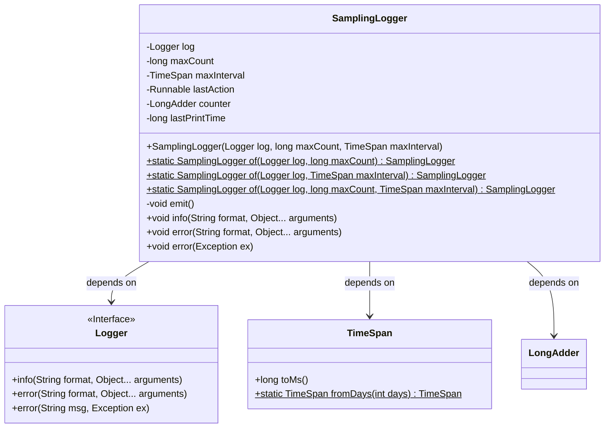
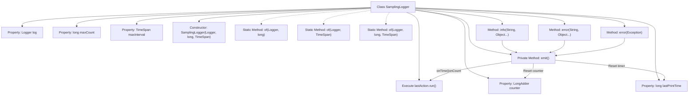

# Basic Information

|      |      |
|------|------|
| Name | SamplingLogger |
| Language | .java |
| Code Path | WeFe/common/java/common-lang/src/main/java/com/welab/wefe/common/SamplingLogger.java |
| Package Name | com.welab.wefe.common |
| Dependencies | ['org.slf4j.Logger', 'java.util.concurrent.atomic.LongAdder'] |
| Brief Description | The SamplingLogger class is used for sampling logs by quantity or time intervals, supporting info and error methods, which trigger log printing when conditions are met. |

# Description

SamplingLogger is a sampling log recording class designed to control log output frequency. It limits the maximum number of logs via maxCount and restricts the maximum time interval via maxInterval. The class provides three static factory methods, supporting individual configuration of either quantity or time interval, or both simultaneously. The core emit method triggers log output based on count or time conditions and resets the counter. The class offers info and error methods to record logs at different levels, with the error method supporting exception handling. Internally, it uses LongAdder for thread-safe counting.

# Class Summary

| Name   | Type  | Description |
|-------|------|-------------|
| SamplingLogger | class | The SamplingLogger class implements log sampling functionality based on quantity or time intervals, supporting info and error level logging, and triggers log output when conditions are met. |

## Class SamplingLogger

|      |      |
|------|------|
| Access Modifier | public |
| Type | class |
| Name | SamplingLogger |
| Description | The SamplingLogger class implements log sampling functionality based on quantity or time intervals, supporting info and error level logging, and triggers log output when conditions are met. |

### UML Class Diagram

This code demonstrates the design of a sampling logger (SamplingLogger) that implements intelligent log sampling by composing the Logger interface. The class controls log output frequency through two dimensions: maxCount (maximum count) and maxInterval (maximum time interval), preventing log flooding. The core mechanism executes lastAction and resets the counter when either threshold is reached. The class diagram clearly shows dependencies with the Logger interface, TimeSpan utility class, and LongAdder counter, reflecting the inversion of control design principle.

### Internal Method Call Graph

This code demonstrates the implementation of a sampling logger (SamplingLogger) that controls log output frequency through time intervals (maxInterval) and count thresholds (maxCount). The core mechanism is: only when either the time interval or log count threshold is reached will the actual logging operation (lastAction.run()) be executed, followed by resetting the timestamp and counter. The class provides three static factory methods (of) to create instances with different configurations, along with info/error methods for two log levels, where the error method supports exception object handling. The emit() method serves as an internal trigger, implementing the sampling logic's judgment and execution.

### Field List

| Name  | Type  | Description |
|-------|-------|------|
| lastPrintTime = 0 | long | Define a long integer variable lastPrintTime with an initial value of 0, used to record the last printing time. |
| counter = new LongAdder() | LongAdder | Declare a thread-safe counter variable `counter` using the `LongAdder` class to achieve efficient accumulation. |
| maxCount | long | Private long integer variable maxCount, used to store the maximum count value. |
| maxInterval | TimeSpan | Private time interval variable maxInterval |
| lastAction | Runnable | The private Runnable type variable lastAction is used to store the last executed operation. |
| log | Logger | Private logger instance. |

### Method List

| Name  | Type  | Description |
|-------|-------|------|
| of | SamplingLogger | The static method `of` creates a sampled logger, taking a log object and the maximum interval time as parameters. Internally, it invokes the constructor and sets the maximum sample count to `Long.MAX_VALUE`. |
| of | SamplingLogger | Create a sampling logger, specifying the log object, maximum record count, and time interval. |
| of | SamplingLogger | Create a sampling logger using the specified logger and maximum count, with a default time span of 1 day. |
| emit | void | The emit method executes the lastAction and resets the timer and counter when either the time interval or count condition is met. |
| info | void | Java Method: Logs info, updates counter, and triggers emit. Parameters include a format string and variable arguments. |
| error | void | Java Method: Log error messages with counting and trigger subsequent actions. Parameters: Format string and variable arguments. |
| error | void | This method records error information when an exception occurs, updates the counter, and triggers subsequent operations. Key steps include: recording the exception class name and message, incrementing the counter, and calling the emit method. |

