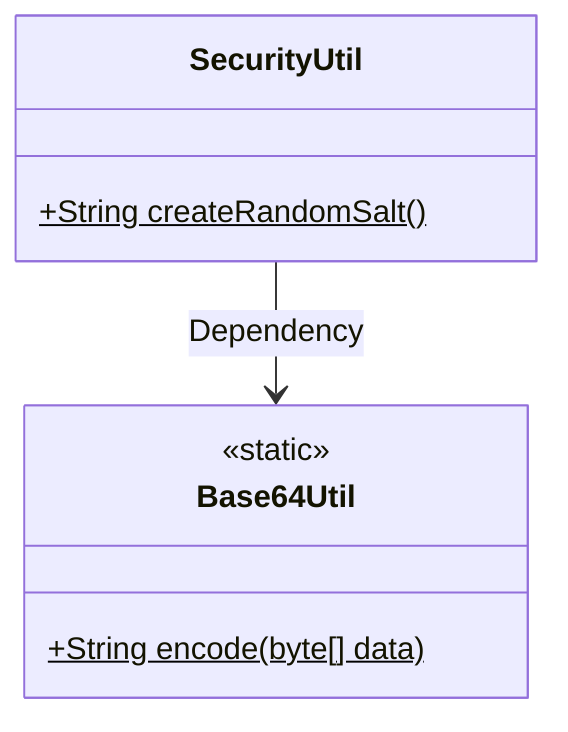
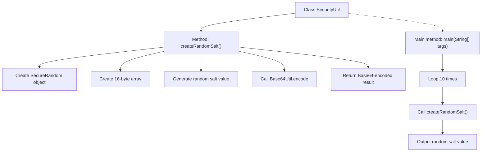

# Basic Information

|      |      |
|------|------|
| Name | SecurityUtil |
| Language | .java |
| Code Path | WeFe/common/java/common-lang/src/main/java/com/welab/wefe/common/SecurityUtil.java |
| Package Name | com.welab.wefe.common |
| Dependencies | ['com.welab.wefe.common.util.Base64Util', 'java.security.SecureRandom', 'java.util.Random'] |
| Brief Description | The SecurityUtil class provides the method createRandomSalt for generating random salts, which uses SecureRandom to produce a 16-byte random number and encodes it in Base64. The main method demonstrates generating 10 salt values. |

# Description

The `SecurityUtil` class contains a static method `createRandomSalt` for generating a 16-byte random salt value. This method uses `SecureRandom` to ensure cryptographic strength and encodes the binary salt value into a string via `Base64Util`. The `main` method demonstrates an example of generating 10 random salt values. The entire implementation focuses on secure random number generation and encoding conversion.

# Class Summary

| Name   | Type  | Description |
|-------|------|-------------|
| SecurityUtil | class | The SecurityUtil class provides a method called createRandomSalt for generating random salts, which uses SecureRandom to produce a 16-byte salt and encodes it in Base64. The main method demonstrates the generation of 10 salt values. |

## Class SecurityUtil

|      |      |
|------|------|
| Access Modifier | public |
| Type | class |
| Name | SecurityUtil |
| Description | The SecurityUtil class provides a method called createRandomSalt for generating random salts, which uses SecureRandom to produce a 16-byte salt and encodes it in Base64. The main method demonstrates the generation of 10 salt values. |

### UML Class Diagram

This code demonstrates a security utility class `SecurityUtil`, primarily used for generating random salt values. The class contains a static method `createRandomSalt()` that utilizes `SecureRandom` to generate 16-byte random numbers, which are then encoded via `Base64Util` before returning. `Base64Util` is a utility class providing static encoding methods. The `main` method in `SecurityUtil` showcases the process of generating 10 random salt values. The overall design is concise and efficient, suitable for cryptographic security scenarios requiring random number generation.

### Internal Method Call Graph

This code flowchart illustrates the core functionality of the SecurityUtil class. The main process begins with the createRandomSalt() method, which generates a 16-byte random number via SecureRandom and returns the Base64-encoded result. The main method then calls this method 10 times in a loop and outputs the results. The entire workflow demonstrates a secure random salt generation mechanism, encompassing three critical steps: cryptographically secure random number generation, byte array processing, and Base64 encoding conversion, ultimately producing random salt values suitable for security scenarios such as password storage.

### Field List

| Name  | Type  | Description |
|-------|-------|------|

### Method List

| Name  | Type  | Description |
|-------|-------|------|
| main | void | The Java main method loops 10 times, each time calling createRandomSalt() and printing the result. |
| createRandomSalt | String | Generate a 16-byte random salt and return it encoded in Base64. |

