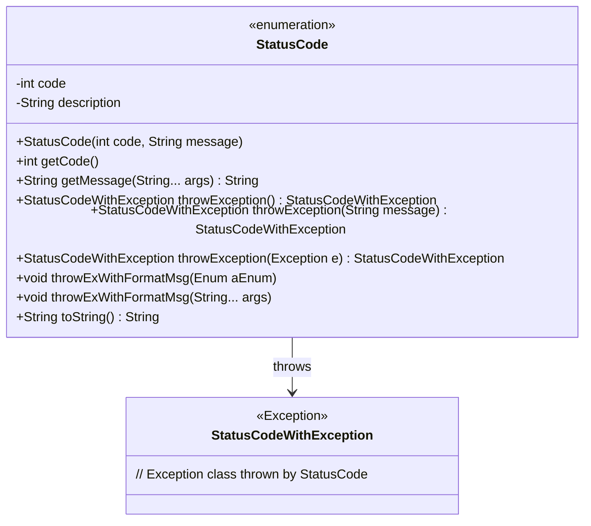
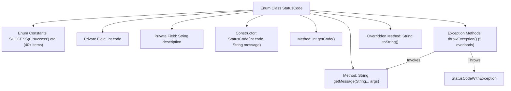

# Basic Information

|      |      |
|------|------|
| Name | StatusCode |
| Language | .java |
| Code Path | WeFe/common/java/common-lang/src/main/java/com/welab/wefe/common/StatusCode.java |
| Package Name | com.welab.wefe.common |
| Dependencies | ['com.welab.wefe.common.exception.StatusCodeWithException'] |
| Brief Description | Status code enumeration class, containing error codes and descriptions for systems, databases, services, etc., supporting exception throwing and formatted messages. |

# Description

This is an enumeration class `StatusCode` that defines system status codes and their corresponding descriptions. The status codes are categorized into system-level errors (10000-10051), database-related errors (10300-10400), service-level status codes (20001), and module-specific errors (30001-30002, 40001-40003). Each status code consists of an integer `code` and a string `description`, supporting formatted description output via the `getMessage` method and providing multiple exception-throwing methods. The status codes cover common error scenarios such as system initialization, permissions, parameter validation, data operations, file I/O, and database connections.

# Class Summary

| Name   | Type  | Description |
|-------|------|-------------|
| StatusCode | enum | Status code enumeration class, including system, database, service, and other error codes, such as success (0), system error (10001), database connection failure (10300), data already exists (20001), etc., providing exception throwing and formatted message functionality. |

## Class StatusCode

|      |      |
|------|------|
| Access Modifier | public |
| Type | enum |
| Name | StatusCode |
| Description | Status code enumeration class, including system, database, service, and other error codes, such as success (0), system error (10001), database connection failure (10300), data already exists (20001), etc., providing exception throwing and formatted message functionality. |

### UML Class Diagram

This code defines an enumeration class StatusCode, which represents system status codes and their corresponding descriptions. The class includes multiple predefined error states (such as system errors, database errors, etc.), each with an associated error code and description. Its primary functionalities include: retrieving error codes and formatting descriptive messages, as well as throwing custom exceptions (StatusCodeWithException) that encapsulate status information. Through the throwException() series of methods, it conveniently throws exceptions carrying status information, supporting three modes: direct throwing, custom message throwing, and throwing based on other exceptions.

### Internal Method Call Graph

This flowchart illustrates the complete structure of the StatusCode enum class, including 40+ predefined status code constants, two private fields, a constructor, and core functional methods. It highlights the invocation relationships of five exception-throwing methods, where the throwException() series methods call getMessage() for message formatting and ultimately throw StatusCodeWithException. The toString() method is overridden to directly return the status code string. The entire design is used to uniformly manage system error codes and exception message formats.

### Field List

| Name  | Type  | Description |
|-------|-------|------|

### Method List

| Name  | Type  | Description |
|-------|-------|------|

