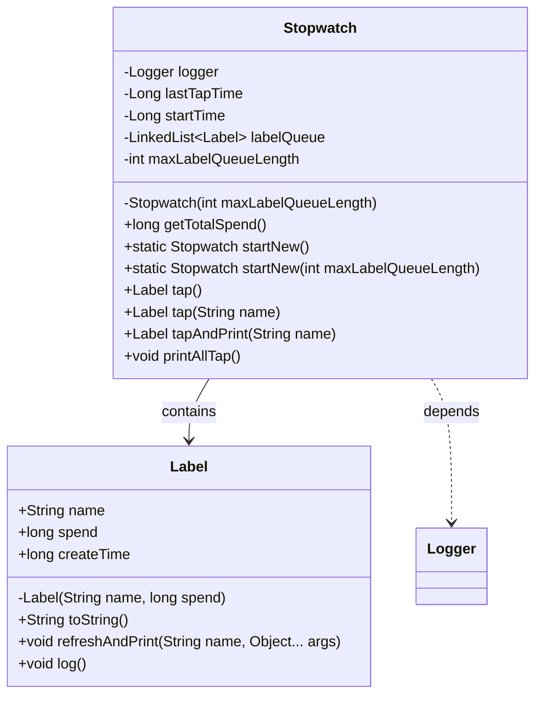
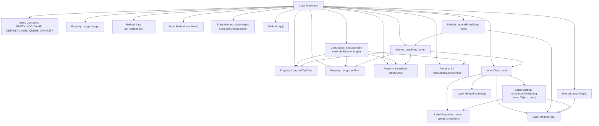

# Basic Information

|      |      |
|------|------|
| Name | Stopwatch |
| Language | .java |
| Code Path | WeFe/common/java/common-lang/src/main/java/com/welab/wefe/common/Stopwatch.java |
| Package Name | com.welab.wefe.common |
| Dependencies | ['org.apache.commons.lang3.StringUtils', 'org.slf4j.Logger', 'org.slf4j.LoggerFactory', 'java.util.LinkedList'] |
| Brief Description | The Stopwatch class is used to record code execution time, supporting functions such as creating labels, calculating time intervals, and printing logs. It includes the Label inner class to record timestamps and elapsed time, with configurable queue capacity limits. |

# Description

The `Stopwatch` class is a tool for measuring code execution time. It creates instances via the `startNew` method and supports setting a maximum length for the label queue. Core functionalities include the `tap` method to record timestamps and calculate intervals since the last record, the `tapAndPrint` method to log and print intervals, and the `printAllTap` method to print all records. The inner class `Label` stores the name, elapsed time, and creation time of each record, providing `toString` for formatted output and `refreshAndPrint` to recalculate elapsed time. The class employs synchronization to ensure thread safety and maintains a fixed-size label queue.

# Class Summary

| Name   | Type  | Description |
|-------|------|-------------|
| Stopwatch | class | The Stopwatch class is used to record code execution time, supporting marking time points, calculating time intervals, printing logs, and allowing the setting of a maximum record count. The internal Label class stores time point and elapsed time information. |

## Class Stopwatch

|      |      |
|------|------|
| Access Modifier | public |
| Type | class |
| Name | Stopwatch |
| Description | The Stopwatch class is used to record code execution time, supporting marking time points, calculating time intervals, printing logs, and allowing the setting of a maximum record count. The internal Label class stores time point and elapsed time information. |

### UML Class Diagram

This code illustrates the design of a stopwatch class (Stopwatch) and its internal label class (Label). The Stopwatch class is used to track code execution time, maintaining states such as start time and last tap time, and provides methods like tap recording (tap) and printing time intervals. The Label class serves as timing tags, storing the name, duration, and creation time of each tap, offering functionalities like time refreshing and log printing. The class diagram clearly demonstrates the containment relationship between Stopwatch and Label, as well as Stopwatch's dependency on Logger, reflecting the complete implementation structure of the timing functionality.

### Internal Method Call Graph

This code implements a timer functionality, primarily consisting of the Stopwatch class and its inner Label class. Stopwatch is used to record code execution time, with instances created via startNew(), time points recorded via tap(), and total duration obtained via getTotalSpend(). The Label class stores each time point's name and duration, providing logging capabilities. The flowchart illustrates the class structure, properties, and method invocation relationships, including interactions between static methods, instance methods, and the inner class logic.

### Field List

| Name  | Type  | Description |
|-------|-------|------|
| labelQueue | LinkedList<Label> | The private linked list variable `labelQueue` stores elements of type `Label`. |
| maxLabelQueueLength | int | Private integer variable used to store the maximum label queue length. |
| startTime | Long | The private long integer variable startTime is used to record the start time. |
| lastTapTime | Long | Private long integer variable, recording the last click time. |
| EMPTY_LOG_NAME = "" | String | The empty log name constant is defined as an empty string. |
| logger = LoggerFactory.getLogger(Stopwatch.class) | Logger | Define a private logger instance for the Stopwatch class. |
| DEFAULT_LABEL_QUEUE_CAPACITY = 100 | int | The default value of the private static constant DEFAULT_LABEL_QUEUE_CAPACITY is 100. |

### Method List

| Name  | Type  | Description |
|-------|-------|------|
| startNew | Stopwatch | The static method `startNew` creates a `Stopwatch` instance with the default queue capacity. |
| tap | Label | The method `tap` takes a name parameter, synchronously updates the tag queue, records the time interval, and returns a new tag object. If the queue exceeds the limit, the earliest item is removed. |
| getTotalSpend | long | This method returns the millisecond difference between the current time and startTime, used to calculate the total time consumed. |
| printAllTap | void | The method iterates through each Label object in the labelQueue and calls its log() method. |
| tapAndPrint | Label | Method tapAndPrint clicks the label with the specified name, logs the action, and returns the label object. |
| tap | Label | The method tap() calls tap(EMPTY_LOG_NAME) and returns a Label object. |
| startNew | Stopwatch | The static method `startNew` creates and returns a `Stopwatch` instance, with the parameter `maxLabelQueueLength` specifying the maximum length of the label queue. |

