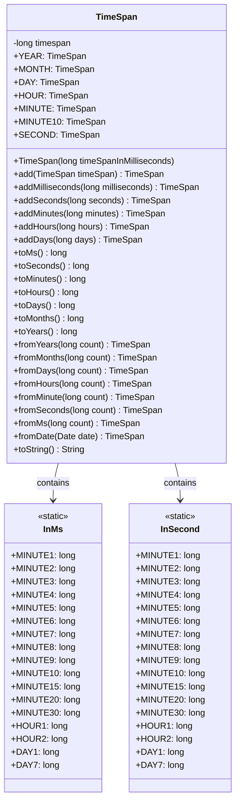

# Basic Information

|      |      |
|------|------|
| Name | TimeSpan |
| Language | .java |
| Code Path | WeFe/common/java/common-lang/src/main/java/com/welab/wefe/common/TimeSpan.java |
| Package Name | com.welab.wefe.common |
| Dependencies | ['com.welab.wefe.common.util.StringUtil', 'java.util.Date'] |
| Brief Description | The TimeSpan class is used to handle time intervals, providing functionalities for creating, adding, subtracting, and converting time units. It supports conversions from milliseconds to years and includes commonly used time constants. |

# Description

The code defines a TimeSpan class for representing time intervals. It includes static constants denoting common time units (years, months, days, hours, minutes, seconds) and provides multiple constructors to create instances from different time units. Core functionalities encompass addition and subtraction operations for time intervals (milliseconds, seconds, minutes, hours, days), as well as methods to convert time intervals into different units (milliseconds, seconds, minutes, hours, days, months, years). Additionally, it contains two nested classes, InMs and InSecond, which define millisecond and second values for common time periods. The toString method formats time intervals into human-readable strings (e.g., "X days X hours X minutes X seconds"). The entire class is designed for efficient computation and conversion of time intervals.

# Class Summary

| Name   | Type  | Description |
|-------|------|-------------|
| TimeSpan | class | The TimeSpan class encapsulates time interval operations, providing constants such as years, months, and days. It supports time addition/subtraction and unit conversion, and includes common duration definitions like milliseconds and seconds. |

## Class TimeSpan

|      |      |
|------|------|
| Access Modifier | public |
| Type | class |
| Name | TimeSpan |
| Description | The TimeSpan class encapsulates time interval operations, providing constants such as years, months, and days. It supports time addition/subtraction and unit conversion, and includes common duration definitions like milliseconds and seconds. |

### UML Class Diagram

This code defines a TimeSpan class for representing time intervals and provides a series of static methods and constants to create and manipulate time intervals. The class includes two static inner classes, InMs and InSecond, which define common time interval constants in milliseconds and seconds, respectively. The TimeSpan class offers static factory methods to create time intervals from different time units, as well as methods for time addition, subtraction, and conversion. Finally, the toString method formats the time interval into a human-readable string. The overall design is concise and efficient, suitable for handling various time calculation scenarios.

### Internal Method Call Graph

```mermaid
graph TD
    A["Class TimeSpan"]
    B["Static Constants: YEAR/MONTH/DAY/HOUR/MINUTE/MINUTE10/SECOND"]
    C["Private Property: long timespan"]
    D["Constructor: TimeSpan(long timeSpanInMilliseconds)"]
    E["Method Group: add series (add/addMilliseconds/addSeconds/addMinutes/addHours/addDays)"]
    F["Method Group: to series (toMs/toSeconds/toMinutes/toHours/toDays/toMonths/toYears)"]
    G["Method Group: from series (fromYears/fromMonths/fromDays/fromHours/fromMinute/fromSeconds/fromMs/fromDate)"]
    H["Override Method: toString()"]
    I["Inner Class: InMs"]
    J["Inner Class: InSecond"]

    A --> B
    A --> C
    A --> D
    A --> E
    A --> F
    A --> G
    A --> H
    A --> I
    A --> J
```

This code defines a TimeSpan class for representing time intervals and providing various time unit conversion functionalities. The class consists of three main components: 1) Static constants defining common time units; 2) Core methods including time addition/subtraction (add series), time unit conversion (to series), and static construction methods (from series); 3) Two inner classes InMs and InSecond providing constant values for common time intervals. The toString() method implements formatting time intervals into human-readable strings. The overall design adopts a fluent interface style, supporting multi-level time unit conversion from years to milliseconds, and addresses various time calculation scenarios.

### Field List

| Name  | Type  | Description |
|-------|-------|------|
| timespan | long | The private long integer variable `timespan` is used to store the time span. |
| DAY = TimeSpan.fromDays(1) | TimeSpan | Define the constant DAY as a TimeSpan object with a value of 1 day. |
| YEAR = TimeSpan.fromYears(1) | TimeSpan | Define the constant YEAR, representing a time span of 1 year. |
| MONTH = TimeSpan.fromMonths(1) | TimeSpan | Defined a public static constant MONTH, representing a time span of 1 month. |
| SECOND = TimeSpan.fromSeconds(1) | TimeSpan | Define the constant SECOND, representing a time span of 1 second. |
| MINUTE10 = TimeSpan.fromMinute(10) | TimeSpan | Define a static immutable field with a 10-minute time constant. |
| HOUR = TimeSpan.fromHours(1) | TimeSpan | Define a static constant HOUR, representing the time span of one hour. |
| MINUTE = TimeSpan.fromMinute(1) | TimeSpan | Define a static constant MINUTE with the value of a TimeSpan object representing 1 minute. |

### Method List

| Name  | Type  | Description |
|-------|-------|------|
| toHours | long | This method converts minutes into hours by dividing by 60. |
| fromHours | TimeSpan | The static method `fromHours` converts hours into a TimeSpan by internally calling `fromMinute`, with the parameter `count` multiplied by 60 to convert it into minutes. |
| fromDays | TimeSpan | The static method `fromDays` accepts a long integer parameter `count` and returns a `TimeSpan` object by converting `count` into hours through multiplication by 24 and invoking the `fromHours` method. |
| addDays | TimeSpan | The method `addDays` accepts a long integer parameter `days`, converts it into hours, and invokes the `addHours` method, then returns the current object. |
| toMonths | long | Convert days to months, calculated at 30 days per month. |
| fromYears | TimeSpan | The static method `fromYears` converts the number of years into days and then creates a `TimeSpan` object. |
| toSeconds | long | The method to convert milliseconds to seconds returns the result of timespan divided by 1000. |
| toMinutes | long | Convert seconds to minutes, the return value is of type long. |
| fromSeconds | TimeSpan | The static method `fromSeconds` accepts a long integer parameter `count` and returns a `TimeSpan` object with a value equal to `count` multiplied by 1000 milliseconds. |
| add | TimeSpan | The method `add` takes a TimeSpan parameter, accumulates its millisecond value to the current object, and returns itself. |
| toDays | long | The method `toDays` converts the number of hours into days, returning the result of `this.toHours()` divided by 24. |
| fromMs | TimeSpan | The static method `fromMs` accepts a long integer parameter `count` and returns a `TimeSpan` object based on `count`. |
| fromDate | TimeSpan | The static method `fromDate` takes a `Date` object as input and returns a `TimeSpan` converted from the millisecond difference between the current time and the given date. |
| toString | String | Convert milliseconds into a string representation of days, hours, minutes, and seconds. Display seconds if less than a day, and return milliseconds if no value is provided. |
| toYears | long | Convert the number of months to years by dividing the number of months by 12. |
| addMinutes | TimeSpan | The method `addMinutes` takes the number of minutes, converts it to seconds, and then calls `addSeconds`, returning the current object. |
| addSeconds | TimeSpan | The method `addSeconds` accepts a long integer representing seconds, converts it to milliseconds, then invokes `addMilliseconds`, and finally returns the current object instance. |
| fromMinute | TimeSpan | The static method `fromMinute` converts minutes into seconds and creates a TimeSpan object. |
| addMilliseconds | TimeSpan | This method accumulates the input milliseconds into the current time interval object and returns the updated object itself. |
| fromMonths | TimeSpan | The static method `fromMonths` converts the number of months into days (by multiplying by 30) and then calls `fromDays` to generate a TimeSpan. |
| toMs | long | Method toMs returns the timespan value of the current object, with the type being long. |
| addHours | TimeSpan | The method `addHours` accepts a long integer parameter `hours`, converts it to minutes, and invokes the `addMinutes` method, then returns the current object. |

