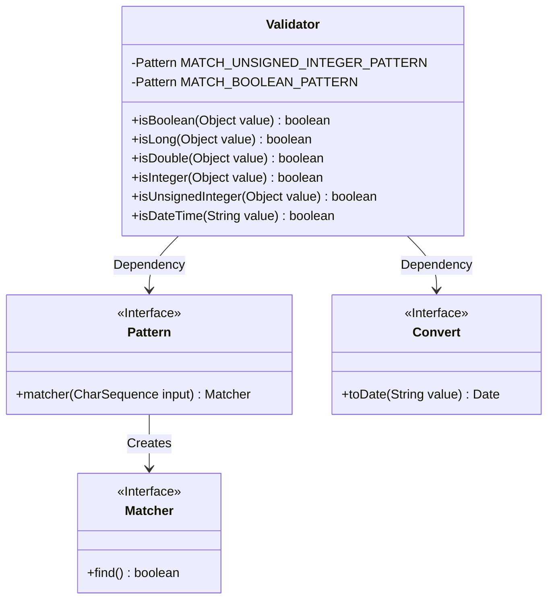

# Basic Information

|      |      |
|------|------|
| Name | Validator |
| Language | .java |
| Code Path | WeFe/common/java/common-lang/src/main/java/com/welab/wefe/common/Validator.java |
| Package Name | com.welab.wefe.common |
| Dependencies | ['java.util.regex.Pattern'] |
| Brief Description | The Validator class provides static methods for validating data types: checking boolean values (true/false/0/1), long integers, double-precision numbers, integers, unsigned integers (digits only), and datetime formats (converted via Convert.toDate). |

# Description

The Validator class provides a series of static methods for validating different types of data. It includes the isBoolean method for validating boolean values, which matches true/false/0/1 (case-insensitive) via regular expressions. The methods isLong, isDouble, and isInteger validate numeric types by checking whether the input can be converted to the corresponding type. The isUnsignedInteger method validates unsigned integers using a regular expression to match pure numeric strings or non-negative Integers. The isDateTime method checks whether a string is in a valid date-time format by attempting to convert it to a date object. All methods first verify whether the parameter is an instance of the corresponding type before performing string conversion validation.

# Class Summary

| Name   | Type  | Description |
|-------|------|-------------|
| Validator | class | The Validator class provides static methods for validating data types, including boolean, long, double, integer, unsigned integer, and datetime formats. |

## Class Validator

|      |      |
|------|------|
| Access Modifier | public |
| Type | class |
| Name | Validator |
| Description | The Validator class provides static methods for validating data types, including boolean, long, double, integer, unsigned integer, and datetime formats. |

### UML Class Diagram

This code demonstrates a `Validator` utility class primarily used for validating different types of data formats. It contains multiple static methods to check whether an object is a boolean, long integer, double-precision floating-point number, integer, unsigned integer, or datetime format. The class utilizes regular expression pattern matching and type conversion, implemented through the `Pattern` and `Convert` classes. All methods are static and can be called directly without instantiation.

### Internal Method Call Graph

```mermaid
graph TD
    A["Class Validator"]
    B["Static Constant: MATCH_UNSIGNED_INTEGER_PATTERN"]
    C["Static Constant: MATCH_BOOLEAN_PATTERN"]
    D["Static Method: isBoolean(Object value)"]
    E["Static Method: isLong(Object value)"]
    F["Static Method: isDouble(Object value)"]
    G["Static Method: isInteger(Object value)"]
    H["Static Method: isUnsignedInteger(Object value)"]
    I["Static Method: isDateTime(String value)"]
    J["Instance Check: value instanceof Boolean"]
    K["Regex Match: MATCH_BOOLEAN_PATTERN.matcher"]
    L["Instance Check: value instanceof Long"]
    M["Numeric Conversion: Long.valueOf"]
    N["Exception Catch: NumberFormatException"]
    O["Instance Check: value instanceof Double"]
    P["Numeric Conversion: Double.valueOf"]
    Q["Instance Check: value instanceof Integer"]
    R["Numeric Conversion: Integer.valueOf"]
    S["Regex Match: MATCH_UNSIGNED_INTEGER_PATTERN.matcher"]
    T["Date Conversion: Convert.toDate"]
    U["Exception Catch: Exception"]

    A --> B
    A --> C
    A --> D
    A --> E
    A --> F
    A --> G
    A --> H
    A --> I
    D --> J
    D --> K
    E --> L
    E --> M
    E --> N
    F --> O
    F --> P
    F --> N
    G --> Q
    G --> R
    G --> N
    H --> Q
    H --> S
    I --> T
    I --> U
```

This code defines a Validator class containing multiple static methods for validating different types of data. Key functionalities include: validating boolean values and unsigned integers via regular expressions, verifying Long, Double, and Integer types through type checks and numeric conversions, and validating DateTime format via date conversion. Each validation method incorporates type checks and exception handling to ensure robustness. The flowchart clearly illustrates the class structure and invocation relationships between methods, including critical steps such as regex matching, type conversion, and exception handling.

### Field List

| Name  | Type  | Description |
|-------|-------|------|
| MATCH_UNSIGNED_INTEGER_PATTERN = Pattern.compile("^\\d+$") | Pattern | Define static constant regular expressions for matching unsigned integer strings. |
| MATCH_BOOLEAN_PATTERN = Pattern.compile("^true$|^false$|^0$|^1$", Pattern.CASE_INSENSITIVE) | Pattern | Define a static boolean matching regex, case-insensitive, matching true/false/0/1. |

### Method List

| Name  | Type  | Description |
|-------|-------|------|
| isBoolean | boolean | Check if the object is a boolean type or if the string matches a boolean pattern. |
| isLong | boolean | Check if the object is of type Long or can be converted to Long. Return true if yes, otherwise false. |
| isDouble | boolean | Check if the object is of type Double or can be converted to Double, returns a boolean value. |
| isInteger | boolean | Check if the object is an integer: return true directly if it is an instance of Integer; otherwise, attempt to convert it to a string and parse as an integer, returning true if successful and false if failed. |
| isUnsignedInteger | boolean | Check if the object is an unsigned integer: returns true if it is of type Integer and non-negative; otherwise, uses regular expression to match the string and determine if it is an unsigned integer. |
| isDateTime | boolean | Check if the string is a valid date-time, return true if the conversion succeeds, otherwise return false. |

