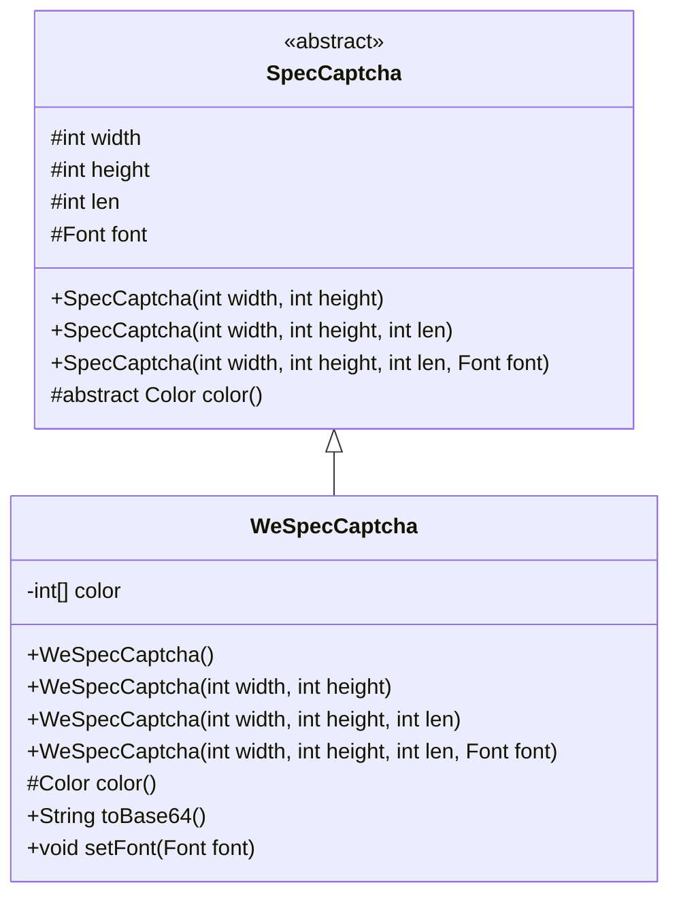
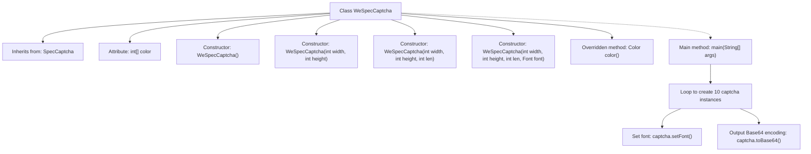

# Basic Information

|      |      |
|------|------|
| Name | WeSpecCaptcha |
| Language | .java |
| Code Path | WeFe/common/java/common-lang/src/main/java/com/welab/wefe/common/WeSpecCaptcha.java |
| Package Name | com.welab.wefe.common |
| Dependencies | ['com.wf.captcha.SpecCaptcha', 'java.awt'] |
| Brief Description | The WeSpecCaptcha class inherits from SpecCaptcha, providing multiple constructors and overriding the color method to ensure uniform verification code colors for enhanced security. Example code generates 10 Base64-format verification codes. |

# Description

The `WeSpecCaptcha` class inherits from `SpecCaptcha` and is used to generate captchas. It includes a color array `color` and overrides the `color` method to ensure the captcha characters use a single color, enhancing security. The class provides multiple constructors, supporting custom width, height, length, and font. The `main` method demonstrates an example of generating 10 Base64-format captchas using KaiTi font at size 24, with dimensions of 85x35 and a length of 5 characters.

# Class Summary

| Name   | Type  | Description |
|-------|------|-------------|
| WeSpecCaptcha | class | The WeSpecCaptcha class inherits from SpecCaptcha, controls the verification code color as a single color to enhance security, provides multiple construction methods, and supports setting fonts and generating Base64 verification codes. |

## Class WeSpecCaptcha

|      |      |
|------|------|
| Access Modifier | public |
| Type | class |
| Name | WeSpecCaptcha |
| Description | The WeSpecCaptcha class inherits from SpecCaptcha, controls the verification code color as a single color to enhance security, provides multiple construction methods, and supports setting fonts and generating Base64 verification codes. |

### UML Class Diagram

Class diagram description:
The WeSpecCaptcha class inherits from the abstract class SpecCaptcha and is primarily used to generate verification codes with specific styles. By overriding the color() method, it implements single-color brush control, replacing the parent class's random color scheme to enhance security. The class includes four overloaded constructors corresponding to different verification code parameter configurations (width, height, length, font). The setFont() method allows for custom font settings, while toBase64() outputs the verification code in Base64 format. The private field color caches color values to avoid repeated calculations.

### Internal Method Call Graph

This flowchart illustrates the structure of the WeSpecCaptcha class, a captcha generation class that inherits from SpecCaptcha. It primarily includes 4 overloaded constructors, an overridden color() method for controlling captcha character colors, and a main method that generates 10 captchas with specific fonts and outputs their Base64 encoding. The key design feature is the unified character coloring through the color() method to enhance security, contrasting with the parent class's random color scheme. The main method demonstrates a typical workflow for batch captcha generation.

### Field List

| Name  | Type  | Description |
|-------|-------|------|
| color = null | int[] | Declare a private integer array color with an initial value of null. |

### Method List

| Name  | Type  | Description |
|-------|-------|------|
| main | void | Java code example: Loop 10 times to generate verification codes, set the font to KaiTi size 24, and output the Base64 encoded result. |
| color | Color | This method overrides the parent class's color(). If the color is empty, it randomly selects an RGB value from the COLOR array and returns a new Color object. |

