# Basic Information

|      |      |
|------|------|
| Name | common |
| Language | .java |
| Code Path | WeFe/common/java/common-lang/src/main/java/com/welab/wefe/common |
| Package Name | docs.common.java.common-lang.src.main.java.com.welab.wefe.common |
| Brief Description | Java Configuration Management Toolset, which uniformly manages configurations and provides type-safe interfaces. Supports multi-environment configuration loading and type conversion, dependent on Log4j. The data processing toolset includes Excel parsing and batch text processing, supporting ETL and log analysis. The field validation platform implements sensitive data masking and format validation. The basic constants module defines key types and compression formats. The general utility library covers encryption, collection operations, and more. The HTTP communication module manages file downloads and request handling. The compression/decompression module supports multi-format processing. Functional interfaces support Lambda operations. The thread pool management tool provides task execution capabilities. Validation classes check data type legality. Status code enumerations define system error codes. Security tools generate random salt values. The time interval class handles time calculations. The batch consumer class implements batch data processing. The captcha generation class creates Base64 captchas. The information size class converts storage units. The data type conversion class handles multi-format conversions. The sampling log class controls log frequency. The timing utility class records code execution time. |

# Description

## Overview  
This module is a comprehensive library of Java foundational utilities and functional components, with core responsibilities including configuration management, data processing, field validation, HTTP communication, and other basic service support. It adopts a static utility class design pattern, providing type-safe interfaces and functional programming support. Key data structures include CompositeConfiguration (composite configuration), Excel worksheets/cells, regular expression rule libraries, and enum constants. External dependencies include Log4j, Apache HttpClient, BouncyCastle, etc. For example, the configuration module relies on Log4j, while the encryption module uses BouncyCastle to implement national cryptographic algorithms.  

The module integrates multi-domain functionalities, resembling infrastructure middleware. For instance, the `Configurations` class manages multi-environment configurations, `ExcelReader` provides lightweight encapsulation of POI operations, and `FieldValidateUtil` handles sensitive data masking. Technical features include annotation-driven approaches (e.g., `@Check`), strategy enums (e.g., `SecretKeyType`), and stream processing (e.g., `BatchConsumer`). All components adhere to the "out-of-the-box" principle, such as `SecurityUtil` for generating encryption salts and `TimeSpan` for handling time interval calculations.  

## Key Business Scenarios  
Typical applications form three major closed loops:  
1) **Configuration and Security Loop**: Loading configurations via `ConfigurationManager` → validating with `FieldValidateUtil` → encrypting with `SecurityUtil`. For example, reading database connection parameters and validating sensitive fields.  
2) **Data Processing Loop**: Combining `ExcelReader` parsing → `BatchConsumer` batch processing → `File` compression storage, resembling an ETL pipeline.  
3) **Communication and Scheduling Loop**: `HttpClient` API calls → `CommonThreadPool` asynchronous execution → `Stopwatch` performance monitoring.  

The unified interaction mode combines chained calls with annotation-driven approaches. For example, the Excel module follows a "load-iterate-close" workflow, while the validation module triggers rules via the `@Check` annotation. Functional completeness is reflected in coverage of national cryptographic algorithms (SM2/SM4), multi-protocol support (HTTP/ZIP), and full lifecycle management (e.g., configuration loading → usage → monitoring). Typical scenarios include:  
- Financial-grade data validation (ID cards/phone numbers).  
- High-concurrency file processing (chunked compression/downloads).  
- Secure communication (HTTPS + signature verification).  
For instance, `HttpRequest` automatically handles 302 redirects, and `Validator` verifies datetime formats.

### Package Internal Structure View

```mermaid
graph TD
    common --> configuration
    common --> fastjson
    common --> enums
    common --> io
    common --> fieldvalidate
    common --> constant
    common --> util
    common --> exception
    common --> http
    common --> file
    common --> function
    common --> CommonThreadPool.java
    common --> Validator.java
    common --> StatusCode.java
    common --> SecurityUtil.java
    common --> TimeSpan.java
    common --> BatchConsumer.java
    common --> WeSpecCaptcha.java
    common --> InformationSize.java
    common --> Convert.java
    common --> SamplingLogger.java
    common --> Stopwatch.java
    
    configuration --> Configurations.java
    configuration --> ConfigurationManager.java
    
    fastjson --> LoggerValueFilter.java
    
    enums --> FilePublicLevel.java
    
    io --> excel
    io --> text
    excel --> ExcelReader.java
    text --> writer
    text --> reader
    writer --> delegate
    writer --> LocalTextFileWriter.java
    writer --> AbstractTextWriter.java
    delegate --> RecordToStringFunction.java
    delegate --> FileNameFunction.java
    reader --> TextFileIterator.java
    reader --> LocalTextFileReader.java
    reader --> AbstractTextReader.java
    
    fieldvalidate --> secret
    fieldvalidate --> annotation
    fieldvalidate --> StandardFieldType.java
    fieldvalidate --> FieldValidateUtil.java
    fieldvalidate --> FieldAssert.java
    fieldvalidate --> ReactionaryKeywords.java
    fieldvalidate --> AbstractCheckModel.java
    secret --> SecretValueFilter.java
    secret --> SecretUtil.java
    secret --> Secret.java
    secret --> MaskStrategy.java
    annotation --> Check.java
    
    constant --> SecretKeyType.java
    constant --> ZipType.java
    constant --> Constant.java
    
    util --> enums
    util --> MapUtil.java
    util --> ReflectionsUtil.java
    util --> IpAddressUtil.java
    util --> Sha1.java
    util --> ListUtil.java
    util --> StringUtil.java
    util --> EncryptUtils.java
    util --> SignUtil.java
    util --> UrlUtil.java
    util --> DateUtil.java
    util --> SM2Util.java
    util --> SM4Util.java
    util --> ClassUtils.java
    util --> JObject.java
    util --> Masker.java
    util --> OS.java
    util --> Base64Util.java
    util --> ZipUtil.java
    util --> Md5.java
    util --> ImageUtil.java
    util --> FileUtil.java
    util --> XmlUtil.java
    util --> CommentedProperties.java
    util --> AESUtil.java
    util --> RandomUtil.java
    util --> FileType.java
    util --> ThreadUtil.java
    util --> CopyUtil.java
    util --> GzipUtil.java
    util --> HostUtil.java
    util --> AsymmetricCryptoUtil.java
    util --> RSAUtil.java
    enums --> ContentType.java
    
    exception --> StatusCodeWithException.java
    
    http --> download
    http --> MyRedirectStrategy.java
    http --> HttpContentType.java
    http --> HttpMethod.java
    http --> HttpResponse.java
    http --> HttpRequest.java
    download --> DownloadResult.java
    download --> HttpDownloader.java
    download --> DownloadStatus.java
    
    file --> compression
    file --> decompression
    compression --> impl
    compression --> CompressionType.java
    compression --> AbstractCompression.java
    impl --> Zip.java
    impl --> Tgz.java
    decompression --> impl
    decompression --> dto
    decompression --> SuperDecompressor.java
    decompression --> AbstractDecompression.java
    impl --> Zip.java
    impl --> SevenZip.java
    impl --> Tgz.java
    dto --> DecompressionResult.java
    
    function --> CharFunction.java
    function --> ConsumerWithException.java
    function --> ToBooleanFunction.java
```

This flowchart illustrates the complete directory structure of the common module in the WeFe project, starting from the top-level common node and expanding hierarchically to submodules and specific files. The diagram includes 12 first-level directories (such as configuration, fastjson, etc.), each further subdivided into second-level, third-level subdirectories and concrete implementation classes, fully presenting the organizational architecture of the project's utility library. Notably, modules like io, fieldvalidate, and util feature deeper hierarchical relationships, with the io/text module subdivided into submodules like reader/writer, reflecting the complex design of file operation functionalities.

# File List

| Name   | Type  | Description |
|-------|------|-------------|
| [CommonThreadPool.java](CommonThreadPool.md) | file | The CommonThreadPool class provides static thread pool management, supporting task execution, submission, termination, and status query. It utilizes LinkedBlockingQueue and CountDownLatch to implement asynchronous task control. |
| [Validator.java](Validator.md) | file | The Validator class provides static methods for validating data types: checking boolean values (true/false/0/1), long integers, double precision numbers, integers, unsigned integers (digits only), and datetime formats (converted via Convert.toDate). |
| [StatusCode.java](StatusCode.md) | file | Status code enumeration class, containing system, database, service error codes and descriptions, supporting exception throwing and formatted messages. |
| [SecurityUtil.java](SecurityUtil.md) | file | The `SecurityUtil` class provides the method `createRandomSalt` for generating random salts, which uses `SecureRandom` to produce a 16-byte random number and encodes it in Base64. The `main` method demonstrates the generation of 10 salt values. |
| [TimeSpan.java](TimeSpan.md) | file | The TimeSpan class is used to handle time intervals, providing functionality for creating, adding, subtracting, and converting time units. It supports conversions from milliseconds to years and includes commonly used time constants. |
| [BatchConsumer.java](BatchConsumer.md) | file | BatchConsumer is a utility class designed for batch processing of queue data, supporting configurable maximum batch size and delay thresholds. It is thread-safe and features automatic shutdown capability. |
| [WeSpecCaptcha.java](WeSpecCaptcha.md) | file | The WeSpecCaptcha class inherits from SpecCaptcha, providing multiple constructors. It overrides the color method to ensure uniform verification code colors for enhanced security. Example code generates 10 Base64-format verification codes. |
| [InformationSize.java](InformationSize.md) | file | The `InformationSize` class encapsulates bit size, providing conversion methods for bits, bytes, KiB, MiB, and GiB, supporting static creation and formatted output. |
| [Convert.java](Convert.md) | file | The Convert class provides various type conversion methods: handling null values, supporting mutual conversion between types such as Integer, Double, Long, Boolean, Date, etc., including exception handling and default value settings. |
| [SamplingLogger.java](SamplingLogger.md) | file | The SamplingLogger class is used to sample logs based on quantity or time intervals, supporting info and error methods, which trigger log printing when conditions are met. |
| [Stopwatch.java](Stopwatch.md) | file | The Stopwatch class is used to record code execution time, supporting functions such as creating labels, calculating time intervals, and printing logs. It includes an internal Label class to record timestamps and elapsed time, with configurable queue capacity limits. |
| [function](function/_module.md) | package | The CharFunction interface processes character input and returns a generic result. The ConsumerWithException interface handles consumer behavior with exceptions. The ToBooleanFunction interface converts any type to a boolean value. |
| [exception](exception/_module.md) | package | The StatusCodeWithException class extends Exception, encapsulates status codes and messages, provides static factory methods to create exception instances, and supports retrieving status codes and formatted output. |
| [file](file/_module.md) | package | This module implements multi-format file compression and decompression, supporting formats such as ZIP/TAR.GZ/7z. It adopts an abstract class and factory pattern design, relies on libraries like Apache Commons, and is suitable for scenarios like log packaging and file transfer. It provides synchronous APIs and command-line tools. |
| [http](http/_module.md) | package | The HTTP download module supports multi-threaded chunked downloads, including state management and resumable transfers. It includes core classes such as HttpDownloader and DownloadResult, relying on Apache HttpClient. Supporting utilities include redirect policies, HTTP method enums, content-type constants, and request/response wrapper classes, with support for HTTPS and connection pooling. |
| [util](util/_module.md) | package | A collection of multiple Java utility classes, including file type processing, collection statistics, reflection scanning, IP address operations, encryption and decryption, date handling, string manipulation, XML conversion, thread sleep, and other practical functions, covering common development needs. |
| [constant](constant/_module.md) | package | Three types of constant classes are defined: the SecretKeyType enum includes RSA and SM2 key types along with their retrieval methods; the ZipType class contains constants for ZIP and GZIP compression formats; the Constant class holds global constants such as encoding, date-time, and others. |
| [fieldvalidate](fieldvalidate/_module.md) | package | This module implements data desensitization and field validation, including annotation marking, policy execution, and reflection processing. It supports standardization and validation of fields such as phone numbers and email addresses, integrating XSS protection and anti-verb filtering. Utility classes provide regex validation and non-null checks, while abstract classes implement recursive validation. |
| [io](io/_module.md) | package | ExcelReader is a Java class that supports reading Excel data, offering multiple initialization methods and data traversal functionalities. The text processing module supports data serialization, segmented storage, and line-by-line reading, making it suitable for ETL and high-throughput log processing. |
| [enums](enums/_module.md) | package | File visibility level enumeration: Private, Public, PublicWithMemberList. |
| [fastjson](fastjson/_module.md) | package | The LoggerValueFilter class is used to truncate excessively long values in logs, with a default limit of 1024 characters. It supports processing various types such as strings, files, and byte arrays to prevent excessively large logs and debugging inconvenience. |
| [configuration](configuration/_module.md) | package | The `Configurations` class manages configuration information, providing static methods to check keys, retrieve various configuration values and lists, and supporting default values. The `ConfigurationManager` manages configuration files, supporting loading from files or classpaths, and includes caching and dynamic environment configuration capabilities. |

