# Basic Information

|      |      |
|------|------|
| Name | ConfigurationManager |
| Language | .java |
| Code Path | WeFe/common/java/common-lang/src/main/java/com/welab/wefe/common/configuration/ConfigurationManager.java |
| Package Name | com.welab.wefe.common.configuration |
| Dependencies | ['com.welab.wefe.common.util.StringUtil', 'org.apache.commons.configuration', 'org.apache.commons.lang3.StringUtils', 'org.slf4j.Logger', 'org.slf4j.LoggerFactory', 'java.io.File', 'java.nio.file.Files', 'java.nio.file.Paths', 'java.util.ArrayList', 'java.util.Arrays', 'java.util.List'] |
| Brief Description | The ConfigurationManager class manages configurations, supporting file initialization, system property settings, and exception handling. It reads config.properties by default and supports environment variable configurations. |

# Description

ConfigurationManager is a utility class for managing configuration files, providing static methods to initialize configurations. It uses CompositeConfiguration to store configurations, supporting loading property files from file paths or classpaths. During initialization, it reads system properties or default configuration files and supports dynamic environment configurations. The class includes logging, exception handling, and configuration item caching functionalities to ensure the efficiency and flexibility of configuration loading.

# Class Summary

| Name   | Type  | Description |
|-------|------|-------------|
| ConfigurationManager | class | The ConfigurationManager class manages configuration files, supporting initialization, loading property files, and retrieving configurations. It operates through static methods init and getConfig, supports multi-file and environment configurations, and automatically handles paths and exceptions. |

## Class ConfigurationManager

|      |      |
|------|------|
| Access Modifier | public |
| Type | class |
| Name | ConfigurationManager |
| Description | The ConfigurationManager class manages configuration files, supporting initialization, loading property files, and retrieving configurations. It operates through static methods init and getConfig, supports multi-file and environment configurations, and automatically handles paths and exceptions. |

### UML Class Diagram

Class Diagram Description:
The diagram illustrates the core structure of ConfigurationManager and its dependencies. ConfigurationManager is a singleton class that manages configuration loading through static methods, internally maintaining a CompositeConfiguration object and a list of property files. It relies on PropertiesConfiguration and SystemConfiguration to load configurations from different sources, with these configuration classes inheriting from the base class AbstractConfiguration. As an interface, CompositeConfiguration defines the specification for configuration operations, supporting the combined management of multiple configuration sources. The overall design enables the capability to load configurations from various channels including file systems, classpaths, and system properties.

### Internal Method Call Graph

```mermaid
sequenceDiagram
    participant A as Caller
    participant B as ConfigurationManager
    participant C as CompositeConfiguration
    participant D as PropertiesFiles

    A->>B: init(files)
    B->>B: new ConfigurationManager(files)
    B->>D: addPropertyFiles(files)
    B->>C: config()
    C->>C: Add system configurations
    loop Iterate files
        C->>C: Add file configurations
    end
    B->>B: Process config items

    A->>B: getConfig()
    alt configurationManager is null
        B->>B: Load default config
        B->>B: Determine config file path
        B->>B: new ConfigurationManager(configFile)
    end
    B->>A: Return config
```

This code implements a thread-safe configuration manager using the singleton pattern to manage configurations from multiple sources. Key processes include: 1) Loading specified configuration files during initialization via the constructor; 2) Implementing lazy loading through getConfig(), automatically handling default config paths and system properties; 3) Supporting dynamic addition of system and file configurations. Special attention is given to hierarchical file processing logic, including environment variable recognition and default path fallback, with merged configuration management via CompositeConfiguration. The logging system tracks critical operations throughout, ensuring traceability of the configuration loading process.

### Field List

| Name  | Type  | Description |
|-------|-------|------|
| config = new CompositeConfiguration() | CompositeConfiguration | Create a CompositeConfiguration object instance named config for managing composite configurations. |
| configurationManager | ConfigurationManager | Private static configuration manager instance. |
| propertiesFiles = new ArrayList<>() | List<String> | Declare a private list variable propertiesFiles to store property file paths of string type. |
| throwExceptionOnMissing = true | boolean | Private static boolean variable that controls whether to throw an exception when missing, with a default value of true. |
| CONFIG_FILE = "configFile" | String | Define a static constant string CONFIG_FILE with the value "configFile". |
| LOG = LoggerFactory.getLogger(ConfigurationManager.class) | Logger | Define a static constant LOG for logging in the ConfigurationManager class. |

### Method List

| Name  | Type  | Description |
|-------|-------|------|
| init | void | The static method `init` accepts variable arguments `files`, logs the message and joins the file list with commas, then creates an instance of `ConfigurationManager`. |
| getConfig | CompositeConfiguration | Method to obtain configuration: Priority is given to reading environment configurations from system properties or application.properties. If none are found, the default config.properties is used. It supports Flink path fallback and ultimately returns a combined configuration object. |
| init | void | The static method `init` initializes the configuration manager. If the manager is null and the configuration is non-null, it creates an instance and logs the action. |
| config | Configuration | The method config() configures system properties, loads the specified property file, handles missing file exceptions, and returns the configuration object. |
| addPropertyFiles | void | The method `addPropertyFiles` accepts a variable argument `files`, converts it into a list, and adds it to the `propertiesFiles` collection. |

