# Basic Information

|      |      |
|------|------|
| Name | Configurations |
| Language | .java |
| Code Path | WeFe/common/java/common-lang/src/main/java/com/welab/wefe/common/configuration/Configurations.java |
| Package Name | com.welab.wefe.common.configuration |
| Dependencies | ['org.apache.commons.configuration.Configuration', 'java.math.BigDecimal', 'java.math.BigInteger', 'java.util.Iterator', 'java.util.List', 'java.util.Properties', 'java.util.stream.Collectors'] |
| Brief Description | The Configurations class provides static methods to access configuration data, supporting retrieval of various data types including boolean, numeric, string, list, etc., and allows default value settings. |

# Description

The `Configurations` class is a utility class designed for managing configuration information. It prevents instantiation via a private constructor and provides static methods to access configuration data. Key functionalities include checking if a configuration is empty, determining whether a key exists, retrieving configuration values of various types (such as boolean, byte, double, float, int, long, short, big number, string, etc.), as well as obtaining key iterators and property lists. It supports overloaded methods with default values to ensure a default return when a key is absent. Additionally, it offers capabilities to fetch string arrays and lists, including converting semicolon-delimited values into string lists.

# Class Summary

| Name   | Type  | Description |
|-------|------|-------------|
| Configurations | class | The `Configurations` class provides static methods to access configuration data, supporting retrieval of various data types including boolean, numeric, string, list, etc., with default value options. |

## Class Configurations

|      |      |
|------|------|
| Access Modifier | public |
| Type | class |
| Name | Configurations |
| Description | The `Configurations` class provides static methods to access configuration data, supporting retrieval of various data types including boolean, numeric, string, list, etc., with default value options. |

### UML Class Diagram

```mermaid
classDiagram
    class Configurations {
        -Configuration config
        -Configurations()
        +isEmpty() boolean
        +containsKey(String key) boolean
        +getProperty(String key) Object
        +getKeys(String prefix) Iterator~String~
        +getKeys() Iterator~String~
        +getProperties(String key) Properties
        +getBoolean(String key) boolean
        +getBoolean(String key, boolean defaultValue) boolean
        +getBoolean(String key, Boolean defaultValue) Boolean
        +getByte(String key) byte
        +getByte(String key, byte defaultValue) byte
        +getByte(String key, Byte defaultValue) Byte
        +getDouble(String key) double
        +getDouble(String key, double defaultValue) double
        +getDouble(String key, Double defaultValue) Double
        +getFloat(String key) float
        +getFloat(String key, float defaultValue) float
        +getFloat(String key, Float defaultValue) Float
        +getInt(String key) int
        +getInt(String key, int defaultValue) int
        +getInteger(String key, Integer defaultValue) Integer
        +getLong(String key) long
        +getLong(String key, long defaultValue) long
        +getLong(String key, Long defaultValue) Long
        +getShort(String key) short
        +getShort(String key, short defaultValue) short
        +getShort(String key, Short defaultValue) Short
        +getBigDecimal(String key) BigDecimal
        +getBigDecimal(String key, BigDecimal defaultValue) BigDecimal
        +getBigInteger(String key) BigInteger
        +getBigInteger(String key, BigInteger defaultValue) BigInteger
        +getString(String key) String
        +getString(String key, String defaultValue) String
        +getStringArray(String key) String[]
        +getList(String key) List~Object~
        +getStringList(String key) List~String~
        +getList(String key, List~?~ defaultValue) List~Object~
    }

    class Configuration {
        <<Interface>>
        +isEmpty() boolean
        +containsKey(String key) boolean
        +getProperty(String key) Object
        +getKeys(String prefix) Iterator~String~
        +getKeys() Iterator~String~
        +getProperties(String key) Properties
        +getBoolean(String key) boolean
        +getBoolean(String key, boolean defaultValue) boolean
        +getBoolean(String key, Boolean defaultValue) Boolean
        +getByte(String key) byte
        +getByte(String key, byte defaultValue) byte
        +getByte(String key, Byte defaultValue) Byte
        +getDouble(String key) double
        +getDouble(String key, double defaultValue) double
        +getDouble(String key, Double defaultValue) Double
        +getFloat(String key) float
        +getFloat(String key, float defaultValue) float
        +getFloat(String key, Float defaultValue) Float
        +getInt(String key) int
        +getInt(String key, int defaultValue) int
        +getInteger(String key, Integer defaultValue) Integer
        +getLong(String key) long
        +getLong(String key, long defaultValue) long
        +getLong(String key, Long defaultValue) Long
        +getShort(String key) short
        +getShort(String key, short defaultValue) short
        +getShort(String key, Short defaultValue) Short
        +getBigDecimal(String key) BigDecimal
        +getBigDecimal(String key, BigDecimal defaultValue) BigDecimal
        +getBigInteger(String key) BigInteger
        +getBigInteger(String key, BigInteger defaultValue) BigInteger
        +getString(String key) String
        +getString(String key, String defaultValue) String
        +getStringArray(String key) String[]
        +getList(String key) List~Object~
        +getList(String key, List~?~ defaultValue) List~Object~
    }

    Configurations --> Configuration : depends on\n(via static config member)
```

This code demonstrates a configuration utility class Configurations, which encapsulates all operations for the Configuration interface through static methods. The class diagram clearly shows Configurations as a facade pattern implementation, with its private static config member implementing the Configuration interface. It provides type-safe configuration value retrieval methods (such as getInt/getBoolean), including overloaded methods for primitive and wrapper types, along with collection handling capabilities. The Configuration interface defines all configuration operation contracts, forming a typical "static proxy" relationship between the two. Particularly noteworthy is the custom implementation logic of the getBigDecimal method, which is the only method with independent logic in the class diagram.

### Internal Method Call Graph

```mermaid
graph TD
    A["Class Configurations"]
    B["Private static property: Configuration config"]
    C["Private constructor: Configurations()"]
    D["Method: isEmpty()"]
    E["Method: containsKey(String key)"]
    F["Method: getProperty(String key)"]
    G["Method: getKeys(String prefix)"]
    H["Method: getKeys()"]
    I["Method: getProperties(String key)"]
    J["Method: getBoolean series"]
    K["Method: getByte series"]
    L["Method: getDouble series"]
    M["Method: getFloat series"]
    N["Method: getInt series"]
    O["Method: getLong series"]
    P["Method: getShort series"]
    Q["Method: getBigDecimal series"]
    R["Method: getBigInteger series"]
    S["Method: getString series"]
    T["Method: getStringArray(String key)"]
    U["Method: getList series"]
    V["Method: getStringList(String key)"]

    A --> B
    A --> C
    A --> D
    A --> E
    A --> F
    A --> G
    A --> H
    A --> I
    A --> J
    A --> K
    A --> L
    A --> M
    A --> N
    A --> O
    A --> P
    A --> Q
    A --> R
    A --> S
    A --> T
    A --> U
    A --> V
    B -->|via ConfigurationManager| B1["getConfig()"]
    F -->|calls| B
    G -->|calls| B
    H -->|calls| B
    I -->|calls| B
    J -->|calls| B
    K -->|calls| B
    L -->|calls| B
    M -->|calls| B
    N -->|calls| B
    O -->|calls| B
    P -->|calls| B
    Q -->|calls| F
    Q -->|calls| B
    R -->|calls| B
    S -->|calls| B
    T -->|calls| B
    U -->|calls| B
    V -->|calls| U
```

This code illustrates a configuration management utility class Configurations, which provides various access methods to configuration data through static methods. The class follows the singleton pattern (private constructor), with all methods being static and functionality implemented via an internally held Configuration object. It primarily includes three types of methods: 1) Basic query methods like isEmpty/containsKey; 2) Type conversion methods like getBoolean/getInt; 3) Collection operation methods like getList/getStringArray. Notably, the getBigDecimal method features special handling logic that first checks whether the property value is a Number type before deciding the conversion approach. The entire class is designed as a unified access point for configuration data, supporting multiple data types and default value handling.

### Field List

| Name  | Type  | Description |
|-------|-------|------|
| config = ConfigurationManager.getConfig() | Configuration | Get the static configuration instance. |

### Method List

| Name  | Type  | Description |
|-------|-------|------|
| getBigInteger | BigInteger | This is a static method that retrieves a big integer from the configuration by key, returning the default value if it does not exist. |
| getByte | byte | Get the byte value of the specified key in the configuration. |
| getStringArray | String[] | Retrieve an array of strings for the specified key from the configuration. |
| getByte | byte | Get the byte value from the configuration, or return the default value if it does not exist. |
| getBigInteger | BigInteger | Get the BigInteger value corresponding to the specified key by calling the getBigInteger method of the config. |
| getFloat | float | This is a static method that retrieves a floating-point value from the configuration by key, returning the default value if it does not exist. |
| getKeys | Iterator<String> | Get an iterator for configuration keys starting with the specified prefix. |
| getProperty | Object | This is a static method that retrieves and returns the corresponding property value from a configuration object based on the provided key. |
| getBigDecimal | BigDecimal | This method retrieves the attribute value based on the key, converts it to BigDecimal if the value is numeric, otherwise obtains the BigDecimal value from the configuration. |
| getString | String | The static method `getString` retrieves the corresponding string value from the config by key. |
| getFloat | Float | Get the floating-point value of the specified key in the configuration, or return the default value if it does not exist. |
| getKeys | Iterator<String> | Get the iterator of configuration keys. |
| getLong | long | This is a static method that retrieves a long integer value from the configuration by key name. |
| getDouble | double | Retrieve the floating-point value of the specified key in the configuration, or return the default value if it does not exist. |
| getBoolean | boolean | Method to retrieve boolean configuration value, which returns the corresponding boolean value from the configuration by key name. |
| getInteger | Integer | Get the integer value of the specified key in the configuration, or return the default value if it does not exist. |
| getShort | short | Get the short integer value from the configuration, with the parameter being the key name. |
| getDouble | double | This is a static method that retrieves the corresponding double-precision floating-point value from the configuration object using the passed string key name. |
| getString | String | This is a static method that retrieves a string from the configuration using a key and a default value. If the key does not exist, it returns the default value. |
| getList | List<Object> | Get the configuration list for the specified key names. |
| getStringList | List<String> | The static method `getStringList` takes a string `key` as input and returns a list of strings converted from the result of `getList(key)`. |
| getList | List<Object> | Get the value of the specified key in the configuration list, or return the default list if it does not exist. |
| getByte | Byte | Get the Byte value from the configuration, or return the default value if it does not exist. |
| getInt | int | This is a Java static method that retrieves an integer value from the configuration by key, returning a default value if the key does not exist. |
| containsKey | boolean | Check if the specified key exists in the configuration, returns a boolean value. |
| getDouble | Double | Get the double-precision value from the configuration, or return the default value if it does not exist. |
| getLong | Long | This is a static method that retrieves a long integer value from the configuration by key, returning the default value if it does not exist. |
| getProperties | Properties | Get the configuration property with the specified key name. |
| getBoolean | boolean | This is a static method that retrieves a boolean configuration value by key, returning the default value if the key does not exist. |
| getBigDecimal | BigDecimal | The method retrieves attribute values based on keys, converting them to BigDecimal if numeric; otherwise, it returns the default or configured value. |
| isEmpty | boolean | Check if the configuration is empty and return a boolean value. |
| getInt | int | Java static method to retrieve integer value from configuration by key. |
| getLong | long | This is a Java static method that retrieves a long value from the configuration by key, returning the default value if it does not exist. |
| getFloat | float | Get the floating-point value of the specified key in the configuration. |
| getBoolean | Boolean | Method to obtain a boolean configuration value, returns the default value if the specified key does not exist. |
| getShort | Short | Get the Short value from the configuration, or return the default value if it does not exist. |
| getShort | short | Get the short integer value from the configuration, or return the default value if it does not exist. |

