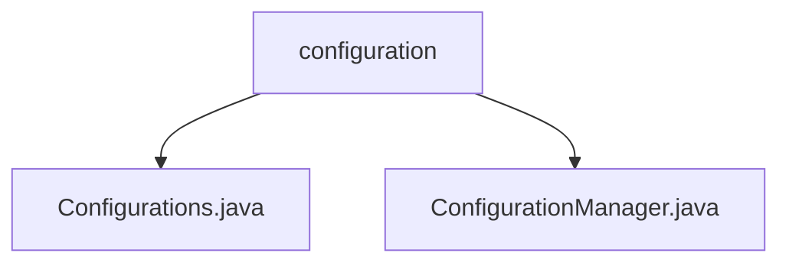

# Basic Information

|      |      |
|------|------|
| Name | configuration |
| Language | .java |
| Code Path | WeFe/common/java/common-lang/src/main/java/com/welab/wefe/common/configuration |
| Package Name | docs.common.java.common-lang.src.main.java.com.welab.wefe.common.configuration |
| Brief Description | The `Configurations` class manages configuration information, providing static methods to check keys, retrieve various configuration values and lists, and supporting default values. The `ConfigurationManager` manages configuration files, supporting loading from files or classpaths, and includes caching and dynamic environment configuration capabilities. |

# Description

## Overview  
This module is a Java configuration management toolkit, with its core responsibility being the unified management of various configuration information and the provision of type-safe access interfaces. The `Configurations` class serves as a static utility class, offering multi-type configuration reading and null-checking capabilities, while the `ConfigurationManager` handles the initialization of configuration sources, supporting file/classpath loading and environment awareness.  

Key data structures include `CompositeConfiguration` (for composite configuration storage) and a caching mechanism. Interface specifications cover configuration validation, type conversion (e.g., boolean/numeric/string), and collection handling (e.g., semicolon-delimited values converted to lists). The only external dependency is the Log4j logging component. For example, it supports reading JVM parameters from `system.properties` or loading configurations from `classpath:application.conf`.  

## Primary Business Scenarios  
Typical application patterns include: 1) Loading multi-environment configurations (e.g., dev/test/prod) via `ConfigurationManager` during service startup, similar to Spring Profile; 2) Retrieving specific parameters in business logic through `Configurations`, such as obtaining a database connection timeout with `getInt("db.timeout", 30)`.  

The unified interaction model follows a chained process: initialization → caching → type conversion → fallback to default values. Full functionality covers the entire configuration lifecycle, from loading and parsing to access, supporting API integrations such as dynamically retrieving string arrays via `split("mail.recipients")`. For instance, in financial scenarios, it can read risk control thresholds using `BigDecimal("risk.threshold")`.

### Package Internal Structure View

This flowchart illustrates the hierarchical structure of the configuration package under the common-lang module in the WeFe project. The parent node 'configuration' contains two child nodes: the configuration file classes Configurations.java and ConfigurationManager.java. This reflects the organization of core classes related to configuration management, adhering to the typical layered structure design of Java projects.

# File List

| Name   | Type  | Description |
|-------|------|-------------|
| [Configurations.java](Configurations.md) | file | The `Configurations` class provides static methods to access configuration data, supporting retrieval of various data types including boolean, numeric, string, list, etc., and allows default value settings. |
| [ConfigurationManager.java](ConfigurationManager.md) | file | The ConfigurationManager class manages configurations, supports file initialization, system property settings, and exception handling. By default, it reads config.properties and supports environment variable configurations. |

